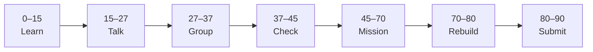

# Lesson 1: Course Workflow and First GitHub Repository


| | |
|:---|:---|
| **Time** | 90 minutes |
| **Evidence** | GitHub repo + track folder |

> [!TIP]
> Mission card → **45–70 Mission Task** → **70–80 Rebuild/Exit** → submit evidence.

**Your repo:** `[studentName]-Full-Stack-Web-and-AI-Application`

## Lesson Goal

By the end of this lesson, each student should be able to:

1. Explain what GitHub is used for in this course.
2. Explain repository, README, commit, and commit history in simple words.
3. Complete GitHub Skills: Introduction to GitHub.
4. Create a personal course repository with a README and at least one commit.
5. Repeat a small GitHub workflow without looking at the tutorial.
6. Submit evidence that proves the work was completed.

---

## 90-Minute Class Flow



### 0–15 min: Individual Learning

> [!NOTE]
> **One required resource** for this block — see below. Do not browse extra playlists during class.

Students work individually first.

**Step A — video explanation:**

1. Open: https://www.youtube.com/watch?v=3squmVe7OR0
2. Watch the full assigned video.
3. Focus on what GitHub is, why developers save versions, and why commit history matters.

**Step B — interactive practice:**

1. Open **GitHub Skills: Introduction to GitHub**: https://github.com/skills/introduction-to-github
2. Complete the GitHub Skills exercise.
3. Stop when the exercise is complete.

**Individual notes:**

```text
GitHub is useful because...
A repository is...
A README is...
A commit is...
Commit history shows...
One thing I still do not understand is...
```

**Student output:** Completed notes and GitHub Skills progress.

---

### 15–27 min: Talk Robin / Group Discussion

Each student speaks once before anyone speaks twice.

**Share:**

1. What GitHub is used for
2. What a repository is
3. What a commit is
4. One thing GitHub Skills helped you understand
5. One confusion or question

**Student output:** Group list of clear ideas and unclear questions.

---

### 27–37 min: Group Answer

As a group, prepare one shared answer:

```text
GitHub is useful because...
A repository is...
A README is...
A commit is...
Commit history matters because...
Our group still needs help with...
```

**Student output:** One group answer.

---

### 37–45 min: Entry Points Check

The teacher checks what students already understand before explaining.

**Teacher checks:**

1. Can students explain GitHub without saying only “a website”?
2. Can students explain repository, README, commit, and commit history?
3. Did students complete GitHub Skills: Introduction to GitHub?
4. Which questions appear across multiple groups?

**Teacher explanation rule:** Explain only the unclear parts. Do not run a full teacher-demo-first lesson.

---

### 45–70 min: Mission Task

Students create their personal course repository.

**Mission resource, if needed:** GitHub's create/edit/commit steps from the video and GitHub Skills exercise.

**Task:**

1. Create a public repository named `[studentName]-Full-Stack-Web-and-AI-Application`.
2. Create or edit `README.md`.
3. Add a title and a short “About me” section.
4. Commit the README with a meaningful message.
5. Open commit history and confirm the commit is visible.

**Mission output:**

- Personal course repository link
- `README.md` with title and About me section
- At least one meaningful commit visible in commit history

---

### 70–80 min: Independent Rebuild / Exit Check

> [!IMPORTANT]
> Independent work: close course videos, notes, AI tools, and follow-along code before this block.

Students repeat the workflow independently **without looking at the tutorial**.

This is not a delete-and-redo task. Students stay in the same repository and complete one small new change.

**Independent rebuild task:**

1. Open the same course repository.
2. Edit `README.md` and add one sentence about what you learned today.
3. Commit the change with a new meaningful message.
4. Confirm that commit history now shows both commits.

**Exit prompts:**

```text
My repository link is...
My first commit message is...
My independent rebuild commit message is...
One thing I can now do without the tutorial is...
One thing I still need help with is...
```

**Oral check if called:** Explain README → commit → commit history using your own repository.

---

### 80–90 min: Submission of Evidence

Submit evidence before leaving class.

Check that every link or screenshot clearly shows the student's own work.

---

## What You Must Submit

1. Personal course repository link
2. Screenshot or link showing `README.md`
3. Screenshot or link showing commit history with at least two meaningful commits
4. Screenshot or note showing GitHub Skills: Introduction to GitHub completed
5. One sentence: “Today I learned that GitHub is useful because...”

---

## Success Criteria

You are successful if:

1. Your repository is named `[studentName]-Full-Stack-Web-and-AI-Application`.
2. Your `README.md` has a title and About me section.
3. Your commit history shows at least two meaningful commits.
4. You completed GitHub Skills: Introduction to GitHub.
5. You can explain what you did in your own words.
6. You submitted all required evidence.

---

## Common Problems

| Problem | Try first |
|---|---|
| I made changes but cannot see them | Check whether you clicked **Commit changes**. |
| I am in the wrong repository | Open your own `[studentName]-Full-Stack-Web-and-AI-Application` repo. |
| I think I need to delete and redo | Do not delete. Make a small fix and commit again. |

---

## Fast Track Option

If most students complete this lesson in about 45 minutes, continue directly into Lesson 2 during the same 90-minute block.

Use this only if students have:

1. Completed the required GitHub Skills exercise.
2. Submitted or saved the required evidence.
3. Completed the independent rebuild without looking at the tutorial.
4. Can explain the workflow orally in simple words.

If more than one third of the class is still stuck, do not start the next lesson. Use the remaining time for rebuild, evidence checks, and oral explanation.
