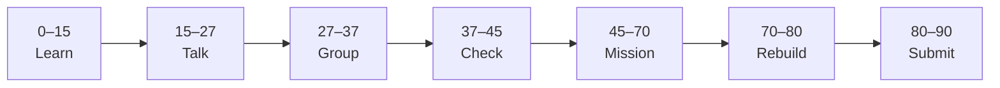

# Lesson 2: README, Markdown, and Commit History


| | |
|:---|:---|
| **Time** | 90 minutes |
| **Evidence** | GitHub repo + track folder |

> [!TIP]
> Mission card → **45–70 Mission Task** → **70–80 Rebuild/Exit** → submit evidence.

**Your repo:** `[studentName]-Full-Stack-Web-and-AI-Application`

## Lesson Goal

By the end of this lesson, each student should be able to:

1. Use basic Markdown to make a README easier to read.
2. Explain why a README is communication, not just a file.
3. Complete GitHub Skills: Communicate using Markdown.
4. Make a meaningful README or learning-log update in the course repo.
5. Show commit history as evidence of the update.
6. Explain the update orally if called.

---

## 90-Minute Class Flow



### 0–15 min: Individual Learning

> [!NOTE]
> **One required resource** for this block — see below. Do not browse extra playlists during class.

Students work individually first.

**Step A — video explanation:**

1. Open: https://www.youtube.com/watch?v=LxeclcePg-c&list=PL0lo9MOBetEFcp4SCWinBdpml9B2U25-f&index=13
2. Watch the full assigned video.
3. Focus on README purpose, Markdown formatting, and why clear repository communication matters.

**Step B — interactive practice:**

1. Open **GitHub Skills: Communicate using Markdown**: https://github.com/skills/communicate-using-markdown
2. Complete the GitHub Skills exercise.
3. Stop when the exercise is complete.

**Individual notes:**

```text
A README is useful because...
Markdown helps because...
One Markdown feature I practiced is...
A good commit message for a README change could be...
One thing I still do not understand is...
```

**Student output:** Completed notes and GitHub Skills progress.

---

### 15–27 min: Talk Robin / Group Discussion

Each student speaks once before anyone speaks twice.

**Share:**

1. What a README is for
2. One Markdown feature you practiced
3. Why commit history is evidence of improving communication
4. One confusion or question

**Student output:** Group list of useful Markdown features and unclear questions.

---

### 27–37 min: Group Answer

As a group, prepare one shared answer:

```text
A README is useful because...
Markdown makes README clearer because...
Commit history matters because...
One good README commit message is...
Our group still needs help with...
```

**Student output:** One group answer.

---

### 37–45 min: Entry Points Check

The teacher checks what students already understand before explaining.

**Teacher checks:**

1. Can students explain the purpose of a README?
2. Can students name at least one Markdown feature?
3. Did students complete GitHub Skills: Communicate using Markdown?
4. Which questions appear across multiple groups?

**Teacher explanation rule:** Explain only the unclear parts. Do not run a full teacher-demo-first lesson.

---

### 45–70 min: Mission Task

Students complete the main task.

**Mission resource, if needed:** Use the Markdown patterns from the video and GitHub Skills exercise.

**Task:**

1. Open your `[studentName]-Full-Stack-Web-and-AI-Application` repository.
2. Edit `README.md`.
3. Add or improve at least two Markdown elements, such as headings, bullets, or a task list.
4. Add a short section called `## Learning Log`.
5. Commit the README update with a meaningful message, such as `Improve README with Markdown learning notes`.

**Mission output:**

- Updated `README.md`
- At least two Markdown features used correctly
- Meaningful commit visible in commit history

---

### 70–80 min: Independent Rebuild / Exit Check

> [!IMPORTANT]
> Independent work: close course videos, notes, AI tools, and follow-along code before this block.

Students repeat the workflow independently **without looking at the tutorial**.

This is not a delete-and-redo task. Students stay in the same repo/project and complete one small new change.

**Independent rebuild task:**

1. Open the same `README.md`.
2. Add one new bullet under `## Learning Log`.
3. Commit the small change with a new meaningful message.
4. Confirm that commit history shows both today's mission commit and independent rebuild commit.

**Exit prompts:**

```text
A README is useful because...
One Markdown feature I used is...
My best commit message today is...
One thing I can now do without the tutorial is...
One thing I still need help with is...
```

**Oral check if called:** Explain README → Markdown update → commit → commit history using your own repository.

---

### 80–90 min: Submission of Evidence

Submit evidence before leaving class.

Check that every link or screenshot clearly shows the student's own work.

---

## What You Must Submit

1. Link or screenshot showing updated `README.md`
2. Screenshot or link showing commit history with today's commits
3. Screenshot or note showing GitHub Skills: Communicate using Markdown completed
4. One sentence: “Markdown makes my README clearer because...”

---

## Success Criteria

You are successful if:

1. Your `README.md` is easier to read than before.
2. Your `README.md` uses at least two Markdown features correctly.
3. Your commit history shows meaningful README update commits.
4. You completed GitHub Skills: Communicate using Markdown.
5. You can explain what you did in your own words.
6. You submitted all required evidence.

---

## Common Problems

| Problem | Try first |
|---|---|
| My README is plain text only | Add headings and bullets. |
| My commit message says only `update` | Rewrite it to describe the change. |
| I think GitHub Skills is the evidence | GitHub Skills is practice; your own repo update is the evidence. |

---

## Fast Track Option

If most students complete this lesson in about 45 minutes, continue directly into Lesson 3 during the same 90-minute block.

Use this only if students have:

1. Completed the required GitHub Skills exercise.
2. Submitted or saved the required evidence.
3. Completed the independent rebuild without looking at the tutorial.
4. Can explain the workflow orally in simple words.

If more than one third of the class is still stuck, do not start the next lesson. Use the remaining time for rebuild, evidence checks, and oral explanation.
