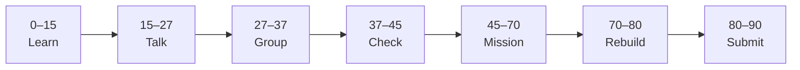

# Lesson 3: GitHub Pages and Public Learning Site


| | |
|:---|:---|
| **Time** | 90 minutes |
| **Evidence** | GitHub repo + track folder |

> [!TIP]
> Mission card → **45–70 Mission Task** → **70–80 Rebuild/Exit** → submit evidence.

**Your repo:** `[studentName]-Full-Stack-Web-and-AI-Application`

## Lesson Goal

By the end of this lesson, each student should be able to:

1. Explain what GitHub Pages is used for.
2. Complete GitHub Skills: GitHub Pages.
3. Create or update a simple GitHub Pages site from a GitHub repository.
4. Customize a homepage or blog-style page with personal learning content.
5. Show commit history as evidence of site changes.
6. Submit a public page link and explain what changed.

---

## 90-Minute Class Flow



### 0–15 min: Individual Learning

> [!NOTE]
> **One required resource** for this block — see below. Do not browse extra playlists during class.

Students work individually first.

**Step A — video explanation:**

1. Open: https://www.youtube.com/watch?v=b2r9Cdvssi0&list=PL0lo9MOBetEFcp4SCWinBdpml9B2U25-f&index=12
2. Watch the full assigned video.
3. Focus on what GitHub Pages publishes, where the page content comes from, and why a public page can show learning evidence.

**Step B — interactive practice:**

1. Open **GitHub Skills: GitHub Pages**: https://github.com/skills/github-pages
2. Complete the GitHub Skills exercise.
3. Stop when the exercise is complete.

**Individual notes:**

```text
GitHub Pages is useful because...
A public learning site can show...
One thing I changed in the GitHub Pages exercise was...
Commit history matters for a public page because...
One thing I still do not understand is...
```

**Student output:** Completed notes and GitHub Skills progress.

---

### 15–27 min: Talk Robin / Group Discussion

Each student speaks once before anyone speaks twice.

**Share:**

1. What GitHub Pages publishes
2. What students changed during the GitHub Pages exercise
3. How a public page can show learning progress
4. One confusion or question

**Student output:** Group list of what GitHub Pages is for and what is still unclear.

---

### 27–37 min: Group Answer

As a group, prepare one shared answer:

```text
GitHub Pages is useful because...
A public learning site should include...
Commit history proves page changes because...
One good commit message for a page update is...
Our group still needs help with...
```

**Student output:** One group answer.

---

### 37–45 min: Entry Points Check

The teacher checks what students already understand before explaining.

**Teacher checks:**

1. Can students explain GitHub Pages without saying only “a website”?
2. Can students explain where page content comes from?
3. Did students complete GitHub Skills: GitHub Pages?
4. Which questions appear across multiple groups?

**Teacher explanation rule:** Explain only the unclear parts. Do not run a full teacher-demo-first lesson.

---

### 45–70 min: Mission Task

Students create or update a simple public learning page.

**Mission resource, if needed:** Use the page setup and editing patterns from the video and GitHub Skills exercise.

**Task:**

1. Open your `[studentName]-Full-Stack-Web-and-AI-Application` repository.
2. Create or update a simple homepage for your learning site.
3. Add a title, a short course description, and one section called `Learning Progress`.
4. Add at least two bullets describing what you have learned so far.
5. Commit the page update with a meaningful message, such as `Add GitHub Pages learning homepage`.

**Mission output:**

- Public GitHub Pages link or page preview evidence
- Homepage with course description and learning progress
- Meaningful commit visible in commit history

---

### 70–80 min: Independent Rebuild / Exit Check

> [!IMPORTANT]
> Independent work: close course videos, notes, AI tools, and follow-along code before this block.

Students repeat the workflow independently **without looking at the tutorial**.

This is not a delete-and-redo task. Students stay in the same repo/project and complete one small new change.

**Independent rebuild task:**

1. Open the same page file or homepage editor.
2. Add one new sentence or bullet about today's GitHub Pages practice.
3. Commit the small change with a new meaningful message.
4. Confirm that commit history shows both today's mission commit and independent rebuild commit.

**Exit prompts:**

```text
My GitHub Pages link or page evidence is...
GitHub Pages is useful because...
One change I made to my page was...
My best commit message today is...
One thing I can now do without the tutorial is...
One thing I still need help with is...
```

**Oral check if called:** Explain page content → commit → public page evidence using your own repository.

---

### 80–90 min: Submission of Evidence

Submit evidence before leaving class.

Check that every link or screenshot clearly shows the student's own work.

---

## What You Must Submit

1. GitHub Pages public link or screenshot showing the page
2. Screenshot or link showing commit history with today's commits
3. Screenshot or note showing GitHub Skills: GitHub Pages completed
4. One sentence: “GitHub Pages can show my learning because...”

---

## Success Criteria

You are successful if:

1. Your page includes a title, course description, and learning progress section.
2. Your page evidence is visible through a public link or screenshot.
3. Your commit history shows meaningful page update commits.
4. You completed GitHub Skills: GitHub Pages.
5. You can explain what you did in your own words.
6. You submitted all required evidence.

---

## Common Problems

| Problem | Try first |
|---|---|
| My page does not show changes yet | Wait a few minutes, refresh, and check the latest commit. |
| I only completed GitHub Skills | Update your own course repo too; that is the course evidence. |
| My commit message says only `update` | Rewrite it to describe the page change. |

---

## Fast Track Option

If most students complete this lesson in about 45 minutes, continue directly into Lesson 4 during the same 90-minute block.

Use this only if students have:

1. Completed the required GitHub Skills exercise.
2. Submitted or saved the required evidence.
3. Completed the independent rebuild without looking at the tutorial.
4. Can explain the workflow orally in simple words.

If more than one third of the class is still stuck, do not start the next lesson. Use the remaining time for rebuild, evidence checks, and oral explanation.
