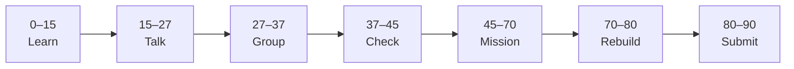

# Lesson 4: Introduction to Git and Version History


| | |
|:---|:---|
| **Time** | 90 minutes |
| **Evidence** | GitHub repo + track folder |

> [!TIP]
> Mission card → **45–70 Mission Task** → **70–80 Rebuild/Exit** → submit evidence.

**Your repo:** `[studentName]-Full-Stack-Web-and-AI-Application`

## Lesson Goal

By the end of this lesson, each student should be able to:

1. Explain why developers use Git version control.
2. Explain commit and history using a real repository example.
3. Complete GitHub Skills: Introduction to Git.
4. Make a small versioned change in the course repository.
5. Show commit history as evidence of the change.
6. Explain the workflow orally if called.

---

## 90-Minute Class Flow



### 0–15 min: Individual Learning

> [!NOTE]
> **One required resource** for this block — see below. Do not browse extra playlists during class.

Students work individually first.

**Step A — video explanation:**

1. Open: https://www.youtube.com/watch?v=rE2zRhZdjFU&list=PL0lo9MOBetEFcp4SCWinBdpml9B2U25-f&index=2&t=553s
2. Watch the assigned section from the linked timestamp.
3. Focus on version control, commits, history, and why Git helps developers track changes.

**Step B — interactive practice:**

1. Open **GitHub Skills: Introduction to Git**: https://github.com/skills/introduction-to-git
2. Complete the GitHub Skills exercise.
3. Stop when the exercise is complete.

**Individual notes:**

```text
Git is useful because...
Version control means...
A commit is...
History helps because...
One thing I still do not understand is...
```

**Student output:** Completed notes and GitHub Skills progress.

---

### 15–27 min: Talk Robin / Group Discussion

Each student speaks once before anyone speaks twice.

**Share:**

1. Why developers use Git
2. What a commit saves
3. How history helps compare or explain changes
4. One confusion or question

**Student output:** Group list of clear Git ideas and unclear questions.

---

### 27–37 min: Group Answer

As a group, prepare one shared answer:

```text
Git is useful because...
Version control means...
A commit saves...
History helps because...
Our group still needs help with...
```

**Student output:** One group answer.

---

### 37–45 min: Entry Points Check

The teacher checks what students already understand before explaining.

**Teacher checks:**

1. Can students explain Git vs GitHub in simple words?
2. Can students explain commit and history?
3. Did students complete GitHub Skills: Introduction to Git?
4. Which questions appear across multiple groups?

**Teacher explanation rule:** Explain only the unclear parts. Do not run a full teacher-demo-first lesson.

---

### 45–70 min: Mission Task

Students make a small versioned update in their course repository.

**Mission resource, if needed:** Use the version-control ideas from the video and GitHub Skills exercise.

**Task:**

1. Open your `[studentName]-Full-Stack-Web-and-AI-Application` repository.
2. Create or update a file called `git-notes.md`.
3. Add short notes explaining Git, commit, and history in your own words.
4. Commit the file with a meaningful message, such as `Add Git version control notes`.
5. Open commit history and confirm the commit is visible.

**Mission output:**

- `git-notes.md` with student-written explanations
- Meaningful commit visible in commit history
- Repo evidence that shows the change was saved

---

### 70–80 min: Independent Rebuild / Exit Check

> [!IMPORTANT]
> Independent work: close course videos, notes, AI tools, and follow-along code before this block.

Students repeat the workflow independently **without looking at the tutorial**.

This is not a delete-and-redo task. Students stay in the same repo/project and complete one small new change.

**Independent rebuild task:**

1. Open `git-notes.md`.
2. Add one new bullet explaining why history is useful.
3. Commit the small change with a new meaningful message.
4. Confirm that commit history shows both today's mission commit and independent rebuild commit.

**Exit prompts:**

```text
Git is useful because...
A commit saves...
History helps because...
My best commit message today is...
One thing I can now do without the tutorial is...
One thing I still need help with is...
```

**Oral check if called:** Explain Git → commit → history using your own repository.

---

### 80–90 min: Submission of Evidence

Submit evidence before leaving class.

Check that every link or screenshot clearly shows the student's own work.

---

## What You Must Submit

1. Link or screenshot showing `git-notes.md`
2. Screenshot or link showing commit history with today's commits
3. Screenshot or note showing GitHub Skills: Introduction to Git completed
4. One sentence: “Git history is useful because...”

---

## Success Criteria

You are successful if:

1. `git-notes.md` explains Git, commit, and history in your own words.
2. Your commit history shows meaningful Git notes commits.
3. You completed GitHub Skills: Introduction to Git.
4. You can explain what you did in your own words.
5. You submitted all required evidence.

---

## Common Problems

| Problem | Try first |
|---|---|
| I confuse Git and GitHub | Write one sentence for each: Git tracks changes; GitHub hosts repos online. |
| My notes copy the exercise wording | Rewrite using your own course repo as the example. |
| I only completed GitHub Skills | Add `git-notes.md` in your own repo too; that is the course evidence. |

---

## Fast Track Option

If most students complete this lesson in about 45 minutes, continue directly into Lesson 5 during the same 90-minute block.

Use this only if students have:

1. Completed the required GitHub Skills exercise.
2. Submitted or saved the required evidence.
3. Completed the independent rebuild without looking at the tutorial.
4. Can explain the workflow orally in simple words.

If more than one third of the class is still stuck, do not start the next lesson. Use the remaining time for rebuild, evidence checks, and oral explanation.
