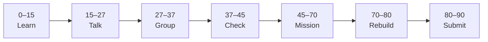

# Lesson 5: Pull Requests and Code Review


| | |
|:---|:---|
| **Time** | 90 minutes |
| **Evidence** | GitHub repo + track folder |

> [!TIP]
> Mission card → **45–70 Mission Task** → **70–80 Rebuild/Exit** → submit evidence.

**Your repo:** `[studentName]-Full-Stack-Web-and-AI-Application`

## Lesson Goal

By the end of this lesson, each student should be able to:

1. Explain what a pull request is used for.
2. Explain why review comments and suggestions improve work before merging.
3. Complete GitHub Skills: Review pull requests.
4. Practice reviewing or documenting a change in the course repository.
5. Submit evidence of pull request review practice and repo commit history.
6. Explain the review workflow orally if called.

---

## 90-Minute Class Flow



### 0–15 min: Individual Learning

> [!NOTE]
> **One required resource** for this block — see below. Do not browse extra playlists during class.

Students work individually first.

**Step A — video explanation:**

1. Open: https://www.youtube.com/watch?v=nCKdihvneS0&list=PL0lo9MOBetEFcp4SCWinBdpml9B2U25-f&index=7&t=2s
2. Watch the assigned video section.
3. Focus on what a pull request is and why developers use it before merging work.
4. Open: https://www.youtube.com/watch?v=FDXSgyDGmho&list=PL0lo9MOBetEFcp4SCWinBdpml9B2U25-f&index=7&t=70s
5. Watch the assigned video section.
6. Focus on review, comments, suggestions, and approval.

**Step B — interactive practice:**

1. Open **GitHub Skills: Review pull requests**: https://github.com/skills/review-pull-requests
2. Complete the GitHub Skills exercise.
3. Stop when the exercise is complete.

**Individual notes:**

```text
A pull request is useful because...
A review comment should...
A suggested change is useful because...
Before merging, reviewers should check...
One thing I still do not understand is...
```

**Student output:** Completed notes and GitHub Skills progress.

---

### 15–27 min: Talk Robin / Group Discussion

Each student speaks once before anyone speaks twice.

**Share:**

1. What a pull request is used for
2. What makes a review comment helpful
3. What the Review pull requests exercise made clearer
4. One confusion or question

**Student output:** Group list of useful review behaviors and unclear questions.

---

### 27–37 min: Group Answer

As a group, prepare one shared answer:

```text
A pull request is useful because...
A good review comment should...
A suggested change helps because...
Review evidence matters because...
Our group still needs help with...
```

**Student output:** One group answer.

---

### 37–45 min: Entry Points Check

The teacher checks what students already understand before explaining.

**Teacher checks:**

1. Can students explain pull request vs commit?
2. Can students explain what review comments are for?
3. Did students complete GitHub Skills: Review pull requests?
4. Which questions appear across multiple groups?

**Teacher explanation rule:** Explain only the unclear parts. Do not run a full teacher-demo-first lesson.

---

### 45–70 min: Mission Task

Students document a review-ready change in their course repository.

**Mission resource, if needed:** Use the review behaviors from the videos and GitHub Skills exercise.

**Task:**

1. Open your `[studentName]-Full-Stack-Web-and-AI-Application` repository.
2. Create or update a file called `review-notes.md`.
3. Add a section called `## Pull Request Review Checklist`.
4. Add at least four bullets describing what a reviewer should check.
5. Commit the file with a meaningful message, such as `Add pull request review checklist`.

**Mission output:**

- `review-notes.md` with a review checklist
- Meaningful commit visible in commit history
- Evidence that GitHub Skills: Review pull requests was completed

---

### 70–80 min: Independent Rebuild / Exit Check

> [!IMPORTANT]
> Independent work: close course videos, notes, AI tools, and follow-along code before this block.

Students repeat the workflow independently **without looking at the tutorial**.

This is not a delete-and-redo task. Students stay in the same repo/project and complete one small new change.

**Independent rebuild task:**

1. Open `review-notes.md`.
2. Add one new bullet describing a helpful review comment.
3. Commit the small change with a new meaningful message.
4. Confirm that commit history shows both today's mission commit and independent rebuild commit.

**Exit prompts:**

```text
A pull request is useful because...
A good review comment should...
One thing I added to my review checklist was...
My best commit message today is...
One thing I can now do without the tutorial is...
One thing I still need help with is...
```

**Oral check if called:** Explain pull request → review comment → suggested change → merge using the GitHub Skills exercise and your own notes.

---

### 80–90 min: Submission of Evidence

Submit evidence before leaving class.

Check that every link or screenshot clearly shows the student's own work.

---

## What You Must Submit

1. Link or screenshot showing `review-notes.md`
2. Screenshot or link showing commit history with today's commits
3. Screenshot or note showing GitHub Skills: Review pull requests completed
4. One sentence: “Pull request reviews improve work because...”

---

## Success Criteria

You are successful if:

1. `review-notes.md` includes a pull request review checklist.
2. Your checklist has at least four useful review bullets.
3. Your commit history shows meaningful review-notes commits.
4. You completed GitHub Skills: Review pull requests.
5. You can explain what you did in your own words.
6. You submitted all required evidence.

---

## Common Problems

| Problem | Try first |
|---|---|
| I confuse pull request and commit | Commit saves a change; pull request asks for review before merging. |
| My review checklist is too vague | Write checks a reviewer can actually do. |
| I only completed GitHub Skills | Add `review-notes.md` in your own repo too; that is the course evidence. |

---

## Fast Track Option

If most students complete this lesson in about 45 minutes, continue directly into Lesson 6 during the same 90-minute block.

Use this only if students have:

1. Completed the required GitHub Skills exercise.
2. Submitted or saved the required evidence.
3. Completed the independent rebuild without looking at the tutorial.
4. Can explain the workflow orally in simple words.

If more than one third of the class is still stuck, do not start the next lesson. Use the remaining time for rebuild, evidence checks, and oral explanation.
