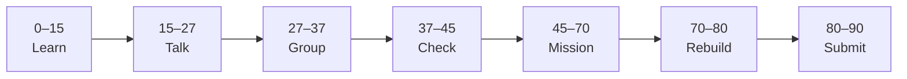

# Lesson 6: Resolve Merge Conflicts


| | |
|:---|:---|
| **Time** | 90 minutes |
| **Evidence** | GitHub repo + track folder |

> [!TIP]
> Mission card → **45–70 Mission Task** → **70–80 Rebuild/Exit** → submit evidence.

**Your repo:** `[studentName]-Full-Stack-Web-and-AI-Application`

## Lesson Goal

By the end of this lesson, each student should be able to:

1. Explain why merge conflicts happen.
2. Identify conflicting changes in a file.
3. Complete GitHub Skills: Resolve Merge Conflicts.
4. Write a short conflict-resolution checklist in the course repository.
5. Show commit history as evidence of the checklist update.
6. Explain the conflict-resolution workflow orally if called.

---

## 90-Minute Class Flow



### 0–15 min: Individual Learning

> [!NOTE]
> **One required resource** for this block — see below. Do not browse extra playlists during class.

Students work individually first.

**Step A — video explanation:**

1. Open: https://www.youtube.com/watch?v=mOJazBNrG-c
2. Watch the full assigned video.
3. Focus on why conflicts happen, how conflicting changes are shown, and how developers decide what to keep.

**Step B — interactive practice:**

1. Open **GitHub Skills: Resolve Merge Conflicts**: https://github.com/skills/resolve-merge-conflicts
2. Complete the GitHub Skills exercise.
3. Stop when the exercise is complete.

**Individual notes:**

```text
A merge conflict happens when...
GitHub shows a conflict by...
To resolve a conflict, I should...
One careful choice I need to make is...
One thing I still do not understand is...
```

**Student output:** Completed notes and GitHub Skills progress.

---

### 15–27 min: Talk Robin / Group Discussion

Each student speaks once before anyone speaks twice.

**Share:**

1. Why merge conflicts happen
2. What conflict markers or conflicting sections mean
3. One decision you made during the Resolve Merge Conflicts exercise
4. One confusion or question

**Student output:** Group list of conflict causes and unclear questions.

---

### 27–37 min: Group Answer

As a group, prepare one shared answer:

```text
A merge conflict happens when...
Conflict resolution means...
A careful resolver should...
Commit history matters after resolving a conflict because...
Our group still needs help with...
```

**Student output:** One group answer.

---

### 37–45 min: Entry Points Check

The teacher checks what students already understand before explaining.

**Teacher checks:**

1. Can students explain why conflicts happen?
2. Can students explain the difference between choosing one side and combining both sides?
3. Did students complete GitHub Skills: Resolve Merge Conflicts?
4. Which questions appear across multiple groups?

**Teacher explanation rule:** Explain only the unclear parts. Do not run a full teacher-demo-first lesson.

---

### 45–70 min: Mission Task

Students document a safe conflict-resolution process in their course repository.

**Mission resource, if needed:** Use the conflict-resolution steps from the video and GitHub Skills exercise.

**Task:**

1. Open your `[studentName]-Full-Stack-Web-and-AI-Application` repository.
2. Create or update a file called `merge-conflict-notes.md`.
3. Add a section called `## Conflict Resolution Checklist`.
4. Add at least five checklist items for resolving a conflict carefully.
5. Commit the file with a meaningful message, such as `Add merge conflict resolution checklist`.

**Mission output:**

- `merge-conflict-notes.md` with a conflict-resolution checklist
- Meaningful commit visible in commit history
- Evidence that GitHub Skills: Resolve Merge Conflicts was completed

---

### 70–80 min: Independent Rebuild / Exit Check

> [!IMPORTANT]
> Independent work: close course videos, notes, AI tools, and follow-along code before this block.

Students repeat the workflow independently **without looking at the tutorial**.

This is not a delete-and-redo task. Students stay in the same repo/project and complete one small new change.

**Independent rebuild task:**

1. Open `merge-conflict-notes.md`.
2. Add one new bullet explaining what to check before committing a conflict fix.
3. Commit the small change with a new meaningful message.
4. Confirm that commit history shows both today's mission commit and independent rebuild commit.

**Exit prompts:**

```text
A merge conflict happens when...
One safe conflict-resolution step is...
One thing I added to my checklist was...
My best commit message today is...
One thing I can now do without the tutorial is...
One thing I still need help with is...
```

**Oral check if called:** Explain conflict → resolution choice → commit → history using the GitHub Skills exercise and your own notes.

---

### 80–90 min: Submission of Evidence

Submit evidence before leaving class.

Check that every link or screenshot clearly shows the student's own work.

---

## What You Must Submit

1. Link or screenshot showing `merge-conflict-notes.md`
2. Screenshot or link showing commit history with today's commits
3. Screenshot or note showing GitHub Skills: Resolve Merge Conflicts completed
4. One sentence: “Merge conflicts are easier to solve when...”

---

## Success Criteria

You are successful if:

1. `merge-conflict-notes.md` includes a conflict-resolution checklist.
2. Your checklist has at least five useful conflict-resolution items.
3. Your commit history shows meaningful merge-conflict-notes commits.
4. You completed GitHub Skills: Resolve Merge Conflicts.
5. You can explain what you did in your own words.
6. You submitted all required evidence.

---

## Common Problems

| Problem | Try first |
|---|---|
| I think conflicts mean Git is broken | Conflicts mean two changes touched the same area and need a human decision. |
| I delete one side without reading | Read both sides first, then decide what should remain. |
| I only completed GitHub Skills | Add `merge-conflict-notes.md` in your own repo too; that is the course evidence. |

---

## Fast Track Option

If most students complete this lesson in about 45 minutes, continue directly into Lesson 7 during the same 90-minute block.

Use this only if students have:

1. Completed the required GitHub Skills exercise.
2. Submitted or saved the required evidence.
3. Completed the independent rebuild without looking at the tutorial.
4. Can explain the workflow orally in simple words.

If more than one third of the class is still stuck, do not start the certification sprint. Use the remaining time for rebuild, evidence checks, and oral explanation.
