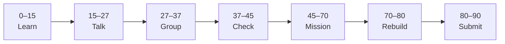

# Lesson 7: Coursera Git/GitHub Certification Sprint


| | |
|:---|:---|
| **Time** | 90 minutes |
| **Evidence** | GitHub repo + track folder |

> [!TIP]
> Mission card → **45–70 Mission Task** → **70–80 Rebuild/Exit** → submit evidence.

**Your repo:** `[studentName]-Full-Stack-Web-and-AI-Application`

## Lesson Goal

By the end of this lesson, each student should be able to:

1. Use Lessons 1–6 knowledge to complete a Coursera Git/GitHub module quickly.
2. Submit Coursera completion evidence or certificate evidence.
3. Connect Coursera evidence with their own GitHub repository evidence.
4. Add certification evidence or a certification reflection to the course repository.
5. Explain the difference between course completion evidence and real project evidence.

---

## 90-Minute Class Flow



### 0–15 min: Individual Learning

> [!NOTE]
> **One required resource** for this block — see below. Do not browse extra playlists during class.

Students work individually first.

**Step A — certification target:**

1. Open Coursera: https://www.coursera.org/learn/getting-started-with-git-and-github/home/module/4
2. Identify the required module, quiz, or completion item assigned by the teacher.
3. Do not start randomly clicking. First find what counts as completion evidence.

**Step B — quick self-check:**

Before starting Coursera, answer:

```text
One Git/GitHub concept I already understand is...
One Git/GitHub concept I may need to review is...
The Coursera evidence I need to submit is...
My GitHub repo evidence is...
```

**Student output:** Coursera target identified + four self-check notes.

---

### 15–27 min: Talk Robin / Group Discussion

Each student speaks once before anyone speaks twice.

**Share:**

1. What Coursera item you need to complete
2. What evidence will prove completion
3. Which Git/GitHub concept you may need to review
4. One question before starting the sprint

**Student output:** Group list of unclear Coursera requirements or Git/GitHub concepts.

---

### 27–37 min: Group Answer

As a group, prepare one shared answer:

```text
Coursera completion evidence means...
GitHub repo evidence means...
The difference is...
Our group still needs help with...
```

**Student output:** One group answer.

---

### 37–45 min: Entry Points Check

The teacher checks what students already understand before explaining.

**Teacher checks:**

1. Do students know which Coursera module or quiz to complete?
2. Do students know what screenshot/certificate evidence is required?
3. Can students explain how Coursera evidence differs from repo evidence?
4. Which questions appear across multiple groups?

**Teacher explanation rule:** Explain only the unclear parts. Do not reteach all of Git/GitHub.

---

### 45–70 min: Certification Sprint

Students complete the Coursera requirement.

**Task:**

1. Complete the assigned Coursera module, quiz, or certificate item.
2. Save a screenshot or completion proof.
3. If you finish early, review any missed questions or weak concepts.
4. Open your course repo.
5. Create or update `certification-evidence.md`.

**Add this structure to `certification-evidence.md`:**

```markdown
# Certification Evidence

## Coursera Git/GitHub Completion
- What I completed:
- Evidence link or screenshot filename:
- One concept Coursera helped me review:

## My GitHub Evidence
- My course repo:
- One commit or file that proves I can apply the skill:
```

**Mission output:**

- Coursera completion/certificate evidence
- `certification-evidence.md` in the course repo
- Meaningful commit visible in commit history

---

### 70–80 min: Independent Rebuild / Exit Check

> [!IMPORTANT]
> Independent work: close course videos, notes, AI tools, and follow-along code before this block.

Students connect certification evidence to actual GitHub work.

This is not a delete-and-redo task. Students stay in the same repo/project and complete one small new change.

**Independent rebuild task:**

1. Open `certification-evidence.md`.
2. Add one new bullet under `## My GitHub Evidence` linking Coursera learning to your own repo work.
3. Commit the change with a meaningful message, such as `Add Coursera GitHub certification evidence`.
4. Confirm that commit history shows the certification evidence commit.

**Exit prompts:**

```text
Coursera evidence proves...
My GitHub repo evidence proves...
The difference between them is...
One concept I reviewed today was...
One thing I can now do without the tutorial is...
One thing I still need help with is...
```

**Oral check if called:** Explain how Coursera completion and personal repo evidence support each other.

---

### 80–90 min: Submission of Evidence

Submit evidence before leaving class.

Check that every link or screenshot clearly shows the student's own work.

---

## What You Must Submit

1. Coursera completion, quiz, or certificate screenshot
2. Link or screenshot showing `certification-evidence.md`
3. Screenshot or link showing commit history with the certification evidence commit
4. One sentence: “Coursera proves I completed learning; my GitHub repo proves I can apply it because...”

---

## Success Criteria

You are successful if:

1. You completed the assigned Coursera Git/GitHub requirement.
2. You saved visible Coursera completion or certificate evidence.
3. You added `certification-evidence.md` to your own course repo.
4. Your commit history shows a meaningful certification evidence commit.
5. You can explain the difference between Coursera evidence and repo evidence.
6. You submitted all required evidence.

---

## Common Problems

| Problem | Try first |
|---|---|
| I finished Coursera but have no proof | Take a screenshot of completion, quiz result, or certificate page. |
| I only submitted Coursera evidence | Add `certification-evidence.md` to your own repo too. |
| I cannot explain the difference | Coursera shows completion; your repo shows applied skill. |

---

## Fast Track Option

If most students complete the certification sprint in about 45 minutes, use the rest of the 90-minute block as a Phase 0 evidence audit.

Students should check that they have:

1. Coursera completion, quiz, or certificate evidence.
2. GitHub Skills completion evidence from the Phase 0 lessons.
3. A complete `[studentName]-Full-Stack-Web-and-AI-Application` repository.
4. Meaningful commit history across multiple files.
5. A short reflection explaining how GitHub, Git, Markdown, pull requests, merge conflicts, and certification connect.

If students are missing evidence, they should fix the evidence before moving into Phase 1.
