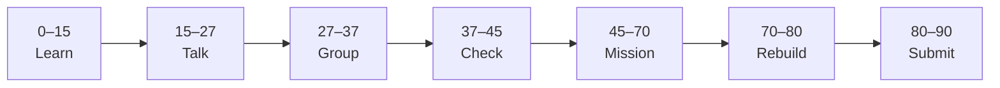

# Lesson 1: Figma Basics and User Flow


| | |
|:---|:---|
| **Time** | 90 minutes |
| **Evidence** | GitHub repo + track folder |

> [!TIP]
> Mission card → **45–70 Mission Task** → **70–80 Rebuild/Exit** → submit evidence.

**Your repo:** `[studentName]-Full-Stack-Web-and-AI-Application`

## Lesson Goal

By the end of this lesson, each student should be able to:

1. Create a free Figma account and open the Design editor.
2. Name frames, use shapes/text, and navigate the canvas.
3. Sketch the **AI School Assistant** flow on paper: question → loading → answer → **source**.
4. Create `figma-design/` on GitHub with `README.md` and `user-flow.md`.
5. Start the **Figma Design for beginners (2025)** course (first lessons only).
6. Submit flow sketch evidence and one commit.

---

## 90-Minute Class Flow



### 0–15 min: Individual Learning

> [!NOTE]
> **One required resource** for this block — see below. Do not browse extra playlists during class.

**Required resource — Figma official (2025 beginner course, start only):**

Overview: [Figma Design for beginners (2025)](https://help.figma.com/hc/en-us/articles/30848209492887-Course-overview-Figma-Design-for-beginners-2025)

In Figma Learn, complete through: **account setup, canvas navigation, frames, basic shapes and text** (stop before components — Lesson 4).

**Individual notes:**

```text
The canvas is for...
A frame is...
My app’s main user action is...
After the user submits a question...
The source must appear because...
One thing I still do not understand is...
```

---

### 15–27 min: Talk Robin / Group Discussion

**Share:** Your four-step user flow; why showing **source** is responsible AI; one Figma UI element you found.

---

### 27–37 min: Group Answer

```text
We design before we code because...
Our result screen shows trust by...
Our group still needs help with...
```

---

### 37–45 min: Entry Points Check

**Teacher checks:** Figma login works; GitHub repo ready; students can name four target screens.

---

### 45–70 min: Mission Task

1. Create folder `figma-design/` in your repo.
2. Add `README.md`: project name (AI School Assistant), purpose, link to Notion portfolio.
3. Add `user-flow.md` with ASCII or bullet flow:

   ```text
   Home → Ask → Loading → Result (answer + source)
   ```

   Or attach a photo of a paper sketch in `figma-design/screenshots/flow-paper.jpg`.
4. In Figma, create file **AI-School-Assistant**; add one frame titled `01-flow-draft` with sticky-note labels for each step.
5. Commit: `Start figma-design with user flow`.

---

### 70–80 min: Independent Rebuild / Exit Check

Without notes, say the four screens aloud. Add one sentence to README: **“Phase 6 Next.js will implement this design.”**

---

### 80–90 min: Submission of Evidence

---

## What You Must Submit

1. GitHub link to `figma-design/`
2. `user-flow.md` or paper sketch image
3. Screenshot of Figma file with flow draft frame
4. Figma Learn progress screenshot (optional)
5. Commit history

---

## Success Criteria

1. Four-step flow documented with **source** on result step.
2. Figma file created with viewable draft.
3. README explains folder purpose.
4. At least one meaningful commit.

---

## Common Problems

| Problem | Try first |
|---|---|
| Cannot edit Figma | Confirm Design (not FigJam) file; check team permissions. |
| Flow skips loading | Loading sets user expectation while FastAPI/RAG runs later. |
| No source on result | Required for capstone — fix before Lesson 3. |

---

## Fast Track Option

Watch Coursera wireframe GP intro video titles only — full GP is Lesson 2.

---

Educational materials in this folder are copyright © 2026 Wang Morgan. All Rights Reserved.
