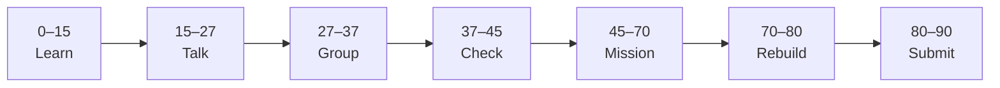

# Lesson 2: Wireframe Guided Project


| | |
|:---|:---|
| **Time** | 90 minutes |
| **Evidence** | GitHub repo + track folder |

> [!TIP]
> Mission card → **45–70 Mission Task** → **70–80 Rebuild/Exit** → submit evidence.

**Your repo:** `[studentName]-Full-Stack-Web-and-AI-Application`

## Lesson Goal

By the end of this lesson, each student should be able to:

1. Explain what a **wireframe** is and why it comes before visual polish.
2. Complete the Coursera Guided Project on digital wireframes.
3. Apply wireframe techniques to one **AI School Assistant** screen (Ask or Home).
4. Use grayscale layout (no final colors required today).
5. Export one wireframe PNG to `figma-design/screenshots/`.
6. Submit Coursera progress and GitHub evidence.

---

## 90-Minute Class Flow



### 0–15 min: Individual Learning

> [!NOTE]
> **One required resource** for this block — see below. Do not browse extra playlists during class.

**Required resource — Coursera Guided Project (~1.5 hours; finish as much as possible in class):**

[Create a Digital Wireframe with Figma](https://www.coursera.org/projects/create-digital-wireframe-figma)

Focus: wireframe principles, frames, placeholders, hierarchy — **not** the pizza topic details; transfer patterns to your app.

**Individual notes:**

```text
A wireframe is...
Wireframes skip color because...
Placeholder text helps...
I will wireframe this capstone screen first...
One thing I still do not understand is...
```

---

### 15–27 min: Talk Robin / Group Discussion

**Share:** One wireframe principle from the GP; which capstone screen you will wireframe first; low-fi vs high-fi.

---

### 27–37 min: Group Answer

```text
Wireframes save coding time because...
Our Ask screen includes...
Our group still needs help with...
```

---

### 37–45 min: Entry Points Check

**Teacher checks:** Lesson 1 flow on GitHub; Coursera GP workspace opens (desktop browser).

---

### 45–70 min: Mission Task

1. In **AI-School-Assistant** Figma file, add frame `02-wireframe-home` OR `02-wireframe-ask` (mobile or desktop — pick one, stay consistent).
2. Wireframe with rectangles and text labels only:
   - App title
   - Short description
   - Question input + Submit **or** welcome + “Start”
3. Export PNG → `figma-design/screenshots/wireframe-01.png`.
4. Add bullet to `README.md`: what you wireframed today.
5. Commit: `Add first capstone wireframe screenshot`.

---

### 70–80 min: Independent Rebuild / Exit Check

Hide GP tab; add one labeled button rectangle from memory in Figma.

**Oral check:** What is the difference between wireframe and final UI?

---

### 80–90 min: Submission of Evidence

---

## What You Must Submit

1. Coursera Guided Project progress or completion screenshot
2. GitHub link to wireframe PNG
3. Figma screenshot of wireframe frame
4. Commit history

---

## Success Criteria

1. GP started or completed.
2. At least one capstone wireframe frame in Figma.
3. PNG in repo `screenshots/`.
4. Grayscale / low-fi (no need for brand colors yet).

---

## Common Problems

| Problem | Try first |
|---|---|
| GP desktop only | Use laptop; finish remainder as homework with deadline. |
| Too much visual polish | Remove fills; use gray boxes and labels. |
| Wrong project topic | GP is practice — capstone wireframe is the graded mission part. |

---

## Fast Track Option

Start second wireframe frame (Loading) before Lesson 3.

---

Educational materials in this folder are copyright © 2026 Wang Morgan. All Rights Reserved.
