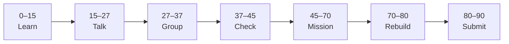

# Lesson 3: AI Assistant Wireframes (Four Screens)


| | |
|:---|:---|
| **Time** | 90 minutes |
| **Evidence** | GitHub repo + track folder |

> [!TIP]
> Mission card → **45–70 Mission Task** → **70–80 Rebuild/Exit** → submit evidence.

**Your repo:** `[studentName]-Full-Stack-Web-and-AI-Application`

## Lesson Goal

By the end of this lesson, each student should be able to:

1. Wireframe all **four capstone screens** in one Figma page.
2. Label navigation between screens (arrows or notes).
3. Show **answer + source** on the Result wireframe.
4. Show a **Loading** state between Ask and Result.
5. Update `user-flow.md` to match Figma frame names.
6. Export a overview PNG and commit.

---

## 90-Minute Class Flow



### 0–15 min: Individual Learning

> [!NOTE]
> **One required resource** for this block — see below. Do not browse extra playlists during class.

**Required resource — review (no new long course):**

Re-read your [Lesson 1 user flow](lesson-01-figma-basics-and-user-flow.md) and teacher demo UX if shown.

Optional 10 min: Figma Learn 2025 — **“Structuring pages”** or frames section only.

**Individual notes:**

```text
Frame names I will use are...
Loading communicates...
Source on result looks like...
Navigation from Ask to Result goes through...
One thing I still do not understand is...
```

---

### 15–27 min: Talk Robin / Group Discussion

**Share:** Result screen layout for answer vs source; what Loading shows (spinner, text, disabled button).

---

### 27–37 min: Group Answer

```text
We separate Loading so users know...
Source might be labeled...
Our group still needs help with...
```

---

### 37–45 min: Entry Points Check

**Teacher checks:** Four frame names ready; Lesson 2 wireframe exists.

---

### 45–70 min: Mission Task

Create wireframe frames (grayscale OK):

| Frame name | Content |
|---|---|
| `03-home` | Welcome, app purpose, CTA to ask |
| `03-ask` | Question input, Submit |
| `03-loading` | “Searching handbook…” or spinner placeholder |
| `03-result` | Answer text area + **Source:** handbook section |

1. Connect frames with flow arrows or a `Flow notes` sticky.
2. Update `user-flow.md` with frame names.
3. Export `figma-design/screenshots/wireframes-all.png`.
4. Commit: `Add four capstone wireframe screens`.

---

### 70–80 min: Independent Rebuild / Exit Check

Partner points to a frame — you explain what the user does there.

**Oral check:** Which screen proves responsible AI?

---

### 80–90 min: Submission of Evidence

---

## What You Must Submit

1. Figma screenshot showing all four frames
2. GitHub PNG export
3. Updated `user-flow.md`
4. Commit history

---

## Success Criteria

1. Four frames present and named consistently.
2. Result frame includes visible **source** placeholder.
3. Loading frame exists between ask and answer.
4. Flow documented in repo.

---

## Common Problems

| Problem | Try first |
|---|---|
| Only 2 screens | Add Loading and Home — all four required. |
| Source missing | Add label “Source: page/section” under answer. |
| Messy canvas | Use Figma **Section** or align frames in a row. |

---

## Fast Track Option

Add empty/error state wireframe `03-no-answer` (“I don’t know”).

---

Educational materials in this folder are copyright © 2026 Wang Morgan. All Rights Reserved.
