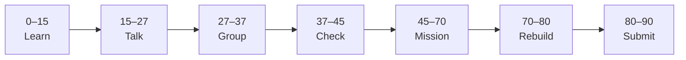

# Lesson 4: Components, Auto Layout, and Polish


| | |
|:---|:---|
| **Time** | 90 minutes |
| **Evidence** | GitHub repo + track folder |

> [!TIP]
> Mission card → **45–70 Mission Task** → **70–80 Rebuild/Exit** → submit evidence.

**Your repo:** `[studentName]-Full-Stack-Web-and-AI-Application`

## Lesson Goal

By the end of this lesson, each student should be able to:

1. Create at least two **reusable components** (e.g. `Button/Primary`, `Input/Question`).
2. Apply **Auto Layout** to the Ask and Result screens.
3. Upgrade wireframes to **mid/high-fidelity** for Home and Result (typography, spacing, color).
4. Keep **source** visually distinct on the Result screen (card, caption, or sidebar).
5. Complete optional Coursera sections from the Weather App UI project (multi-screen polish).
6. Export polished Result screenshot and commit.

---

## 90-Minute Class Flow



### 0–15 min: Individual Learning

> [!NOTE]
> **One required resource** for this block — see below. Do not browse extra playlists during class.

**Required resource A — Figma official (2025 course):**

Continue [Figma Design for beginners](https://help.figma.com/hc/en-us/articles/30848209492887-Course-overview-Figma-Design-for-beginners-2025): **components, variants (intro), Auto Layout**.

**Optional resource B — Coursera (~1h, selected modules only):**

[UI Design using Figma: Create a Weather App Interface](https://www.coursera.org/projects/ui-design-using-figma-create-a-weather-app-interface)

Focus: login/home layout patterns, linking screens — **apply ideas to your app, do not copy weather UI**.

**Individual notes:**

```text
A component helps because...
Auto Layout helps responsive design by...
My Result screen shows source using...
Primary button component props are...
One thing I still do not understand is...
```

---

### 15–27 min: Talk Robin / Group Discussion

**Share:** Component naming; how source looks different from answer text; one Auto Layout tip.

---

### 27–37 min: Group Answer

```text
We use components so Phase 6 Next.js can map...
Source styling differs from answer because...
Our group still needs help with...
```

---

### 37–45 min: Entry Points Check

**Teacher checks:** Lesson 3 four wireframes exist; students can open Assets panel for components.

---

### 45–70 min: Mission Task

1. Create components:
   - `Button/Primary` (Submit)
   - `Input/Question` or `TextField`
   - Optional: `Card/Source`
2. Rebuild `03-ask` and `03-result` using instances + Auto Layout.
3. On **Result**: answer body + clear **Source** block (file name, page, or quote snippet placeholder).
4. Polish **03-home** with real heading and one accent color (school-safe palette).
5. Export `figma-design/screenshots/result-with-source.png`.
6. Commit: `Add components and polished result screen`.

---

### 70–80 min: Independent Rebuild / Exit Check

Change primary button label in component — confirm instances update.

**Oral check:** What will you name the matching React component in Phase 6?

---

### 80–90 min: Submission of Evidence

---

## What You Must Submit

1. Figma screenshot showing Components page or Assets
2. Result screen PNG with visible source styling
3. Optional Coursera Weather GP progress screenshot
4. Commit history

---

## Success Criteria

1. At least two components with instances on screens.
2. Auto Layout on Ask or Result.
3. Source visually distinct from answer.
4. Home + Result beyond grayscale wireframe.

---

## Common Problems

| Problem | Try first |
|---|---|
| Component edit breaks layout | Use Auto Layout padding; detach only if teacher allows. |
| Source hard to see | Border, smaller type, icon, or “Source” label prefix. |
| Too many colors | Limit to 1 accent + neutrals. |

---

## Fast Track Option

Dark mode variant frame `04-result-dark` (extension from formal Phase 4).

---

Educational materials in this folder are copyright © 2026 Wang Morgan. All Rights Reserved.
