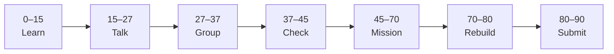

# Lesson 5: Prototype, Handoff, and Phase Submission


| | |
|:---|:---|
| **Time** | 90 minutes |
| **Evidence** | GitHub repo + track folder |

> [!TIP]
> Mission card → **45–70 Mission Task** → **70–80 Rebuild/Exit** → submit evidence.

**Your repo:** `[studentName]-Full-Stack-Web-and-AI-Application`

## Lesson Goal

By the end of this lesson, each student should be able to:

1. Link screens into a clickable **prototype** (Home → Ask → Loading → Result).
2. Complete Coursera Guided Project concepts from **High-Fidelity Prototype with Figma** (share + test flow).
3. Publish **view link** in `figma-design/figma-link.md` with teacher access instructions.
4. Write `README.md` design decisions (fonts, components, responsible AI UX).
5. Update Notion portfolio with Figma link.
6. Pass **course Phase 4** oral check and checklist.

---

## 90-Minute Class Flow



### 0–15 min: Individual Learning

> [!NOTE]
> **One required resource** for this block — see below. Do not browse extra playlists during class.

**Required resource — Coursera Guided Project (~1.5h; complete key steps in class):**

[Create a High-Fidelity Prototype with Figma](https://www.coursera.org/projects/create-high-fidelity-prototype-figma)

Focus: prototype connections, preview mode, sharing with stakeholders — apply to **AI-School-Assistant** file.

**Individual notes:**

```text
Prototype mode lets users...
I connect Ask to Loading by...
Share link settings I used are...
Developer handoff means...
One thing I still do not understand is...
```

---

### 15–27 min: Talk Robin / Group Discussion

**Share:** Demo one prototype path; how a developer uses your Figma in Phase 6; one design change after peer feedback.

---

### 27–37 min: Group Answer

```text
Our prototype proves flow because...
Handoff helps coders by...
Our group still needs help with...
```

---

### 37–45 min: Entry Points Check

**Teacher checks:** Lesson 4 components exist; four polished frames; GitHub folder complete except link.

---

### 45–70 min: Mission Task

1. Prototype flow:
   - Home → Ask (button)
   - Ask Submit → Loading
   - Loading → Result (after delay or tap “continue” if GP teaches timed interaction)
2. Add `figma-design/figma-link.md`:

   ```markdown
   # Figma link
   - File: AI School Assistant
   - Link: [paste view link]
   - Access: Anyone with link can view
   - Prototype: Start from Home frame
   ```

3. Expand `README.md`: screen list, components list, **why source is shown**, planned Next.js mapping.
4. Export final PNGs for all four screens into `screenshots/`.
5. Update Notion portfolio — **Projects** or **Design** section with Figma link.
6. Commit: `Complete Figma Phase 4 prototype and handoff docs`.

---

### 70–80 min: Independent Rebuild / Exit Check

> [!IMPORTANT]
> Independent work: close course videos, notes, AI tools, and follow-along code before this block.

Teacher oral quiz (pick 2):

- Why design before code?
- Which screen will you build first in Next.js?
- How does design show responsible AI?

Sign Phase 4 checklist (below).

---

### 80–90 min: Submission of Evidence

---

## What You Must Submit

1. Working Figma **view** link in `figma-link.md`
2. Prototype recording or screenshot (Preview mode)
3. Coursera High-Fidelity GP progress/completion screenshot
4. All four screen PNGs in GitHub
5. Notion link updated
6. Completed checklist pasted in PR or Notion

**Phase 4 checklist:**

```text
[ ] figma-design/ on GitHub with README + figma-link.md
[ ] 4 screens: Home, Ask, Loading, Result
[ ] Result shows answer + source
[ ] 2+ reusable components
[ ] Clickable prototype through main flow
[ ] Figma view link works (teacher tested)
[ ] Notion links design
[ ] Can explain design → Next.js plan orally
```

---

## Success Criteria

1. Meets your teacher’s Phase 4 Figma evidence table.
2. Prototype runs without broken links on main path.
3. Handoff README helps a coder in Phase 6.
4. Responsible AI visible in Result design.

---

## Common Problems

| Problem | Try first |
|---|---|
| Teacher cannot open link | Set to “Anyone with link → can view”; not edit-only private. |
| Prototype skips Loading | Add interaction; Loading teaches async backend. |
| README too short | Add component names + one paragraph on source UX. |

---

## Fast Track Option

Optional homework: [Figma UI/UX Essentials Pt.3 — Handoff](https://www.coursera.org/specializations/beginnerfigmauiuxdesignessentials) for certificate seekers.

---

## After Figma

**Next phase:** TypeScript Basics — your teacher will share the formal course overview.

**Class missions:** Continue [Front-end Phase 4 React & Next.js](../../02Front-end/Phase_4_React_and_NextJS/) or teacher cohort map.

---

Educational materials in this folder are copyright © 2026 Wang Morgan. All Rights Reserved.
