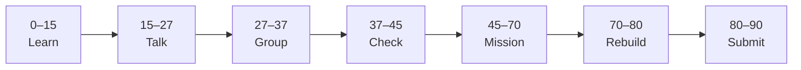

# Lesson 1: HTML Form Structure


| | |
|:---|:---|
| **Time** | 90 minutes |
| **Evidence** | student repo + phase folder |

> [!TIP]
> Mission card → **45–70 Mission Task** → **70–80 Rebuild/Exit** → submit evidence.

**Your repo:** `[studentName]-Full-Stack-Web-and-AI-Application`

## Lesson Goal

By the end of this lesson, each student should be able to:

1. Explain what a web form is used for.
2. Build HTML form structure with `<form>`, `<label>`, `<input>`, `<textarea>`, and `<button>`.
3. Connect each `<label>` to its control with `for` and `id`.
4. Add `name` attributes for future form data submission.
5. Save work in `html-css-first-form/` with at least one commit.
6. Submit evidence of an unstyled working form in the browser.

---

## 90-Minute Class Flow



### 0–15 min: Individual Learning

> [!NOTE]
> **One required resource** for this block — see below. Do not browse extra playlists during class.

**Step A — MDN reading:**

1. Open: https://developer.mozilla.org/en-US/docs/Learn_web_development/Extensions/Forms/Your_first_form
2. Read only:
   - What are web forms?
   - Designing your form
   - Implementing our form HTML (through `<button>`)
3. Do **not** read CSS sections yet.

**Individual notes:**

```text
A web form is for...
action and method on form mean...
Each label needs for because...
input vs textarea difference is...
One thing I still do not understand is...
```

---

### 15–27 min: Talk Robin / Group Discussion

**Share:**

1. Why forms matter for the AI School Assistant later
2. What `type="email"` does
3. What happens when you click a label
4. One question

---

### 27–37 min: Group Answer

```text
A well-structured HTML form must include...
Our group still needs help with...
```

---

### 37–45 min: Entry Points Check

**Teacher checks:**

1. Phase 1 Notion portfolio link still in your README?
2. Editor + browser ready?
3. Can students explain label/input connection?

---

### 45–70 min: Mission Task

**Task:**

1. Create folder `html-css-first-form/`.
2. Build `index.html` with full document structure.
3. Add contact form:
   - Name — `<input type="text">`
   - Email — `<input type="email">`
   - Message — `<textarea>`
   - Submit — `<button type="submit">Send your message</button>`
4. Every label has `for`; every input has matching `id` and `name`.
5. Open in browser; click each label to test focus.
6. Commit: `Add HTML structure for contact form`.

---

### 70–80 min: Independent Rebuild / Exit Check

**Independent rebuild:**

1. Add one more labeled text field without MDN.
2. Explain `action` on `<form>` in one sentence.

---

### 80–90 min: Submission of Evidence

---

## What You Must Submit

1. Screenshot of unstyled form in browser
2. GitHub link to `html-css-first-form/index.html`
3. Commit history screenshot or link
4. One sentence: “Each label needs a for attribute because...”

---

## Success Criteria

1. Form opens in browser with all fields.
2. Labels activate correct fields on click.
3. Meaningful commit on GitHub.
4. Student can explain HTML structure vs CSS (Lesson 2).
5. All evidence submitted.

---

## Common Problems

| Problem | Try first |
|---|---|
| Blank page | Check `<body>` and form inside it. |
| Label click fails | Match `for` on label to `id` on input. |

---

## Fast Track Option

Continue into [Lesson 2](lesson-02-html-form-styling-and-github.md) in the same block if evidence is complete.
