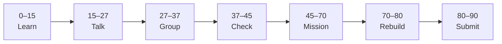

# Lesson 2: Form Styling and GitHub Evidence


| | |
|:---|:---|
| **Time** | 90 minutes |
| **Evidence** | student repo + phase folder |

> [!TIP]
> Mission card → **45–70 Mission Task** → **70–80 Rebuild/Exit** → submit evidence.

**Your repo:** `[studentName]-Full-Stack-Web-and-AI-Application`

## Lesson Goal

By the end of this lesson, each student should be able to:

1. Style the contact form with CSS (linked file or `<style>` block).
2. Customize at least three properties beyond the MDN default example.
3. Name the three `name` attributes and explain what data the form would send.
4. Add folder `README.md` documenting the project.
5. Make at least two meaningful commits across Lessons 1–2.
6. Submit complete Phase 2 evidence on GitHub.

---

## 90-Minute Class Flow



### 0–15 min: Individual Learning

> [!NOTE]
> **One required resource** for this block — see below. Do not browse extra playlists during class.

**Step A — MDN reading:**

1. Open: https://developer.mozilla.org/en-US/docs/Learn_web_development/Extensions/Forms/Your_first_form
2. Read only:
   - Basic form styling
   - Sending form data to your web server
   - Summary

**Individual notes:**

```text
Three name attributes on my form are...
Three name/value pairs sent are...
One CSS rule I will change is...
fetch/server is not required today because...
One thing I still do not understand is...
```

---

### 15–27 min: Talk Robin / Group Discussion

**Share:**

1. HTML gives structure; CSS gives style because...
2. What `user_name`, `user_email`, `user_message` mean
3. One design choice you made
4. One question

---

### 27–37 min: Group Answer

```text
Our form is ready to submit as evidence when...
Our group still needs help with...
```

---

### 37–45 min: Entry Points Check

**Teacher checks:**

1. Lesson 1 HTML complete?
2. CSS linked correctly?
3. Students know difference between `get` and `post` at high level?

---

### 45–70 min: Mission Task

**Task:**

1. Add MDN basic form CSS to `style.css` or `<head>` `<style>`.
2. Change **at least three** of: colors, border-radius, fonts, spacing, button style.
3. Add `README.md`:

```md
# HTML/CSS First Form

## What This Is
Contact form from MDN Your first form tutorial.

## Form Data
- user_name
- user_email
- user_message

## What I Learned
```

4. Commit: `Style contact form and add README`.
5. Optional: add link in Notion Learning Projects.

---

### 70–80 min: Independent Rebuild / Exit Check

Point to one HTML tag, one CSS rule, and three `name` attributes without notes.

---

### 80–90 min: Submission of Evidence

---

## What You Must Submit

1. Screenshot of styled form
2. GitHub folder with `index.html`, CSS, `README.md`
3. Two+ meaningful commits across Phase 2 lessons
4. Written answer: three name/value pairs your form sends
5. One sentence: “This form is like our AI app because...”

---

## Success Criteria

1. CSS visibly improves the form.
2. README complete in student’s own words.
3. Can explain `name` attributes and HTML vs CSS.
4. All evidence submitted.

---

## Common Problems

| Problem | Try first |
|---|---|
| CSS not applied | Check `<link href="style.css">` path. |
| Copied MDN exactly | Change at least three visual properties. |
| Missing names | Add `name` to every data field. |

---

## Fast Track Option

Preview [Phase 3 JavaScript](../Phase_3_JavaScript/) if Phase 2 evidence is complete and teacher approves.

---

## After Phase 2

Next: [Phase 3: JavaScript](../Phase_3_JavaScript/)
