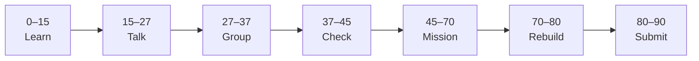

# Lesson 1: JavaScript Foundations in the Browser


| | |
|:---|:---|
| **Time** | 90 minutes |
| **Evidence** | student repo + phase folder |

> [!TIP]
> Mission card → **45–70 Mission Task** → **70–80 Rebuild/Exit** → submit evidence.

**Your repo:** `[studentName]-Full-Stack-Web-and-AI-Application`

## Lesson Goal

By the end of this lesson, each student should be able to:

1. Connect `script.js` to `index.html` and run code in the browser Console.
2. Use variables, operators, and `console.log` to inspect values.
3. Write one conditional, one loop over an array, and one simple function.
4. Explain what HTML, CSS, and JavaScript each do on one web page.
5. Create the `javascript-interactive-profile/` folder with at least two meaningful commits.
6. Submit evidence that proves the work was completed.

---

## 90-Minute Class Flow



### 0–15 min: Individual Learning

> [!NOTE]
> **One required resource** for this block — see below. Do not browse extra playlists during class.

Students work individually first.

**Required resource — Scrimba (complete all 5 scrims in order):**

Open: https://v1.scrimba.com/playlist/pQxQdTM

| # | Scrim | Focus |
|---|---|---|
| 1 | Programming Foundations: Getting Set up with JavaScript | Link JS to HTML, open Console |
| 2 | Programming Foundations: Intro to Variables and Operators | `let` / `const`, basic operators |
| 3 | Programming Foundations: Conditional Statements | `if` / `else` |
| 4 | Programming Foundations: Arrays and Loops | arrays, `for` loop |
| 5 | Programming Foundations: Introduction to Functions | declare and call a function |

The playlist is about **25 minutes**. If you do not finish scrim 5 before 15 minutes, pause at a natural break and continue during Talk Robin only if your teacher allows quiet catch-up.

**Optional (prior programming only):** skim [student-handout-js-syntax-bridge.md](student-handout-js-syntax-bridge.md) for Python ↔ JS comparisons — do not skip the Scrimba scrims.

**Individual notes:**

```text
My script tag is placed...
console.log helps me because...
One variable I declared is...
One conditional I wrote in Scrimba does...
One array + loop idea I learned is...
One function I wrote takes ___ and returns ___
HTML on my page is for...
CSS on my page is for...
JavaScript on my page is for...
One thing I still do not understand is...
```

**Student output:** Completed notes + all 5 scrims marked done on Scrimba (or scrims 1–4 + partial 5 with teacher note).

---

### 15–27 min: Talk Robin / Group Discussion

Each student speaks once before anyone speaks twice.

**Share:**

1. Where `script.js` must be linked in HTML
2. One variable or operator example from Scrimba
3. One conditional or loop idea you understood
4. One confusion or question

**Student output:** Group list of clear ideas and unclear questions.

---

### 27–37 min: Group Answer

As a group, prepare one shared answer:

```text
On one web page, HTML...
On one web page, CSS...
On one web page, JavaScript...
Variables in JavaScript are like ___ because...
Our group still needs help with...
```

**Student output:** One group answer.

---

### 37–45 min: Entry Points Check

**Teacher checks:**

1. Can students explain the three layers without saying only “code”?
2. Do students know how to open DevTools Console (F12)?
3. Can students name all five Scrimba topics (variables, conditionals, arrays/loops, functions)?
4. Which questions appear across multiple groups?

**Teacher explanation rule:** Explain only the unclear parts. Do not run a full teacher-demo-first lesson.

---

### 45–70 min: Mission Task

**Mission resource, if needed:** Scrimba playlist scrims 1 and 5 only — do not re-watch the full playlist during the mission.

**Task:**

1. In `[studentName]-Full-Stack-Web-and-AI-Application`, create folder `javascript-interactive-profile/`.
2. Create `index.html` with basic structure and a short heading with your name.
3. Create `script.js` that includes **all** of the following (use your own values):

```javascript
console.log("JavaScript is connected to my profile page.");

const studentName = "Your Name";
const coursePhase = "Phase 3 JavaScript";
console.log("Student:", studentName, "|", coursePhase);

const skillLevel = 2; // change to a number that fits you
if (skillLevel < 3) {
  console.log("Still building my JavaScript foundations.");
} else {
  console.log("Ready for harder challenges.");
}

const goals = ["HTML", "CSS", "JavaScript", "AI project"];
for (let i = 0; i < goals.length; i++) {
  console.log("Goal", i + 1 + ":", goals[i]);
}

function greetStudent(name) {
  return "Welcome, " + name + "!";
}
console.log(greetStudent(studentName));
```

4. Link `script.js` before `</body>` in `index.html`.
5. Open the page in a browser → DevTools → Console. Confirm all messages appear with **no red errors**.
6. Commit with message: `Add JavaScript foundations to profile page`.

**Mission output:**

- GitHub folder link
- Console screenshot showing log output (including loop and function messages)
- At least one meaningful commit

---

### 70–80 min: Independent Rebuild / Exit Check

> [!IMPORTANT]
> Independent work: close course videos, notes, AI tools, and follow-along code before this block.

Students repeat independently **without opening Scrimba**.

**Independent rebuild task:**

1. Add a new function `describePhase(phase)` that returns a short string about Phase 3.
2. Call it and log the result with `console.log`.
3. Change one value in the `goals` array and confirm the loop output updates.
4. Commit: `Add describePhase function and update goals`.

**Exit prompts:**

```text
My script tag is placed...
A function is different from a loop because...
One thing I can do without Scrimba is...
One thing I still need help with is...
```

**Oral check if called:** Explain HTML vs CSS vs JavaScript on your page, then read one line of your function aloud and say what it returns.

---

### 80–90 min: Submission of Evidence

Submit evidence before leaving class.

---

## What You Must Submit

1. GitHub link to `javascript-interactive-profile/`
2. Screenshot of DevTools Console with variable, conditional, loop, and function output visible
3. Screenshot or link showing commit history (at least two meaningful commits)
4. Scrimba playlist progress screenshot (all 5 scrims complete) **or** teacher sign-off if scrim 5 was finished in class
5. One sentence: “Today I learned JavaScript foundations in the browser by...”

---

## Success Criteria

You are successful if:

1. `script.js` is linked and runs without Console errors.
2. Your code uses a variable, conditional, array loop, and function (not copied blindly — you can change values).
3. Your folder exists in your course repository with at least two meaningful commits.
4. You can explain HTML, CSS, and JavaScript roles in your own words.
5. You submitted all required evidence.

---

## Common Problems

| Problem | Try first |
|---|---|
| Console is empty | Check `<script src="script.js">` path; hard refresh (Ctrl+F5). |
| Red error in Console | Read the line number; check missing `}` , `)` , or quote. |
| Loop prints nothing | Check `goals.length` and that the array is not empty. |
| Function returns `undefined` | Make sure you used `return` inside the function. |
| Scrimba scrim won't play | Use desktop browser; log in to Scrimba if prompted — playlist is free. |

---

## Fast Track Option

If most students finish all 5 scrims and the mission in about 45 minutes, continue into [Lesson 2](lesson-02-dom-selection-and-content.md) during the same 90-minute block — start DOM selection only, not the full lesson.

Use this only if students submitted evidence and passed the independent rebuild without Scrimba.

If more than one third of the class is still stuck, use the remaining time for Console checks and oral explanation.

---

Educational materials in this folder are copyright © 2026 Wang Morgan. All Rights Reserved.
