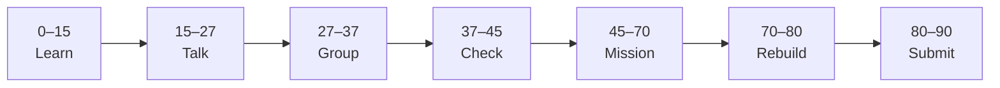

# Lesson 2: The DOM


| | |
|:---|:---|
| **Time** | 90 minutes |
| **Evidence** | student repo + phase folder |

> [!TIP]
> Mission card → **45–70 Mission Task** → **70–80 Rebuild/Exit** → submit evidence.

**Your repo:** `[studentName]-Full-Stack-Web-and-AI-Application`

## Lesson Goal

By the end of this lesson, each student should be able to:

1. Explain what the DOM is in one sentence.
2. Select elements with `document.querySelector` (and name when `querySelectorAll` helps).
3. Change text, create or modify elements, and update at least one style from JavaScript.
4. Attach a click event with `addEventListener` and a named function.
5. Commit DOM and event changes with meaningful messages.
6. Submit evidence that the page changes without reloading.

> **Prerequisite:** [Lesson 1](lesson-01-javascript-in-the-browser.md) complete — `javascript-interactive-profile/` exists with working `script.js`.

---

## 90-Minute Class Flow



### 0–15 min: Individual Learning

> [!NOTE]
> **One required resource** for this block — see below. Do not browse extra playlists during class.

Students work individually first.

**Required resource — Coursera Module 7 (complete the full module):**

Open: https://www.coursera.org/learn/javascript-deep-dive/home/module/7

Course home (if link fails): https://www.coursera.org/learn/javascript-deep-dive

| Topic in Module 7 | What to focus on |
|---|---|
| What is the DOM? | DOM = live tree of page elements JavaScript can change |
| Get single and multiple elements | `querySelector`, `querySelectorAll` |
| Creating and modifying HTML elements | `createElement`, `append`, `textContent` |
| Dynamically add CSS styles | `element.style`, class ideas from scrims |
| Understand and work with events | `addEventListener`, click handlers |
| Module challenges | Finish both DOM and Events challenges if assigned |

Module 7 is about **1 hour** on Coursera (Scrimba interactive scrims + assignment). If you do not finish before 15 minutes, complete the **Events** scrims during quiet catch-up only if your teacher allows.

**Individual notes:**

```text
The DOM is...
querySelector("#id") returns...
querySelectorAll is different because...
textContent changes...
createElement lets me...
addEventListener("click", myFunction) means...
One thing I still do not understand is...
```

**Student output:** Completed notes + Module 7 progress screenshot (or teacher sign-off).

---

### 15–27 min: Talk Robin / Group Discussion

Each student speaks once before anyone speaks twice.

**Share:**

1. What the DOM is
2. Difference between `#id` and `.class` in a selector
3. What happens if `querySelector` returns `null`
4. One event-listener idea from Module 7

**Student output:** Group list of clear ideas and unclear questions.

---

### 27–37 min: Group Answer

As a group, prepare one shared answer:

```text
To change text on a page with JavaScript, you first...
To respond to a click, you need...
Our group still needs help with...
```

**Student output:** One group answer.

---

### 37–45 min: Entry Points Check

**Teacher checks:**

1. Does Lesson 1 `script.js` still run without errors?
2. Does HTML have elements with `id` attributes ready for selectors?
3. Can students explain `textContent` vs copying random `innerHTML` from the web?
4. Can students pass a function name to `addEventListener` without `()`?

**Teacher explanation rule:** Explain only the unclear parts. Do not run a full teacher-demo-first lesson.

---

### 45–70 min: Mission Task

**Mission resource, if needed:** Coursera Module 7 — **Events** scrim only. Do not re-watch the full module during the mission.

**Task:**

1. Open `javascript-interactive-profile/index.html`.
2. Add or update:

```html
<h1 id="profile-name">Your Name</h1>
<p id="profile-tagline">Learning full-stack web and AI</p>
<button id="show-goal-btn" type="button">Show my course goal</button>
<p id="course-goal"></p>
```

3. In `script.js`, add DOM updates (keep Lesson 1 console code or move useful parts into functions):

```javascript
const nameEl = document.querySelector("#profile-name");
const taglineEl = document.querySelector("#profile-tagline");
const btn = document.querySelector("#show-goal-btn");
const goalEl = document.querySelector("#course-goal");

nameEl.textContent = "Your Real Name";
taglineEl.textContent = "Building my interactive portfolio with JavaScript.";
taglineEl.style.color = "#2563eb";

function showGoal() {
  if (goalEl.textContent === "") {
    goalEl.textContent = "I want to build full-stack AI apps responsibly.";
  } else {
    goalEl.textContent = "";
  }
}

btn.addEventListener("click", showGoal);
```

4. Refresh the browser — text, color, and button toggle must work with **no red Console errors**.
5. Commit: `Add DOM updates and click handler from Module 7`.

**Mission output:**

- Screenshot of updated page (before and after one button click)
- GitHub link to `script.js` (DOM + event sections visible)

---

### 70–80 min: Independent Rebuild / Exit Check

> [!IMPORTANT]
> Independent work: close course videos, notes, AI tools, and follow-along code before this block.

Students repeat independently **without opening Coursera**.

**Independent rebuild task:**

1. Add `<p id="course-phase">Phase 3 JavaScript</p>`.
2. Change its text from JavaScript when the user clicks a **new** button you add (`#update-phase-btn`).
3. Commit: `Add second button to update course phase text`.

**Exit prompts:**

```text
My selector for the profile name is...
My event listener is attached to...
One thing I can do without Coursera is...
One thing I still need help with is...
```

**Oral check if called:** Point to selector, element, style property, and explain “When the user clicks..., JavaScript...”

---

### 80–90 min: Submission of Evidence

Submit evidence before leaving class.

---

## What You Must Submit

1. Screenshot of page showing JS-updated content and style
2. Screenshot before click and after click on `#show-goal-btn`
3. GitHub link to `script.js` (DOM + `addEventListener` visible)
4. Coursera Module 7 completion screenshot **or** teacher sign-off
5. One sentence: “The DOM is...”
6. Commit history screenshot or link

---

## Success Criteria

You are successful if:

1. At least two elements updated from JavaScript (text + style).
2. Button click toggles `#course-goal` text using a function + `addEventListener`.
3. No Console errors on load or click.
4. Meaningful commit message(s).
5. All evidence submitted.

---

## Common Problems

| Problem | Try first |
|---|---|
| `Cannot read properties of null` | Check `id` spelling in HTML and selector (`#` for id). |
| Nothing changes | Script before `</body>`; save all files; hard refresh (Ctrl+F5). |
| Button does nothing | Pass `showGoal`, not `showGoal()`. |
| Wrong element selected | `#` for id, `.` for class. |

---

## Fast Track Option

If most students finish Module 7 and the mission early, continue into [Lesson 3](lesson-03-events-and-functions.md) during the same block — start Coursera Module 8 intro only if teacher approves and Lesson 2 evidence is complete.

---

Educational materials in this folder are copyright © 2026 Wang Morgan. All Rights Reserved.
