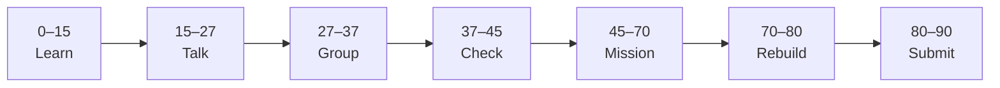

# Lesson 3: Asynchronous JavaScript


| | |
|:---|:---|
| **Time** | 90 minutes |
| **Evidence** | student repo + phase folder |

> [!TIP]
> Mission card → **45–70 Mission Task** → **70–80 Rebuild/Exit** → submit evidence.

**Your repo:** `[studentName]-Full-Stack-Web-and-AI-Application`

## Lesson Goal

By the end of this lesson, each student should be able to:

1. Explain the difference between synchronous and asynchronous JavaScript in simple words.
2. Describe what a Promise is at a beginner level (something that finishes later).
3. Use `async` / `await` with `fetch` to load JSON and show one value on the page.
4. Show a loading state while data is being fetched (text change or button disable).
5. Commit async fetch code with a meaningful message.
6. Submit before/after screenshots as evidence.

> **Prerequisite:** [Lesson 2](lesson-02-dom-selection-and-content.md) complete — DOM selection and click handlers work.

> **Note:** [Lesson 5](lesson-05-debugging-and-fetch-preview.md) will add local `data.json`, debug logging, and AI-app connections. Today focuses on **Module 8 concepts** and one working `fetch` demo.

---

## 90-Minute Class Flow



### 0–15 min: Individual Learning

> [!NOTE]
> **One required resource** for this block — see below. Do not browse extra playlists during class.

Students work individually first.

**Required resource — Coursera Module 8 (complete the full module):**

Open: https://www.coursera.org/learn/javascript-deep-dive/home/module/8

Course home (if link fails): https://www.coursera.org/learn/javascript-deep-dive

| Topic in Module 8 | What to focus on |
|---|---|
| Synchronous vs asynchronous | Why waiting for network data blocks the page if done wrong |
| Callbacks | Functions that run later (preview only) |
| Promises | `.then()` — “work finishes later, then run this” |
| `async` / `await` | Cleaner way to wait for `fetch` and `.json()` |
| Module challenges / assignment | Finish assigned items before mission |

Module 8 is about **1 hour** on Coursera. If you do not finish before 15 minutes, prioritize **Promises** and **async/await** scrims; finish the rest during quiet catch-up only if your teacher allows.

**Individual notes:**

```text
Synchronous code runs...
Asynchronous code is needed when...
A Promise is...
async function means...
await fetch(...) waits for...
One thing I still do not understand is...
```

**Student output:** Completed notes + Module 8 progress screenshot (or teacher sign-off).

---

### 15–27 min: Talk Robin / Group Discussion

Each student speaks once before anyone speaks twice.

**Share:**

1. Why `fetch` is asynchronous
2. What `await` does in an `async function`
3. What the user should see while data is loading
4. One question

**Student output:** Group list of clear ideas and unclear questions.

---

### 27–37 min: Group Answer

As a group, prepare one shared answer:

```text
We use async/await with fetch because...
If fetch fails, we should...
Our group still needs help with...
```

**Student output:** One group answer.

---

### 37–45 min: Entry Points Check

**Teacher checks:**

1. Do Lesson 2 DOM and click handlers still work?
2. Can students write `async function` without syntax errors?
3. Can students open DevTools Console and Network tab?
4. Which questions appear across multiple groups?

**Teacher explanation rule:** Explain only the unclear parts. Do not run a full teacher-demo-first lesson.

---

### 45–70 min: Mission Task

**Mission resource, if needed:** Coursera Module 8 — **async/await** scrim only.

**Task:**

1. Add to `index.html`:

```html
<button id="load-quote-btn" type="button">Load course quote</button>
<p id="quote-line">Click the button to load a quote.</p>
```

2. Add to `script.js`:

```javascript
const loadBtn = document.querySelector("#load-quote-btn");
const quoteEl = document.querySelector("#quote-line");

async function loadQuote() {
  quoteEl.textContent = "Loading...";
  loadBtn.disabled = true;

  try {
    const response = await fetch("https://jsonplaceholder.typicode.com/todos/1");
    const data = await response.json();
    quoteEl.textContent = "Async demo: " + data.title;
  } catch (error) {
    quoteEl.textContent = "Could not load data. Check Console.";
    console.error(error);
  } finally {
    loadBtn.disabled = false;
  }
}

loadBtn.addEventListener("click", loadQuote);
```

3. Test: click button → “Loading...” → quote text appears. No uncaught errors in Console.
4. Add one comment in your own words: `// async/await — preview for AI app data later`
5. Commit: `Add async fetch demo from Module 8`.

**Mission output:**

- Screenshot before click and after data loads
- Optional: Network tab screenshot showing the request
- GitHub link to `script.js` (`async function` + `fetch` visible)

---

### 70–80 min: Independent Rebuild / Exit Check

> [!IMPORTANT]
> Independent work: close course videos, notes, AI tools, and follow-along code before this block.

Students repeat independently **without opening Coursera**.

**Independent rebuild task:**

1. Change the fetch URL to `https://jsonplaceholder.typicode.com/users/1` and display `data.name` instead of `title`.
2. Explain aloud: “`fetch` returns a Promise because...” and “`await` helps because...”
3. Commit: `Fetch user name with async await`.

**Exit prompts:**

```text
My async function is called...
While fetch runs, the user sees...
One thing I can explain without notes is...
One thing I still need help with is...
```

**Oral check if called:** Explain sync vs async using your button demo.

---

### 80–90 min: Submission of Evidence

Submit evidence before leaving class.

---

## What You Must Submit

1. Screenshot before click and after quote loads
2. GitHub link showing `async`, `await`, and `fetch` in `script.js`
3. Coursera Module 8 completion screenshot **or** teacher sign-off
4. One sentence: “Asynchronous JavaScript matters for our AI app because...”
5. Commit history link or screenshot

---

## Success Criteria

You are successful if:

1. Button triggers `async` fetch — page updates only after user click.
2. Loading text or disabled button shows while waiting.
3. `try` / `catch` handles a failed fetch without crashing the page.
4. You can explain Promise / async at a beginner level in your own words.
5. All evidence submitted.

---

## Common Problems

| Problem | Try first |
|---|---|
| `await` syntax error | Wrap code in `async function`. |
| `Failed to fetch` | Check URL; use school network; try jsonplaceholder URL exactly. |
| Button stays disabled | Check `finally` block sets `disabled = false`. |
| CORS error on random API | Use the jsonplaceholder URL above or ask teacher. |

---

## Fast Track Option

Continue into [Lesson 4](lesson-04-arrays-and-render-lists.md) in the same block only if Lesson 3 evidence is complete and teacher approves.

---

Educational materials in this folder are copyright © 2026 Wang Morgan. All Rights Reserved.
