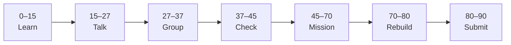

# Lesson 1: JSX and First React Components


| | |
|:---|:---|
| **Time** | 90 minutes |
| **Evidence** | student repo + phase folder |

> [!TIP]
> Mission card → **45–70 Mission Task** → **70–80 Rebuild/Exit** → submit evidence.

**Your repo:** `[studentName]-Full-Stack-Web-and-AI-Application`

## Lesson Goal

By the end of this lesson, each student should be able to:

1. Explain why React uses components and JSX.
2. Set up a Vite + React project in `react-practice/`.
3. Write and render a first React component.
4. Link the project README to Phase 4 goals.
5. Make at least one meaningful commit.
6. Submit Coursera Module 1 progress and repo evidence.

---

## 90-Minute Class Flow



### 0–15 min: Individual Learning

> [!NOTE]
> **One required resource** for this block — see below. Do not browse extra playlists during class.

**Required resource — complete [Learn React Module 1](https://www.coursera.org/learn/learn-react/home/module/1):** Static pages in React 01 — Getting Started (~1 hour on Coursera; finish as much as possible in class, rest as homework if needed).

Focus: first React code, JSX, composable/declarative ideas, local setup with Vite.

**Individual notes:**

```text
JSX is...
A React component is...
Why React is composable means...
Why React is declarative means...
My Vite project folder is...
One thing I still do not understand is...
```

**Student output:** Notes + Module 1 progress screenshot (or teacher sign-off).

---

### 15–27 min: Talk Robin / Group Discussion

**Share:** JSX vs plain HTML; what a component is; one Coursera scrim that helped; one question.

---

### 27–37 min: Group Answer

```text
We use components because...
JSX helps us because...
Our group still needs help with...
```

---

### 37–45 min: Entry Points Check

**Teacher checks:** Node.js installed; students enrolled in Learn React; can open `react-practice/` in editor.

---

### 45–70 min: Mission Task

1. Create `react-practice/` with Vite + React (follow Module 1 / teacher command).
2. Replace default app with a component that shows your name and course phase: `Phase 4 React & Next.js`.
3. Add `README.md`: what the folder is for, how to run `npm run dev`.
4. Commit: `Start react-practice with first component`.

---

### 70–80 min: Independent Rebuild / Exit Check

Add a second line in JSX (e.g. your learning goal) **without** re-opening Coursera. Commit: `Add learning goal to first component`.

**Oral check:** What is JSX?

---

### 80–90 min: Submission of Evidence

---

## What You Must Submit

1. GitHub link to `react-practice/`
2. Screenshot of running app in browser
3. Coursera Module 1 progress screenshot
4. Commit history link or screenshot

---

## Success Criteria

1. Vite app runs with your custom component visible.
2. README explains how to start the dev server.
3. At least one meaningful commit.
4. All evidence submitted.

---

## Common Problems

| Problem | Try first |
|---|---|
| `npm` not found | Install Node.js LTS; restart terminal. |
| Blank page | Check `main.jsx` imports and console errors. |
| Coursera scrim won't play | Desktop browser; allow cookies; try later. |

---

## Fast Track Option

If finished early, preview Module 2 scrims only — do not skip Lesson 2 mission.

---

Educational materials in this folder are copyright © 2026 Wang Morgan. All Rights Reserved.
