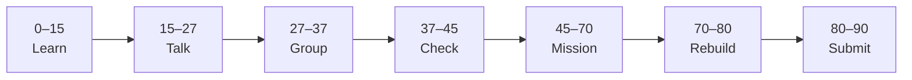

# Lesson 2: Components and Styling


| | |
|:---|:---|
| **Time** | 90 minutes |
| **Evidence** | student repo + phase folder |

> [!TIP]
> Mission card → **45–70 Mission Task** → **70–80 Rebuild/Exit** → submit evidence.

**Your repo:** `[studentName]-Full-Stack-Web-and-AI-Application`

## Lesson Goal

By the end of this lesson, each student should be able to:

1. Split UI into parent and child components.
2. Style React components with CSS classes.
3. Organize files in a simple component folder structure.
4. Explain fragments or wrapper patterns when needed.
5. Commit component refactor with a meaningful message.
6. Submit Module 2 evidence and updated repo.

> **Prerequisite:** [Lesson 1](lesson-01-jsx-and-first-components.md) — `react-practice/` runs.

---

## 90-Minute Class Flow



### 0–15 min: Individual Learning

> [!NOTE]
> **One required resource** for this block — see below. Do not browse extra playlists during class.

**Required resource — complete [Learn React Module 2](https://www.coursera.org/learn/learn-react/home/module/2):** Static pages in React 02 — Building with React (~1 hour).

Focus: custom components, parent/child, fragments, styling with classes, project structure (ReactFacts-style).

**Individual notes:**

```text
A parent component passes structure by...
I styled my component using...
Organizing components in folders helps because...
One thing I still do not understand is...
```

---

### 15–27 min: Talk Robin / Group Discussion

**Share:** Your component tree (Header + Main); one CSS class naming choice; one question.

---

### 27–37 min: Group Answer

```text
Good component structure for a portfolio page includes...
Styling in React is different from HTML-only because...
Our group still needs help with...
```

---

### 37–45 min: Entry Points Check

**Teacher checks:** Lesson 1 app still runs; students can name two components in their plan.

---

### 45–70 min: Mission Task

1. In `react-practice/`, create at least **two components** (e.g. `Header`, `MainContent`).
2. Add a CSS file; style header background and main text color (match your Notion/portfolio colors if you have them).
3. Compose them in `App.jsx`.
4. Commit: `Add Header and MainContent with CSS classes`.

---

### 70–80 min: Independent Rebuild / Exit Check

Add a `Footer` component with one styled line. Commit without Coursera open.

---

### 80–90 min: Submission of Evidence

---

## What You Must Submit

1. Screenshot of styled multi-component page
2. GitHub link showing component files + CSS
3. Coursera Module 2 progress screenshot
4. One sentence: “Components help my UI because...”

---

## Success Criteria

1. At least two custom components composed in App.
2. Visible CSS styling (not inline-only defaults).
3. Meaningful commit.
4. All evidence submitted.

---

## Common Problems

| Problem | Try first |
|---|---|
| Styles not applied | Import CSS in component or `main.jsx`; check class names. |
| Component not showing | Export default; import path correct. |

---

## Fast Track Option

Continue to [Lesson 3](lesson-03-props-and-reusable-components.md) only if Module 2 and mission evidence are complete.

---

Educational materials in this folder are copyright © 2026 Wang Morgan. All Rights Reserved.
