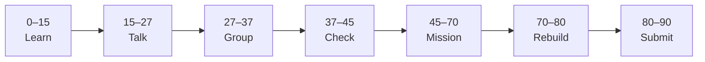

# Lesson 3: Props and Reusable Components


| | |
|:---|:---|
| **Time** | 90 minutes |
| **Evidence** | student repo + phase folder |

> [!TIP]
> Mission card → **45–70 Mission Task** → **70–80 Rebuild/Exit** → submit evidence.

**Your repo:** `[studentName]-Full-Stack-Web-and-AI-Application`

## Lesson Goal

By the end of this lesson, each student should be able to:

1. Pass data into child components with props.
2. Destructure props in function components.
3. Build one reusable card component used twice with different props.
4. Use JavaScript expressions inside JSX where appropriate.
5. Commit props refactor with a meaningful message.
6. Submit Module 4 evidence.

---

## 90-Minute Class Flow



### 0–15 min: Individual Learning

> [!NOTE]
> **One required resource** for this block — see below. Do not browse extra playlists during class.

**Required resource — complete [Learn React Module 4](https://www.coursera.org/learn/learn-react/home/module/4):** Data-Driven React 01 — Understanding Props (~1 hour).

**Individual notes:**

```text
Props are...
Destructuring props looks like...
I reused a component by passing...
One thing I still do not understand is...
```

---

### 15–27 min: Talk Robin / Group Discussion

**Share:** props vs hard-coded text; one non-string prop idea; one question.

---

### 27–37 min: Group Answer

```text
Props make components reusable because...
Our group still needs help with...
```

---

### 37–45 min: Entry Points Check

**Teacher checks:** Can students explain props direction (parent → child)?

---

### 45–70 min: Mission Task

1. Create `ProjectCard.jsx` accepting props: `title`, `description`, `status`.
2. Render **two** `<ProjectCard />` instances with different prop values in `App.jsx`.
3. Commit: `Add reusable ProjectCard with props`.

---

### 70–80 min: Independent Rebuild / Exit Check

Add a third card via props only — no copy-paste of JSX structure. Commit.

---

### 80–90 min: Submission of Evidence

---

## What You Must Submit

1. Screenshot showing three different cards (or two if fast track last lesson)
2. GitHub link to `ProjectCard.jsx` and usage in App
3. Coursera Module 4 progress screenshot
4. One sentence: “Props are like function parameters because...”

---

## Success Criteria

1. One component reused with different props.
2. Props destructured or accessed clearly.
3. Meaningful commit.
4. All evidence submitted.

---

## Common Problems

| Problem | Try first |
|---|---|
| All cards show same text | Pass different prop values on each instance. |
| `props is undefined` | Check component parameter and spelling. |

---

## Fast Track Option

Preview Module 5 mapping scrims if Module 4 is done early.

---

Educational materials in this folder are copyright © 2026 Wang Morgan. All Rights Reserved.
