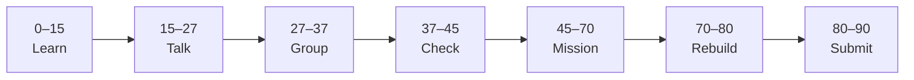

# Lesson 4: Lists, map, and Keys


| | |
|:---|:---|
| **Time** | 90 minutes |
| **Evidence** | student repo + phase folder |

> [!TIP]
> Mission card → **45–70 Mission Task** → **70–80 Rebuild/Exit** → submit evidence.

**Your repo:** `[studentName]-Full-Stack-Web-and-AI-Application`

## Lesson Goal

By the end of this lesson, each student should be able to:

1. Store list data in a JavaScript array.
2. Render a list of components with `.map()`.
3. Assign a stable `key` prop on each list item.
4. Pass object props or spread object props into child components.
5. Commit list rendering with a meaningful message.
6. Submit Module 5 evidence.

---

## 90-Minute Class Flow



### 0–15 min: Individual Learning

> [!NOTE]
> **One required resource** for this block — see below. Do not browse extra playlists during class.

**Required resource — complete [Learn React Module 5](https://www.coursera.org/learn/learn-react/home/module/5):** Data-Driven React 02 — Arrays and Advanced Props (~1 hour).

**Individual notes:**

```text
I map data to components using...
The key prop is needed because...
Spreading object props means...
One thing I still do not understand is...
```

---

### 15–27 min: Talk Robin / Group Discussion

**Share:** your array data shape; why keys matter; one question.

---

### 27–37 min: Group Answer

```text
Data-driven UI beats copying many JSX blocks because...
Our group still needs help with...
```

---

### 37–45 min: Entry Points Check

**Teacher checks:** Phase 3 array/loop skills still accessible; `key` not equal to array index when possible (teacher explains if needed).

---

### 45–70 min: Mission Task

1. Create an array of at least **three** project objects (`id`, `title`, `description`).
2. Map to `<ProjectCard key={...} ... />` components.
3. Remove hard-coded duplicate cards from Lesson 3.
4. Commit: `Render project list from array with keys`.

---

### 70–80 min: Independent Rebuild / Exit Check

Add one project to the array and confirm UI updates with one code change. Commit.

---

### 80–90 min: Submission of Evidence

---

## What You Must Submit

1. Screenshot of three+ cards from one array
2. GitHub link showing `.map()` and `key` in App or list component
3. Coursera Module 5 progress screenshot
4. One sentence: “Using map in React is like Phase 3 loops because...”

---

## Success Criteria

1. List rendered from array with `.map()`.
2. Each item has a `key`.
3. No duplicate hard-coded cards for the same data.
4. All evidence submitted.

---

## Common Problems

| Problem | Try first |
|---|---|
| Warning about keys | Add unique `key={item.id}`. |
| Empty list | Check array name and map return (return JSX). |

---

## Fast Track Option

Optional: complete Module 6 quiz as homework for certificate.

---

Educational materials in this folder are copyright © 2026 Wang Morgan. All Rights Reserved.
