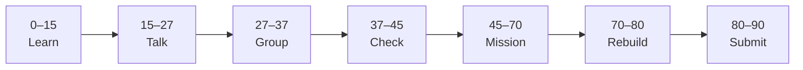

# Lesson 5: State and Events


| | |
|:---|:---|
| **Time** | 90 minutes |
| **Evidence** | student repo + phase folder |

> [!TIP]
> Mission card → **45–70 Mission Task** → **70–80 Rebuild/Exit** → submit evidence.

**Your repo:** `[studentName]-Full-Stack-Web-and-AI-Application`

## Lesson Goal

By the end of this lesson, each student should be able to:

1. Explain props vs state in simple words.
2. Use `useState` to store and update UI state.
3. Attach click handlers that update state (not DOM directly).
4. Start a controlled form field with state.
5. Commit interactive behavior with a meaningful message.
6. Submit Module 7 progress + start Module 8 as homework if needed.

---

## 90-Minute Class Flow



### 0–15 min: Individual Learning

> [!NOTE]
> **One required resource** for this block — see below. Do not browse extra playlists during class.

**Required resource:**

1. Complete [Learn React Module 7](https://www.coursera.org/learn/learn-react/home/module/7): React State 01 (~40 min).
2. Start [Module 8](https://www.coursera.org/learn/learn-react/home/module/8): through `useState` and `Changing state` scrims if time allows.

**Individual notes:**

```text
Props vs state: props are... state is...
useState returns...
When the user clicks, React...
One thing I still do not understand is...
```

---

### 15–27 min: Talk Robin / Group Discussion

**Share:** “When the user clicks my button, React...”; one `useState` example; one question.

---

### 27–37 min: Group Answer

```text
We use useState instead of changing the DOM directly because...
Our group still needs help with...
```

---

### 37–45 min: Entry Points Check

**Teacher checks:** Students import `useState` from `'react'`; no direct `document.querySelector` in new code.

---

### 45–70 min: Mission Task

1. Add a button that toggles visibility of a paragraph or project detail (`useState` boolean).
2. Add one `<input>` whose value is controlled by state (`value` + `onChange`).
3. Commit: `Add useState toggle and controlled input`.

---

### 70–80 min: Independent Rebuild / Exit Check

Add a second button that changes a text label via state. Explain aloud: props vs state.

---

### 80–90 min: Submission of Evidence

---

## What You Must Submit

1. Screenshot before and after toggle click
2. GitHub link showing `useState` and handler in component
3. Coursera Module 7 progress screenshot
4. One sentence: “State is different from props because...”

---

## Success Criteria

1. UI changes on click via state update.
2. One controlled input field.
3. Meaningful commit.
4. All evidence submitted.

---

## Common Problems

| Problem | Try first |
|---|---|
| State not updating | Use setter from `useState`; don't mutate state directly. |
| Input can't type | Missing `onChange` or `value` binding. |

---

## Fast Track Option

Finish Module 8 `useState` scrims before Lesson 6.

---

Educational materials in this folder are copyright © 2026 Wang Morgan. All Rights Reserved.
