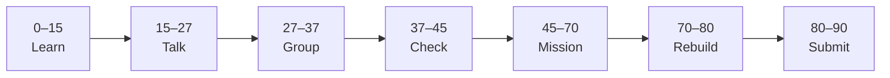

# Lesson 6: Forms and Conditional UI


| | |
|:---|:---|
| **Time** | 90 minutes |
| **Evidence** | student repo + phase folder |

> [!TIP]
> Mission card → **45–70 Mission Task** → **70–80 Rebuild/Exit** → submit evidence.

**Your repo:** `[studentName]-Full-Stack-Web-and-AI-Application`

## Lesson Goal

By the end of this lesson, each student should be able to:

1. Build a small React form with controlled inputs.
2. Use conditional rendering (`&&` or ternary) to show/hide UI.
3. Pass state or callbacks between parent and child components.
4. Explain when to lift state up to a parent.
5. Commit form + conditional UI with a meaningful message.
6. Submit Module 8–9 progress.

---

## 90-Minute Class Flow



### 0–15 min: Individual Learning

> [!NOTE]
> **One required resource** for this block — see below. Do not browse extra playlists during class.

**Required resource:**

1. Finish [Learn React Module 8](https://www.coursera.org/learn/learn-react/home/module/8): forms and complex state (~2 hours total; complete remaining scrims from Lesson 5 + today).
2. Complete [Module 9](https://www.coursera.org/learn/learn-react/home/module/9): conditional rendering and state communication (~1 hour).

**Individual notes:**

```text
Conditional rendering with && means...
I lift state to the parent when...
My form submits or updates state by...
One thing I still do not understand is...
```

---

### 15–27 min: Talk Robin / Group Discussion

**Share:** one conditional UI pattern; one child-to-parent state pattern; one question.

---

### 27–37 min: Group Answer

```text
Conditional UI helps our portfolio because...
Our group still needs help with...
```

---

### 37–45 min: Entry Points Check

**Teacher checks:** Lesson 5 toggle still works; forms use controlled components.

---

### 45–70 min: Mission Task

1. Add a simple “Add project” form: fields for title + description; on submit, append to projects array in state.
2. Show “No projects yet” when array is empty; show list when not empty (conditional rendering).
3. Optional: extract form into child component; pass setter or handler from parent.
4. Commit: `Add project form with conditional list`.

---

### 70–80 min: Independent Rebuild / Exit Check

Add validation message when title is empty (conditional text). Commit.

---

### 80–90 min: Submission of Evidence

---

## What You Must Submit

1. Screenshot: empty state and after adding one project
2. GitHub link showing form + conditional render + array state
3. Coursera Module 8–9 progress screenshot
4. One sentence: “Lifting state helps because...”

---

## Success Criteria

1. Form adds items to list in state.
2. Conditional empty vs list UI works.
3. Meaningful commit.
4. All evidence submitted.

---

## Common Problems

| Problem | Try first |
|---|---|
| Form reloads page | `e.preventDefault()` on submit handler. |
| List doesn't update | Use setter with new array `[...prev, newItem]`. |

---

## Fast Track Option

Optional Module 11 quiz as homework for certificate.

---

Educational materials in this folder are copyright © 2026 Wang Morgan. All Rights Reserved.
