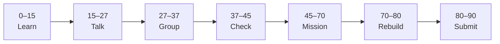

# Lesson 7: useEffect and Fetch in React


| | |
|:---|:---|
| **Time** | 90 minutes |
| **Evidence** | student repo + phase folder |

> [!TIP]
> Mission card → **45–70 Mission Task** → **70–80 Rebuild/Exit** → submit evidence.

**Your repo:** `[studentName]-Full-Stack-Web-and-AI-Application`

## Lesson Goal

By the end of this lesson, each student should be able to:

1. Explain why data fetching in React often uses `useEffect`.
2. Fetch JSON on button click with `async`/`await` inside a handler (Phase 3 skill).
3. Optionally preview `useEffect` for load-on-mount (Module 13).
4. Show loading and error states in the UI.
5. Document how this connects to a future FastAPI call in README.
6. Submit Module 12–13 progress (+ Module 10 API scrims if assigned).

---

## 90-Minute Class Flow



### 0–15 min: Individual Learning

> [!NOTE]
> **One required resource** for this block — see below. Do not browse extra playlists during class.

**Required resource:**

1. Complete [Learn React Module 12](https://www.coursera.org/learn/learn-react/home/module/12): Side Effects 01 (~27 min).
2. Complete [Module 13](https://www.coursera.org/learn/learn-react/home/module/13): `useEffect` and fetch (~1 hour).

Optional if time: Module 10 API integration scrims (skip Sound pads challenges).

**Individual notes:**

```text
useEffect runs when...
fetch in React is similar to Phase 3 because...
Loading state matters because...
This will connect to our AI app when...
One thing I still do not understand is...
```

---

### 15–27 min: Talk Robin / Group Discussion

**Share:** sync vs async in UI; when to use button fetch vs `useEffect`; one question.

---

### 27–37 min: Group Answer

```text
Our React app will call a backend later by...
Our group still needs help with...
```

---

### 37–45 min: Entry Points Check

**Teacher checks:** Phase 3 `async/await` understood; CORS explained for public API vs local backend later.

---

### 45–70 min: Mission Task

1. Add button “Load quote” that `fetch`es `https://jsonplaceholder.typicode.com/todos/1` and displays `title` in state.
2. Show “Loading...” while fetching; show error message on failure.
3. Add to `react-practice/README.md` one bullet: “Next step: call FastAPI from Next.js in course Phase 6–7.”
4. Commit: `Add fetch demo with loading state in React`.

---

### 70–80 min: Independent Rebuild / Exit Check

Change endpoint to `/users/1` and display `name`. Optional: one `useEffect` on mount — explain difference from button fetch.

---

### 80–90 min: Submission of Evidence

---

## What You Must Submit

1. Screenshot after successful fetch
2. GitHub link to fetch handler + loading UI
3. Coursera Module 12–13 progress screenshot
4. README bullet about FastAPI / Next.js next step

---

## Success Criteria

1. Fetch works with loading feedback.
2. Error handled without crashing app.
3. README mentions connection to full-stack course.
4. All evidence submitted.

---

## Common Problems

| Problem | Try first |
|---|---|
| `Failed to fetch` | Check URL; school network; use jsonplaceholder. |
| Infinite re-fetch loop | Check `useEffect` dependency array (teacher help). |

---

## Fast Track Option

Complete `react-practice/README.md` Phase 4 summary section before Lesson 8.

---

Educational materials in this folder are copyright © 2026 Wang Morgan. All Rights Reserved.
