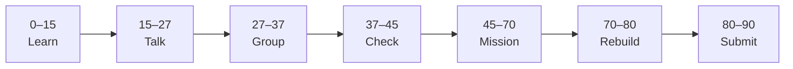

# Lesson 8: Getting Started with Next.js


| | |
|:---|:---|
| **Time** | 90 minutes |
| **Evidence** | student repo + phase folder |

> [!TIP]
> Mission card → **45–70 Mission Task** → **70–80 Rebuild/Exit** → submit evidence.

**Your repo:** `[studentName]-Full-Stack-Web-and-AI-Application`

## Lesson Goal

By the end of this lesson, each student should be able to:

1. Explain how Next.js relates to React (framework on top of React).
2. Create `nextjs-practice/` with `create-next-app` and App Router.
3. Run `npm run dev` and open the default Next.js page.
4. Replace the home page with your name and Phase 4 heading.
5. Commit first Next.js project with meaningful message.
6. Submit [Learn Next.js Module 1](https://www.coursera.org/learn/learn-nextjs/home/module/1) evidence.

> **Prerequisite:** [Lesson 7](lesson-07-useeffect-and-fetch.md) — `react-practice/` complete. Keep `react-practice/`; start a **new** folder for Next.js.

---

## 90-Minute Class Flow



### 0–15 min: Individual Learning

> [!NOTE]
> **One required resource** for this block — see below. Do not browse extra playlists during class.

**Required resource — complete [Learn Next.js Module 1](https://www.coursera.org/learn/learn-nextjs/home/module/1):** Getting Started with Next.js (~1 hour).

Focus: `create-next-app`, App Router basics, how Next extends React.

**Individual notes:**

```text
Next.js is different from Vite React because...
My nextjs-practice folder was created with...
The app/ directory is for...
One thing I still do not understand is...
```

---

### 15–27 min: Talk Robin / Group Discussion

**Share:** React vs Next.js in one sentence; where `page.jsx` lives; one question.

---

### 27–37 min: Group Answer

```text
We use Next.js for our course frontend because...
Our group still needs help with...
```

---

### 37–45 min: Entry Points Check

**Teacher checks:** Node version OK; students know `react-practice/` vs `nextjs-practice/` vs future `nextjs-frontend/`.

---

### 45–70 min: Mission Task

1. Create `nextjs-practice/` using `create-next-app` (JavaScript is OK for Phase 4; TypeScript comes in course Phase 5).
2. Edit `app/page.jsx` (or `.js`): show your name + “Phase 4 — Next.js practice”.
3. Add `README.md`: how to run dev server; link to `react-practice/` as prior step.
4. Commit: `Initialize nextjs-practice with App Router`.

---

### 70–80 min: Independent Rebuild / Exit Check

Add one `<p>` with your learning goal. Commit without Coursera.

---

### 80–90 min: Submission of Evidence

---

## What You Must Submit

1. Screenshot of localhost Next.js page
2. GitHub link to `nextjs-practice/`
3. Coursera Learn Next.js Module 1 screenshot
4. One sentence: “Next.js builds on React by...”

---

## Success Criteria

1. `npm run dev` works for `nextjs-practice/`.
2. Custom home page visible.
3. README documents commands.
4. All evidence submitted.

---

## Common Problems

| Problem | Try first |
|---|---|
| Port in use | `npm run dev -- -p 3001` or close other servers. |
| Wrong folder | Run commands inside `nextjs-practice/`. |

---

## Fast Track Option

Preview Module 2 routing scrims if Module 1 done early.

---

Educational materials in this folder are copyright © 2026 Wang Morgan. All Rights Reserved.
