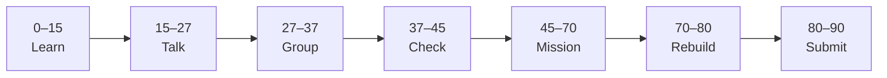

# Lesson 9: Next.js Routing and Layouts


| | |
|:---|:---|
| **Time** | 90 minutes |
| **Evidence** | student repo + phase folder |

> [!TIP]
> Mission card → **45–70 Mission Task** → **70–80 Rebuild/Exit** → submit evidence.

**Your repo:** `[studentName]-Full-Stack-Web-and-AI-Application`

## Lesson Goal

By the end of this lesson, each student should be able to:

1. Create multiple routes with the App Router (`app/` folders).
2. Use a shared `layout.jsx` for header/footer across pages.
3. Link pages with `next/link` (not full page reload).
4. Port one idea from `react-practice/` (e.g. project list) into a Next page as static or props-based UI.
5. Commit routing + layout with meaningful message.
6. Submit [Learn Next.js Module 2](https://www.coursera.org/learn/learn-nextjs/home/module/2) evidence.

---

## 90-Minute Class Flow



### 0–15 min: Individual Learning

> [!NOTE]
> **One required resource** for this block — see below. Do not browse extra playlists during class.

**Required resource — complete [Learn Next.js Module 2](https://www.coursera.org/learn/learn-nextjs/home/module/2):** Building Your First App with Routing (~1 hour).

Focus: PrintForge routing, layouts, navigation, media basics.

**Individual notes:**

```text
A route in App Router is created by...
layout.jsx wraps pages because...
next/link is better than <a> because...
One thing I still do not understand is...
```

---

### 15–27 min: Talk Robin / Group Discussion

**Share:** your planned routes (Home, About, Projects); one layout element; one question.

---

### 27–37 min: Group Answer

```text
Shared layout helps our portfolio because...
Our group still needs help with...
```

---

### 37–45 min: Entry Points Check

**Teacher checks:** Lesson 8 app runs; students can draw a simple route map on paper.

---

### 45–70 min: Mission Task

1. Add routes: `/` (home), `/projects` (list page), `/about` (short bio).
2. Add `app/layout.jsx` with site title and nav links using `Link`.
3. On `/projects`, show at least three project titles (hard-coded array or copied pattern from `react-practice/`).
4. Commit: `Add Next.js routes and shared layout`.

---

### 70–80 min: Independent Rebuild / Exit Check

Add active nav styling or a footer line on all pages via layout. Commit.

---

### 80–90 min: Submission of Evidence

---

## What You Must Submit

1. Screenshot of two different routes + shared nav
2. GitHub link showing `app/` structure and `Link` usage
3. Coursera Module 2 progress screenshot
4. One sentence: “Layouts in Next.js are like...”

---

## Success Criteria

1. At least three routes work via client navigation.
2. Shared layout visible on all pages.
3. Projects page shows list content.
4. All evidence submitted.

---

## Common Problems

| Problem | Try first |
|---|---|
| 404 on route | Folder name must match URL; file must be `page.jsx`. |
| Full page reload | Use `import Link from 'next/link'`. |

---

## Fast Track Option

Preview Module 3 client vs server scrims before Lesson 10.

---

Educational materials in this folder are copyright © 2026 Wang Morgan. All Rights Reserved.
