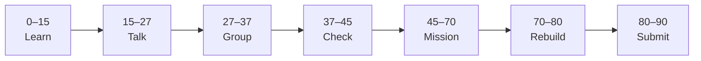

# Lesson 10: Client vs Server Components and Phase 4 Submission


| | |
|:---|:---|
| **Time** | 90 minutes |
| **Evidence** | student repo + phase folder |

> [!TIP]
> Mission card → **45–70 Mission Task** → **70–80 Rebuild/Exit** → submit evidence.

**Your repo:** `[studentName]-Full-Stack-Web-and-AI-Application`

## Lesson Goal

By the end of this lesson, each student should be able to:

1. Explain client vs server components in beginner terms.
2. Mark an interactive component with `'use client'` and use `useState` in Next.js.
3. Add one dynamic route or dynamic segment (Module 3 concept).
4. Complete Phase 4 evidence checklist in repo and Notion.
5. Orally explain the path from Phase 4 → course Phase 5 TypeScript → Phase 6 `nextjs-frontend/`.
6. Submit all Phase 4 evidence including both Coursera courses progress.

---

## 90-Minute Class Flow



### 0–15 min: Individual Learning

> [!NOTE]
> **One required resource** for this block — see below. Do not browse extra playlists during class.

**Required resource — complete [Learn Next.js Module 3](https://www.coursera.org/learn/learn-nextjs/home/module/3):** Components, Links & Dynamic Pages (~1 hour).

Include: component types, **client vs server components**, dynamic routing (PrintForge / model-based pages).

Reference: [Client vs server aside](https://www.coursera.org/learn/learn-nextjs/ungradedWidget/cBgd0/aside-client-vs-server-components) in Module 3 if linked from course.

**Individual notes:**

```text
Server components run...
Client components need 'use client' when...
Dynamic routes use...
After Phase 4 I will learn TypeScript in...
The AI School Assistant frontend will live in...
One thing I still do not understand is...
```

---

### 15–27 min: Talk Robin / Group Discussion

**Share:** when you need `'use client'`; one dynamic route idea; one question about Phase 6.

---

### 27–37 min: Group Answer

```text
Phase 4 prepared us for Next.js because...
Our group still needs help with...
```

---

### 37–45 min: Entry Points Check

**Teacher checks:** Both `react-practice/` and `nextjs-practice/` run; students know folder names for Phase 6.

---

### 45–70 min: Mission Task

1. Create a client component (e.g. `app/components/ProjectToggle.jsx` with `'use client'`) that toggles detail text with `useState`.
2. Import it into a server page (default `page.jsx`).
3. Add one dynamic route, e.g. `app/projects/[id]/page.jsx`, showing project id from params (static array lookup is fine).
4. Update root `README.md` or add `phase-4-evidence.md` with links to both folders + Coursera screenshots list.
5. Commit: `Add client component and dynamic route for Phase 4`.

---

### 70–80 min: Independent Rebuild / Exit Check

**Independent rebuild (oral if called):**

1. Without notes, explain: JSX → props → state → fetch → Next layout → client component.
2. Point to where FastAPI will connect in Phase 6–7.

Update Notion portfolio with Phase 4 block: links to GitHub folders + one screenshot.

---

### 80–90 min: Submission of Evidence

Submit **Phase 4 completion checklist** (below).

---

## What You Must Submit

1. GitHub links: `react-practice/` and `nextjs-practice/`
2. Screenshot: client component interaction on Next page
3. Screenshot: dynamic route showing different `id`
4. Coursera progress: Learn React (modules completed in this track) + Learn Next.js (Modules 1–3)
5. Notion portfolio update with Phase 4 section
6. Written answer (5–8 sentences): “Phase 4 → Phase 5 TS → Phase 6 Next AI UI”
7. Commit history across Phase 4 (teacher may require **8+** meaningful commits total)

---

## Success Criteria

You are successful if:

1. Both projects run locally.
2. You used props, state, list map, and fetch in `react-practice/`.
3. You used routes, layout, `'use client'`, and one dynamic route in `nextjs-practice/`.
4. You can explain client vs server without reading slides.
5. Notion + GitHub evidence complete.

---

## Common Problems

| Problem | Try first |
|---|---|
| `useState` error in page | Move interactivity to `'use client'` file. |
| Dynamic route 404 | Folder `[id]` spelling; export default page component. |
| Missing Phase 3 skills | Review Phase 3 fetch lesson before demo. |

---

## Phase 4 Completion Checklist

```text
[ ] react-practice/ runs — components, props, map, state, fetch
[ ] nextjs-practice/ runs — routes, layout, client component, dynamic route
[ ] Coursera Learn React modules 1,2,4,5,7,8,9,12,13 (+ optional 10) done
[ ] Coursera Learn Next.js modules 1,2,3 done
[ ] Notion updated
[ ] Can explain path to nextjs-frontend/ (course Phase 6)
```

---

## Fast Track Option

Students who finish early may ask your teacher for optional preview reading — do not start the full AI app until course Phase 6.

---

## After Phase 4

**Course track (not class missions folder numbering):** Phase 5 TypeScript → Phase 6 Next.js Frontend. Your teacher will share the formal overview.

---

Educational materials in this folder are copyright © 2026 Wang Morgan. All Rights Reserved.
