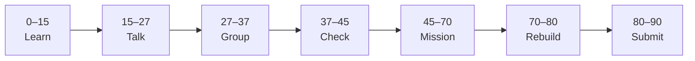

# Lesson 1: Introduction and REST APIs


| | |
|:---|:---|
| **Time** | 90 minutes |
| **Evidence** | `fastapi-backend/` or course folder |

> [!TIP]
> Mission card → **45–70 Mission Task** → **70–80 Rebuild/Exit** → submit evidence.

**Your repo:** `[studentName]-Full-Stack-Web-and-AI-Application`

## Lesson Goal

By the end of this lesson, each student should be able to:

1. Explain what a REST API is and why FastAPI is used in this course.
2. Describe the flow: browser or Next.js → FastAPI → response JSON.
3. Enroll in the Coursera FastAPI fundamentals course and open Module 1.
4. Create the `fastapi-backend/` folder with `.gitignore` for `.env`.
5. Write a one-paragraph README goal for this backend folder.
6. Submit Coursera Module 1 progress and repo evidence.

---

## 90-Minute Class Flow



### 0–15 min: Individual Learning

> [!NOTE]
> **One required resource** for this block — see below. Do not browse extra playlists during class.

**Required resource — complete Coursera Module 1 (Introduction):**

Course: [Introduction to FastAPI and Backend Development Fundamentals](https://www.coursera.org/learn/packt-introduction-to-fastapi-and-backend-development-fundamentals-7zg6w)

Open **Module 1 — Introduction** (~1 hour on Coursera; finish as much as possible in class).

Focus: REST APIs, why FastAPI, course structure, backend vs frontend roles.

**Individual notes:**

```text
REST API means...
FastAPI is a good choice because...
In our AI School Assistant, the backend will...
The frontend talks to the backend by...
One thing I still do not understand is...
```

**Student output:** Notes + Module 1 progress screenshot (or teacher sign-off).

---

### 15–27 min: Talk Robin / Group Discussion

**Share:** What is an API? Why not put API keys in React? One video idea that helped; one question.

---

### 27–37 min: Group Answer

```text
Our AI app needs a backend because...
REST uses HTTP methods like...
Our group still needs help with...
```

---

### 37–45 min: Entry Points Check

**Teacher checks:** Python 3 installed (`python --version` or `py --version`); Coursera enrollment; students understand frontend vs backend.

---

### 45–70 min: Mission Task

1. Create folder `fastapi-backend/` in your repo.
2. Add `README.md`: project name, purpose (AI School Assistant backend), planned stack (FastAPI + Python).
3. Add `.gitignore` with at least `.env` and `__pycache__/`.
4. Add empty `requirements.txt` with a comment: `# fastapi uvicorn — added Lesson 2`.
5. Commit: `Start fastapi-backend folder and README`.

---

### 70–80 min: Independent Rebuild / Exit Check

Without re-opening Coursera, add one bullet to README: **“Evidence: commits + /docs screenshots from Phase 01.”**

**Oral check:** What does REST stand for in plain words?

---

### 80–90 min: Submission of Evidence

---

## What You Must Submit

1. GitHub link to `fastapi-backend/`
2. Screenshot of `README.md` on GitHub
3. Coursera Module 1 progress screenshot
4. Commit history link or screenshot

---

## Success Criteria

1. Folder exists with README and `.gitignore`.
2. README mentions FastAPI and AI School Assistant context.
3. At least one meaningful commit.
4. All evidence submitted.

---

## Common Problems

| Problem | Try first |
|---|---|
| Coursera paywall | Audit, Financial Aid, or school Coursera for Campus. |
| Python not found | Install Python 3.11+ from python.org; restart terminal. |
| Wrong repo folder | Confirm path matches `[studentName]-Full-Stack-Web-and-AI-Application`. |

---

## Fast Track Option

If finished early, skim Module 2 video titles only — do not install FastAPI until Lesson 2.

---

Educational materials in this folder are copyright © 2026 Wang Morgan. All Rights Reserved.
