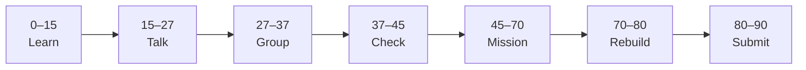

# Lesson 2: Getting Started — First API


| | |
|:---|:---|
| **Time** | 90 minutes |
| **Evidence** | `fastapi-backend/` or course folder |

> [!TIP]
> Mission card → **45–70 Mission Task** → **70–80 Rebuild/Exit** → submit evidence.

**Your repo:** `[studentName]-Full-Stack-Web-and-AI-Application`

## Lesson Goal

By the end of this lesson, each student should be able to:

1. Install FastAPI and Uvicorn in a virtual environment.
2. Run a local server and open interactive docs at `/docs`.
3. Create a `GET /health` route that returns `{"status": "ok"}`.
4. Test the route in Swagger UI and with a browser.
5. Document how to run the server in `README.md`.
6. Submit Coursera Module 2 progress and repo evidence.

---

## 90-Minute Class Flow



### 0–15 min: Individual Learning

> [!NOTE]
> **One required resource** for this block — see below. Do not browse extra playlists during class.

**Required resource — complete Coursera Module 2 (Getting Started):**

[Module 2 — Getting Started](https://www.coursera.org/learn/packt-introduction-to-fastapi-and-backend-development-fundamentals-7zg6w)

Focus: install FastAPI, first endpoint, Uvicorn, built-in OpenAPI docs.

**Individual notes:**

```text
I start the server with...
/docs shows me...
A GET request means...
My first route path is...
One thing I still do not understand is...
```

---

### 15–27 min: Talk Robin / Group Discussion

**Share:** Command to run server; what Swagger UI is for; difference between `/` and `/docs`.

---

### 27–37 min: Group Answer

```text
We test APIs in /docs because...
Uvicorn's job is...
Our group still needs help with...
```

---

### 37–45 min: Entry Points Check

**Teacher checks:** Virtual env created; `pip install fastapi uvicorn` works; port 8000 free.

---

### 45–70 min: Mission Task

1. In `fastapi-backend/`, create virtual environment (`.venv/` — add to `.gitignore`).
2. Update `requirements.txt`:

   ```text
   fastapi
   uvicorn[standard]
   ```

3. Create `main.py` with FastAPI app and `GET /health` → `{"status": "ok"}`.
4. Update README: how to activate venv, install deps, run `uvicorn main:app --reload`.
5. Commit: `Add FastAPI health endpoint and run instructions`.

---

### 70–80 min: Independent Rebuild / Exit Check

> [!IMPORTANT]
> Independent work: close course videos, notes, AI tools, and follow-along code before this block.

Stop the server, start again from memory. Open `/docs`, execute `/health`, screenshot result.

**Oral check:** What URL shows Swagger UI?

---

### 80–90 min: Submission of Evidence

---

## What You Must Submit

1. GitHub link to `main.py` and `requirements.txt`
2. Screenshot of `/docs` with successful `/health` response
3. Coursera Module 2 progress screenshot
4. Commit history

---

## Success Criteria

1. Server runs locally without errors.
2. `/health` returns JSON in `/docs` and browser.
3. README has copy-paste run commands.
4. `.venv` is gitignored.

---

## Common Problems

| Problem | Try first |
|---|---|
| `ModuleNotFoundError: fastapi` | Activate venv; `pip install -r requirements.txt`. |
| Port in use | `uvicorn main:app --reload --port 8001` |
| `/docs` 404 | Confirm `app = FastAPI()` and correct port in URL. |

---

## Fast Track Option

Add `GET /` returning your name and course phase — commit separately.

---

Educational materials in this folder are copyright © 2026 Wang Morgan. All Rights Reserved.
