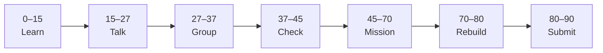

# Lesson 3: Path Parameters


| | |
|:---|:---|
| **Time** | 90 minutes |
| **Evidence** | `fastapi-backend/` or course folder |

> [!TIP]
> Mission card → **45–70 Mission Task** → **70–80 Rebuild/Exit** → submit evidence.

**Your repo:** `[studentName]-Full-Stack-Web-and-AI-Application`

## Lesson Goal

By the end of this lesson, each student should be able to:

1. Define path parameters with type hints in FastAPI routes.
2. Explain route order and why specific paths must come before generic ones.
3. Add `GET /items/{item_id}` (or `/projects/{project_id}`) returning JSON.
4. Test multiple path values in `/docs`.
5. Handle invalid input with appropriate HTTP errors (preview).
6. Submit Coursera Module 3 progress and repo evidence.

---

## 90-Minute Class Flow



### 0–15 min: Individual Learning

> [!NOTE]
> **One required resource** for this block — see below. Do not browse extra playlists during class.

**Required resource — complete Coursera Module 3 (Path Parameter):**

[Module 3 — Path Parameter](https://www.coursera.org/learn/packt-introduction-to-fastapi-and-backend-development-fundamentals-7zg6w)

Focus: dynamic routes, type hints, decorators, simple data storage intro in course videos.

**Individual notes:**

```text
Path parameters look like...
Type hints help FastAPI because...
One example path I will build is...
Route order matters when...
One thing I still do not understand is...
```

---

### 15–27 min: Talk Robin / Group Discussion

**Share:** Path vs query parameter (preview); one typed path example; Coursera demo that helped.

---

### 27–37 min: Group Answer

```text
We use {item_id} in the path when...
FastAPI validates types by...
Our group still needs help with...
```

---

### 37–45 min: Entry Points Check

**Teacher checks:** Students can read `{param}` syntax; know difference from query string `?id=`.

---

### 45–70 min: Mission Task

1. Add in-memory list of 3 sample “projects” or “handbook sections” (dicts with `id` and `title`).
2. Add `GET /projects/{project_id}` returning one item or `404` if missing.
3. Add `GET /projects` listing all items.
4. Test in `/docs` with valid and invalid IDs.
5. Commit: `Add path parameter route for projects`.

---

### 70–80 min: Independent Rebuild / Exit Check

Add a new project ID in code only (no Coursera), reload, verify in `/docs`.

**Oral check:** Where does FastAPI read `project_id` from?

---

### 80–90 min: Submission of Evidence

---

## What You Must Submit

1. GitHub link to updated `main.py`
2. Screenshot of `/docs` showing path route tests
3. Coursera Module 3 progress screenshot
4. Commit history

---

## Success Criteria

1. Path route returns correct JSON for valid IDs.
2. Missing ID returns clear error (404 or HTTPException).
3. List route still works.
4. Code uses type hints on path params.

---

## Common Problems

| Problem | Try first |
|---|---|
| Always 404 | Check ID type (int vs str) matches your data. |
| Route conflict | Put fixed paths like `/projects/active` before `/projects/{project_id}`. |
| Reload not picking changes | Save file; check terminal for reload message. |

---

## Fast Track Option

Add optional path param with default using Query in Lesson 4 — preview only.

---

Educational materials in this folder are copyright © 2026 Wang Morgan. All Rights Reserved.
