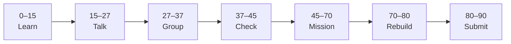

# Lesson 4: Query Parameters and POST


| | |
|:---|:---|
| **Time** | 90 minutes |
| **Evidence** | `fastapi-backend/` or course folder |

> [!TIP]
> Mission card → **45–70 Mission Task** → **70–80 Rebuild/Exit** → submit evidence.

**Your repo:** `[studentName]-Full-Stack-Web-and-AI-Application`

## Lesson Goal

By the end of this lesson, each student should be able to:

1. Add optional query parameters to filter list endpoints.
2. Create a `POST` route that accepts a JSON request body.
3. Use HTTPException for bad requests (empty title, etc.).
4. Test GET with query strings and POST in `/docs`.
5. Explain GET vs POST in your own words.
6. Submit Coursera Module 4 progress and repo evidence.

---

## 90-Minute Class Flow



### 0–15 min: Individual Learning

> [!NOTE]
> **One required resource** for this block — see below. Do not browse extra playlists during class.

**Required resource — complete Coursera Module 4 (Query Parameter):**

[Module 4 — Query Parameter](https://www.coursera.org/learn/packt-introduction-to-fastapi-and-backend-development-fundamentals-7zg6w)

Focus: query filters, POST bodies, request body models (intro), HTTP exceptions.

**Individual notes:**

```text
Query parameters appear in the URL like...
POST is used when...
HTTPException helps me...
My POST route will accept...
One thing I still do not understand is...
```

---

### 15–27 min: Talk Robin / Group Discussion

**Share:** GET vs POST; example query filter; why POST body is not in the URL.

---

### 27–37 min: Group Answer

```text
We use query params to filter because...
POST /projects might...
Our group still needs help with...
```

---

### 37–45 min: Entry Points Check

**Teacher checks:** Students can build `?limit=2` style URLs; know POST sends JSON body in `/docs`.

---

### 45–70 min: Mission Task

1. Extend `GET /projects` with optional query param `limit: int = 10`.
2. Add `POST /projects` accepting JSON `{"title": "...", "description": "..."}`.
3. Append new project to in-memory list; return created object with new `id`.
4. Raise `HTTPException(400)` if `title` is empty or whitespace.
5. Commit: `Add query filter and POST projects`.

---

### 70–80 min: Independent Rebuild / Exit Check

In `/docs`, POST a new project, then GET list with `limit=1` — verify behavior.

**Oral check:** Why should secrets never go in query strings?

---

### 80–90 min: Submission of Evidence

---

## What You Must Submit

1. GitHub link to updated routes
2. Screenshot: POST success + GET with query param in `/docs`
3. Coursera Module 4 progress screenshot
4. Commit history

---

## Success Criteria

1. Query param limits list correctly.
2. POST adds item and validates empty title.
3. GET and POST both documented in `/docs`.
4. Student can explain GET vs POST orally.

---

## Common Problems

| Problem | Try first |
|---|---|
| POST body ignored | Use a Pydantic model or dict param — preview Lesson 6. |
| 422 Unprocessable | Match JSON field names to route parameter names. |
| List not updating | Mutate same in-memory list object, not a copy. |

---

## Fast Track Option

Add `search` query param filtering titles by substring.

---

Educational materials in this folder are copyright © 2026 Wang Morgan. All Rights Reserved.
