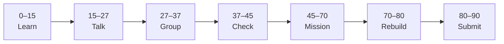

# Lesson 5: CRUD Operations


| | |
|:---|:---|
| **Time** | 90 minutes |
| **Evidence** | `fastapi-backend/` or course folder |

> [!TIP]
> Mission card → **45–70 Mission Task** → **70–80 Rebuild/Exit** → submit evidence.

**Your repo:** `[studentName]-Full-Stack-Web-and-AI-Application`

## Lesson Goal

By the end of this lesson, each student should be able to:

1. Implement PUT (or PATCH) to update an existing resource.
2. Implement DELETE to remove a resource by ID.
3. Keep consistent JSON shapes across all CRUD responses.
4. Test full CRUD cycle in `/docs`.
5. Document endpoints in `README.md` as a simple API table.
6. Submit Coursera Module 5 progress and repo evidence.

---

## 90-Minute Class Flow



### 0–15 min: Individual Learning

> [!NOTE]
> **One required resource** for this block — see below. Do not browse extra playlists during class.

**Required resource — complete Coursera Module 5 (CRUD Operations):**

[Module 5 — CRUD Operations](https://www.coursera.org/learn/packt-introduction-to-fastapi-and-backend-development-fundamentals-7zg6w)

Focus: PUT/PATCH update, DELETE, RESTful resource lifecycle.

**Individual notes:**

```text
CREATE uses POST because...
UPDATE uses PUT/PATCH when...
DELETE should return...
My CRUD paths are...
One thing I still do not understand is...
```

---

### 15–27 min: Talk Robin / Group Discussion

**Share:** Full CRUD map for `/projects`; idempotent meaning of PUT (simple version).

---

### 27–37 min: Group Answer

```text
REST CRUD maps to HTTP methods as...
After DELETE, GET by id should...
Our group still needs help with...
```

---

### 37–45 min: Entry Points Check

**Teacher checks:** Students have POST/GET from Lesson 4; can name four CRUD letters.

---

### 45–70 min: Mission Task

1. Add `PUT /projects/{project_id}` updating `title` and `description`.
2. Add `DELETE /projects/{project_id}` removing item; return `{"deleted": true, "id": ...}`.
3. Return 404 if ID not found on PUT/DELETE.
4. Add API table to README (Method | Path | Purpose).
5. Commit: `Complete CRUD for projects resource`.

---

### 70–80 min: Independent Rebuild / Exit Check

Run CREATE → READ → UPDATE → DELETE sequence in `/docs` without notes.

**Oral check:** What happens if you DELETE the same ID twice?

---

### 80–90 min: Submission of Evidence

---

## What You Must Submit

1. GitHub link to CRUD routes
2. Screenshot showing at least 3 methods tested in `/docs`
3. README API table screenshot
4. Coursera Module 5 progress screenshot
5. Commit history

---

## Success Criteria

1. All four CRUD operations work on in-memory data.
2. 404 on missing IDs for single-resource routes.
3. README lists endpoints clearly.
4. Student can demo CRUD orally.

---

## Common Problems

| Problem | Try first |
|---|---|
| PUT creates instead of updates | Check ID exists before overwrite. |
| DELETE still shows in list | Remove from same list used by GET. |
| Wrong status code | Use 404 for missing; 200 or 204 for successful DELETE (teacher choice). |

---

## Fast Track Option

Add PATCH for partial update (title only).

---

Educational materials in this folder are copyright © 2026 Wang Morgan. All Rights Reserved.
