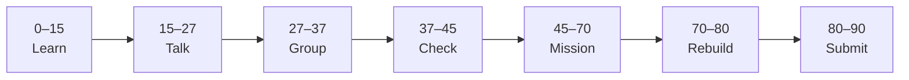

# Lesson 6: Pydantic Models and Phase 01 Checkpoint


| | |
|:---|:---|
| **Time** | 90 minutes |
| **Evidence** | `fastapi-backend/` or course folder |

> [!TIP]
> Mission card → **45–70 Mission Task** → **70–80 Rebuild/Exit** → submit evidence.

**Your repo:** `[studentName]-Full-Stack-Web-and-AI-Application`

## Lesson Goal

By the end of this lesson, each student should be able to:

1. Define Pydantic models for request and response bodies.
2. Replace raw dicts with typed schemas on POST/PUT routes.
3. Add a preview `POST /ask` body schema `{ "question": "..." }` (stub answer for now).
4. Validate empty questions with clear 422/400 errors.
5. Pass **course Phase 7 checkpoint**: running app + `/docs` + POST tested.
6. Submit Coursera Module 6 progress, `/docs` screenshot, and Phase 01 checklist.

---

## 90-Minute Class Flow



### 0–15 min: Individual Learning

> [!NOTE]
> **One required resource** for this block — see below. Do not browse extra playlists during class.

**Required resource — complete Coursera Module 6 (Pydantic Model):**

[Module 6 — Pydantic Model](https://www.coursera.org/learn/packt-introduction-to-fastapi-and-backend-development-fundamentals-7zg6w)

Focus: input/output models, validation rules, response_model, Enums preview.

**Individual notes:**

```text
Pydantic validates...
request model vs response model...
response_model helps because...
My AskRequest fields are...
One thing I still do not understand is...
```

---

### 15–27 min: Talk Robin / Group Discussion

**Share:** Why validation before handler runs; example invalid JSON caught by Pydantic.

---

### 27–37 min: Group Answer

```text
We use Pydantic so bad data...
For AI School Assistant, POST /ask will eventually...
Our group still needs help with...
```

---

### 37–45 min: Entry Points Check

**Teacher checks:** `from pydantic import BaseModel`; students know 422 appears for invalid body.

---

### 45–70 min: Mission Task

1. Create `schemas.py` (or models in `main.py`) with:
   - `ProjectCreate`, `ProjectRead`
   - `AskRequest` with `question: str`
   - `AskResponse` with `answer: str`, `source: str | None = None`
2. Refactor project routes to use Pydantic models.
3. Add `POST /ask`: if question empty → HTTPException; else return stub:

   ```json
   {"answer": "Stub: we will connect RAG in course Phase 8.", "source": null}
   ```

4. Add `.env.example` with `OPENAI_API_KEY=your-key-here` (no real key).
5. Commit: `Add Pydantic schemas and stub POST ask`.

---

### 70–80 min: Independent Rebuild / Exit Check

Test invalid body (missing `question`) in `/docs` — confirm validation error. Test valid stub.

**Oral check:** Why must `OPENAI_API_KEY` stay in `.env`, not in frontend?

---

### 80–90 min: Submission of Evidence

---

## What You Must Submit

1. GitHub link to `schemas.py` / `main.py` and `.env.example`
2. Screenshot of `/docs` showing `POST /ask` success
3. Screenshot of validation error for bad input
4. Coursera Module 6 progress screenshot
5. Phase 01 checklist (below) pasted in Notion or PR description

**Phase 01 checklist:**

```text
[ ] fastapi-backend/ runs with uvicorn
[ ] GET /health works
[ ] CRUD or projects resource works
[ ] POST /ask stub with Pydantic validation
[ ] README documents endpoints
[ ] .env gitignored; .env.example committed
[ ] No secrets in GitHub
```

---

## Success Criteria

1. Pydantic models used on at least POST routes.
2. `/ask` stub runs with validation.
3. Meets course **C6: FastAPI in `/docs`**.
4. Phase 01 checklist complete.

---

## Common Problems

| Problem | Try first |
|---|---|
| 422 on valid body | Check field names and types match model. |
| Import errors | `pip install pydantic` (included with FastAPI). |
| `.env` committed | Remove from Git history with teacher help; rotate keys if leaked. |

---

## Fast Track Option

Continue to [Phase 02 Lesson 7](../Phase_02_Database/lesson-07-sql-database-sqlite.md). Lightweight track may stop here and join course Phase 8 RAG.

---

Educational materials in this folder are copyright © 2026 Wang Morgan. All Rights Reserved.
