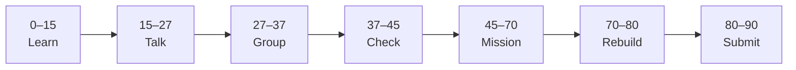

# Lesson 7: SQL Database with SQLite


| | |
|:---|:---|
| **Time** | 90 minutes |
| **Evidence** | `fastapi-backend/` or course folder |

> [!TIP]
> Mission card → **45–70 Mission Task** → **70–80 Rebuild/Exit** → submit evidence.

**Your repo:** `[studentName]-Full-Stack-Web-and-AI-Application`

## Lesson Goal

By the end of this lesson, each student should be able to:

1. Explain why persistent storage replaces in-memory lists.
2. Connect FastAPI to a SQLite database file.
3. Insert and retrieve rows with raw SQL or course-patterns from Module 7.
4. Keep projects data after server restart.
5. Add `sqlite` file pattern to `.gitignore` if using local dev DB (or commit empty seed — teacher choice).
6. Submit Coursera Module 7 progress and repo evidence.

---

## 90-Minute Class Flow



### 0–15 min: Individual Learning

> [!NOTE]
> **One required resource** for this block — see below. Do not browse extra playlists during class.

**Required resource — complete Coursera Module 7 (SQL Database):**

[Module 7 — SQL Database](https://www.coursera.org/learn/packt-introduction-to-fastapi-and-backend-development-fundamentals-7zg6w)

Focus: SQLite connection, INSERT/SELECT, primary keys, integrating DB with routes.

**Individual notes:**

```text
In-memory data is lost when...
SQLite stores data in...
Primary key means...
My database file will be named...
One thing I still do not understand is...
```

---

### 15–27 min: Talk Robin / Group Discussion

**Share:** When AI handbook data needs a database vs files; one SQL concept from video.

---

### 27–37 min: Group Answer

```text
We move from list to DB because...
SELECT is used when...
Our group still needs help with...
```

---

### 37–45 min: Entry Points Check

**Teacher checks:** Lesson 6 complete; students understand SQL as structured tables.

---

### 45–70 min: Mission Task

1. Create `database.db` (or `app.db`) via init script or first route startup.
2. Create `projects` table: `id`, `title`, `description`.
3. Refactor `GET /projects` and `POST /projects` to read/write SQLite.
4. Restart server — confirm data persists.
5. Update README: how DB is created, file location.
6. Commit: `Persist projects in SQLite`.

---

### 70–80 min: Independent Rebuild / Exit Check

Add two projects, restart uvicorn, verify list still has both.

**Oral check:** What is lost if we only use a Python list?

---

### 80–90 min: Submission of Evidence

---

## What You Must Submit

1. GitHub link to DB init / route changes
2. Screenshot: data survives server restart (before/after or terminal + `/docs`)
3. Coursera Module 7 progress screenshot
4. Commit history

---

## Success Criteria

1. SQLite stores projects across restarts.
2. GET/POST still work via `/docs`.
3. README documents database file.
4. No SQL credentials in repo (SQLite is local file).

---

## Common Problems

| Problem | Try first |
|---|---|
| Database locked | One connection at a time; close cursors. |
| Empty after restart | Writing to wrong file path; use absolute path from project root. |
| Table missing | Run CREATE TABLE on startup or migration script once. |

---

## Fast Track Option

Add simple seed data script `seed.py` for demo projects.

---

Educational materials in this folder are copyright © 2026 Wang Morgan. All Rights Reserved.
