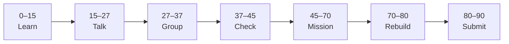

# Lesson 8: SQLModel and Dependency Injection


| | |
|:---|:---|
| **Time** | 90 minutes |
| **Evidence** | `fastapi-backend/` or course folder |

> [!TIP]
> Mission card → **45–70 Mission Task** → **70–80 Rebuild/Exit** → submit evidence.

**Your repo:** `[studentName]-Full-Stack-Web-and-AI-Application`

## Lesson Goal

By the end of this lesson, each student should be able to:

1. Define a SQLModel class matching the `projects` table.
2. Use FastAPI dependency injection for database sessions.
3. Replace raw SQL with SQLModel CRUD on at least two routes.
4. Explain how models link database rows to API responses.
5. Update `requirements.txt` with `sqlmodel`.
6. Submit Coursera Module 8 progress and repo evidence.

---

## 90-Minute Class Flow



### 0–15 min: Individual Learning

> [!NOTE]
> **One required resource** for this block — see below. Do not browse extra playlists during class.

**Required resource — complete Coursera Module 8 (SQLModel):**

[Module 8 — SQLModel](https://www.coursera.org/learn/packt-introduction-to-fastapi-and-backend-development-fundamentals-7zg6w)

Focus: SQLModel models, engine, session, `Depends()` pattern.

**Individual notes:**

```text
SQLModel combines...
Dependency injection means...
Depends(get_session) gives me...
My Project model fields are...
One thing I still do not understand is...
```

---

### 15–27 min: Talk Robin / Group Discussion

**Share:** Why ORM beats long SQL strings for small apps; what `Depends` does.

---

### 27–37 min: Group Answer

```text
We inject session so routes...
SQLModel table=True means...
Our group still needs help with...
```

---

### 37–45 min: Entry Points Check

**Teacher checks:** Lesson 7 SQLite working; `pip install sqlmodel` planned.

---

### 45–70 min: Mission Task

1. Add `models.py` with SQLModel `Project` (id, title, description).
2. Add `database.py` with engine, `get_session()` dependency.
3. Refactor `GET /projects` and `POST /projects` to use SQLModel session.
4. Keep Pydantic response models or use SQLModel read schema.
5. Commit: `Refactor projects to SQLModel with Depends`.

---

### 70–80 min: Independent Rebuild / Exit Check

Create project via `/docs`, verify in DB using teacher-provided viewer or print in route (dev only).

**Oral check:** What does `Depends` save you from writing in every route?

---

### 80–90 min: Submission of Evidence

---

## What You Must Submit

1. GitHub link to `models.py`, `database.py`, updated routes
2. Screenshot of `/docs` CRUD still working
3. Coursera Module 8 progress screenshot
4. Commit history

---

## Success Criteria

1. SQLModel used with dependency injection.
2. Data still persists after restart.
3. requirements.txt includes `sqlmodel`.
4. Code structure is readable (split files).

---

## Common Problems

| Problem | Try first |
|---|---|
| Session not closing | Use `yield` pattern from course; context manager. |
| Model/table mismatch | Run migration or recreate dev DB with teacher approval. |
| Circular imports | Put models in separate module; import order matters. |

---

## Fast Track Option

Convert PUT/DELETE from Lesson 5 to SQLModel if not done yet.

---

Educational materials in this folder are copyright © 2026 Wang Morgan. All Rights Reserved.
