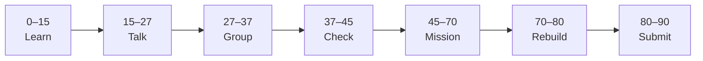

# Lesson 9: AsyncIO in FastAPI


| | |
|:---|:---|
| **Time** | 90 minutes |
| **Evidence** | `fastapi-backend/` or course folder |

> [!TIP]
> Mission card → **45–70 Mission Task** → **70–80 Rebuild/Exit** → submit evidence.

**Your repo:** `[studentName]-Full-Stack-Web-and-AI-Application`

## Lesson Goal

By the end of this lesson, each student should be able to:

1. Explain sync vs async routes in plain language (waiting on I/O).
2. Convert at least one route to `async def`.
3. Use `await` with a simulated slow operation (e.g. `asyncio.sleep` or httpx call preview).
4. Connect async to future LLM API calls (course Phase 8).
5. Keep `/docs` working for async routes.
6. Submit Coursera Module 9 progress and repo evidence.

---

## 90-Minute Class Flow



### 0–15 min: Individual Learning

> [!NOTE]
> **One required resource** for this block — see below. Do not browse extra playlists during class.

**Required resource — complete Coursera Module 9 (AsyncIO):**

[Module 9 — AsyncIO](https://www.coursera.org/learn/packt-introduction-to-fastapi-and-backend-development-fundamentals-7zg6w)

Focus: `async def`, `await`, concurrency for I/O-bound work, FastAPI async handlers.

**Individual notes:**

```text
Async helps when the server is waiting for...
await means...
LLM API calls are slow because...
I will make ___ route async because...
One thing I still do not understand is...
```

---

### 15–27 min: Talk Robin / Group Discussion

**Share:** Why blocking the server is bad during OpenAI calls; one async example from video.

---

### 27–37 min: Group Answer

```text
POST /ask should be async when...
asyncio.sleep simulates...
Our group still needs help with...
```

---

### 37–45 min: Entry Points Check

**Teacher checks:** Students know `async def` syntax; difference from regular `def`.

---

### 45–70 min: Mission Task

1. Change `POST /ask` to `async def`.
2. Add `await asyncio.sleep(1)` before stub answer (simulate LLM latency).
3. Add comment in code: `# Phase 8: replace sleep with real API call`.
4. Optional: add `GET /health/async` returning same as health with async handler.
5. Update README: one bullet on async and future AI integration.
6. Commit: `Make ask endpoint async with simulated delay`.

---

### 70–80 min: Independent Rebuild / Exit Check

Call `/ask` in `/docs` — notice ~1s delay. Explain orally why real LLM calls need async.

**Oral check:** What is the server doing during `await`?

---

### 80–90 min: Submission of Evidence

---

## What You Must Submit

1. GitHub link to async route changes
2. Screenshot of `/ask` response after delay
3. Coursera Module 9 progress screenshot
4. README bullet on async + Phase 8
5. Commit history

---

## Success Criteria

1. At least one route uses `async def` and `await`.
2. `/docs` still executes route successfully.
3. README mentions Phase 8 LLM connection.
4. Student explains sync vs async simply.

---

## Common Problems

| Problem | Try first |
|---|---|
| Forgot await | Error on coroutine — add `await`. |
| Mixed sync DB in async route | For this lesson, stub `/ask` only; DB routes can stay sync. |
| import asyncio | Add at top of `main.py`. |

---

## Fast Track Option

Read Module 10 video titles; do not install PostgreSQL until Lesson 10.

---

Educational materials in this folder are copyright © 2026 Wang Morgan. All Rights Reserved.
