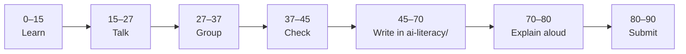

# AI Literacy — Class Missions

| | |
|:---|:---|
| **Classes** | 6 × 90 min |
| **Resource** | [AI for Everyone](https://www.deeplearning.ai/courses/ai-for-everyone) |
| **Evidence** | `ai-literacy/` |
| **Course phase** | Phase 2 · Checkpoint **C3** |

**Your repository:** `[studentName]-Full-Stack-Web-and-AI-Application`

> [!NOTE]
> **Prerequisite:** [Phase 01 Git](../01_Web_Tools/Phase_01_Git/) + [Notion Portfolio](../02Front-end/Phase_1_Notion_Portfolio/)

Open **one mission file per class**. Each lesson maps to one block of AI for Everyone plus a GitHub writing task.

---

## Mission index

| Class | Open this file | AI for Everyone focus |
|---|---|---|
| 1 | [lesson-01-what-is-ai.md](lesson-01-what-is-ai.md) | Week 1 — What is AI? |
| 2 | [lesson-02-building-ai-projects.md](lesson-02-building-ai-projects.md) | Week 2 — Building AI Projects |
| 3 | [lesson-03-ai-in-your-school.md](lesson-03-ai-in-your-school.md) | Week 3 — AI in your organization *(school lens)* |
| 4 | [lesson-04-what-ai-can-and-cannot-do.md](lesson-04-what-ai-can-and-cannot-do.md) | Limits, demos vs products |
| 5 | [lesson-05-ai-and-society.md](lesson-05-ai-and-society.md) | Week 4 — AI and Society |
| 6 | [lesson-06-reflection-and-submission.md](lesson-06-reflection-and-submission.md) | Exit reflection + submission |

**Support docs (reference):**

- [AI for Everyone Study Guide](../../05_Resources/AI_Literacy/AI_for_Everyone_Study_Guide.md)
- [AI Lens Discussion Prompts](../../05_Resources/AI_Literacy/AI_Lens_Discussion_Prompts.md)
- [Responsible AI Checklist](../../05_Resources/AI_Literacy/Responsible_AI_Checklist.md)

---

## 90-minute flow (every class)



Details: [classroom-flow.md](../shared/classroom-flow.md) · Display tips: [mission-display-guide.md](../shared/mission-display-guide.md)

---

## Student folder

```text
ai-literacy/
├── README.md
├── ai-reflection-*.md
├── responsible-ai-notes.md
├── ai-ethics-case-study.md      ← Lesson 6
└── certificates/                 ← optional
```

> [!WARNING]
> AI hints OK — do not paste full reflections from AI without editing. See [AI Usage Policy](../../04_Assessment/AI_Usage_Policy.md).

---

## What comes next

```text
AI Literacy (this block)  →  Phase 3 AI Math Bridge  →  Front-end / Back-end / Vibe Coding (teacher map)
```

Every lesson connects to the **AI School Assistant** capstone.

---

Educational materials in this folder are copyright © 2026 Wang Morgan. All Rights Reserved.
