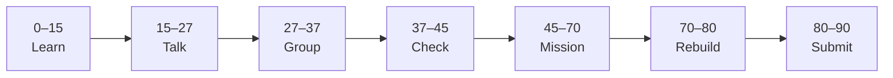

# Lesson 1: What Is AI?


| | |
|:---|:---|
| **Time** | 90 minutes |
| **Evidence** | `ai-literacy/` |

> [!TIP]
> Mission card → **45–70 Mission Task** → **70–80 Rebuild/Exit** → submit evidence.

**Your repo:** `[studentName]-Full-Stack-Web-and-AI-Application`

## Lesson Goal

By the end of this lesson, each student should be able to:

1. Explain AI and machine learning in plain language (no jargon pile-up).
2. Describe why **data** matters for an AI system.
3. Contrast traditional software (if/else rules) with ML-style systems.
4. Create `ai-literacy/` with `README.md` and first reflection file.
5. Complete **AI for Everyone Week 1** (or equivalent module videos).
6. Submit notes, progress evidence, and at least one GitHub commit.

---

## 90-Minute Class Flow



### 0–15 min: Individual Learning

> [!NOTE]
> **One required resource** for this block — see below. Do not browse extra playlists during class.

**Required resource — AI for Everyone Week 1: What is AI?**

- DeepLearning.AI: [AI for Everyone](https://www.deeplearning.ai/courses/ai-for-everyone) — complete **Week 1** videos and readings.
- Coursera mirror: [Week 1](https://www.coursera.org/learn/ai-for-everyone/home/week/1)

Use: [AI for Everyone Study Guide — Module 1](../../05_Resources/AI_Literacy/AI_for_Everyone_Study_Guide.md)

**Individual notes:**

```text
AI in my own words is...
Machine learning means...
Data matters because...
Traditional software vs AI differs because...
Connect to AI School Assistant: data in our project means...
One thing I still do not understand is...
```

---

### 15–27 min: Talk Robin / Group Discussion

**Share:** Your one-sentence definition of AI; one example of ML vs rules; one question.

Use [AI Lens Prompt 1](../../05_Resources/AI_Literacy/AI_Lens_Discussion_Prompts.md) if time allows.

---

### 27–37 min: Group Answer

```text
AI is not magic because...
Our AI School Assistant needs documents because...
Our group still needs help with...
```

---

### 37–45 min: Entry Points Check

**Teacher checks:** Repo from Phase 0 exists; Notion link in root README; students enrolled in AI for Everyone.

---

### 45–70 min: Mission Task

1. Create folder `ai-literacy/` in your GitHub repo.
2. Add `README.md`: course name, your name, link to Notion portfolio, purpose of this folder.
3. Add `ai-reflection-01-what-is-ai.md` using sections from [reflection template](../../03_Templates/ai-literacy-reflection-template.md).
4. Answer **Connect to AI School Assistant** from Study Guide Module 1 in that file.
5. Commit: `Start ai-literacy with Week 1 reflection`.

---

### 70–80 min: Independent Rebuild / Exit Check

Close Coursera. Explain orally: **What is machine learning?** Add one sentence to README without looking at notes.

---

### 80–90 min: Submission of Evidence

---

## What You Must Submit

1. GitHub link to `ai-literacy/`
2. Week 1 completion screenshot (DeepLearning.AI or Coursera)
3. Link or paste of `ai-reflection-01-what-is-ai.md`
4. Commit history

---

## Success Criteria

1. README explains what `ai-literacy/` is for.
2. Reflection is in **your own words** (not copied from slides).
3. Data connection to AI School Assistant is stated.
4. At least one meaningful commit.

---

## Common Problems

| Problem | Try first |
|---|---|
| Course login | Use school email; try Coursera mirror link. |
| “AI is just ChatGPT” | Week 1 distinguishes narrow AI, ML, and data. |
| Empty README | Copy structure from template; fill one section at a time. |

---

## Fast Track Option

Answer AI Lens Prompt 1 in writing — add to reflection file.

---

Educational materials in this folder are copyright © 2026 Wang Morgan. All Rights Reserved.
