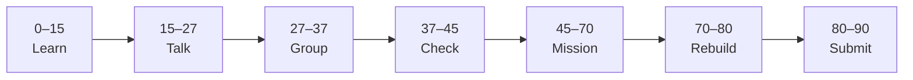

# Lesson 2: Building AI Projects


| | |
|:---|:---|
| **Time** | 90 minutes |
| **Evidence** | `ai-literacy/` |

> [!TIP]
> Mission card → **45–70 Mission Task** → **70–80 Rebuild/Exit** → submit evidence.

**Your repo:** `[studentName]-Full-Stack-Web-and-AI-Application`

## Lesson Goal

By the end of this lesson, each student should be able to:

1. Describe a typical AI project workflow (problem → data → model → interface → test).
2. Name at least two roles on an AI team (even if one person wears many hats).
3. Explain the difference between a **demo** and a **real product**.
4. Map the AI School Assistant to that workflow in writing.
5. Complete **AI for Everyone Week 2**.
6. Submit reflection file and course progress evidence.

---

## 90-Minute Class Flow



### 0–15 min: Individual Learning

> [!NOTE]
> **One required resource** for this block — see below. Do not browse extra playlists during class.

**Required resource — Week 2: Building AI Projects**

- [AI for Everyone — Week 2](https://www.coursera.org/learn/ai-for-everyone/home/week/2)

Study guide: [Module 2 — Building AI Projects](../../05_Resources/AI_Literacy/AI_for_Everyone_Study_Guide.md)

**Individual notes:**

```text
AI project workflow steps are...
Roles on an AI team include...
Demo vs real product differs because...
Hardest step for our AI School Assistant will be...
One thing I still do not understand is...
```

---

### 15–27 min: Talk Robin / Group Discussion

**Share:** One workflow step you understand; one you find confusing; who does what on a small student team.

---

### 27–37 min: Group Answer

```text
Our capstone follows workflow like...
We are not building a toy demo because...
Our group still needs help with...
```

---

### 37–45 min: Entry Points Check

**Teacher checks:** Lesson 1 reflection on GitHub; Week 1 marked complete or in progress with teacher note.

---

### 45–70 min: Mission Task

1. Add `ai-reflection-02-building-projects.md`.
2. Draw or write a **numbered workflow** for AI School Assistant (5–7 steps). Save in that file (ASCII diagram OK).
3. Label which steps are **frontend**, **backend**, **documents**, **LLM** (preview — OK to guess).
4. Answer Study Guide Module 2 **Connect to AI School Assistant** question.
5. Commit: `Add AI project workflow reflection Week 2`.

---

### 70–80 min: Independent Rebuild / Exit Check

From memory, list workflow steps on whiteboard or sticky note — compare to your file.

**Oral check:** What is the difference between demo and product?

---

### 80–90 min: Submission of Evidence

---

## What You Must Submit

1. GitHub link to `ai-reflection-02-building-projects.md`
2. Week 2 progress screenshot
3. Commit history

---

## Success Criteria

1. Workflow has clear ordered steps.
2. Capstone mapping is specific (not generic “use AI”).
3. Demo vs product distinction appears in writing.
4. Own words; AI assistance disclosed if used.

---

## Common Problems

| Problem | Try first |
|---|---|
| Workflow too vague | Use: question → find handbook text → generate answer → show source. |
| Skipping data step | Week 2 emphasizes data before model — include handbook/documents. |

---

## Fast Track Option

Read [AI Lens Prompt 10](../../05_Resources/AI_Literacy/AI_Lens_Discussion_Prompts.md) — sketch architecture boxes only.

---

Educational materials in this folder are copyright © 2026 Wang Morgan. All Rights Reserved.
