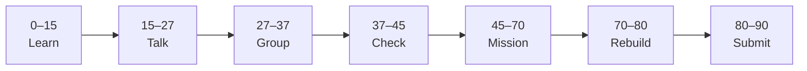

# Lesson 3: AI in Your School


| | |
|:---|:---|
| **Time** | 90 minutes |
| **Evidence** | `ai-literacy/` |

> [!TIP]
> Mission card → **45–70 Mission Task** → **70–80 Rebuild/Exit** → submit evidence.

**Your repo:** `[studentName]-Full-Stack-Web-and-AI-Application`

## Lesson Goal

By the end of this lesson, each student should be able to:

1. Identify problems that **are** a good fit for AI in a school context.
2. Identify problems that **are not** a good fit for AI alone.
3. Explain why “answer from the student handbook” is a sensible AI use case.
4. Complete **AI for Everyone Week 3** (Building AI in Your Company — apply **school** lens).
5. Write AI Lens Prompt 2 response in `ai-literacy/`.
6. Submit evidence and commit.

---

## 90-Minute Class Flow



### 0–15 min: Individual Learning

> [!NOTE]
> **One required resource** for this block — see below. Do not browse extra playlists during class.

**Required resource — Week 3: Building AI In Your Company**

- [AI for Everyone — Week 3](https://www.coursera.org/learn/ai-for-everyone/home/week/3)

Study guide: [Module 3 — AI in Your Organization / School](../../05_Resources/AI_Literacy/AI_for_Everyone_Study_Guide.md)

**Individual notes:**

```text
A good AI problem in school is...
A bad AI problem in school is...
Handbook Q&A is a good fit because...
Spotting AI opportunities means...
One thing I still do not understand is...
```

---

### 15–27 min: Talk Robin / Group Discussion

Discuss [AI Lens Prompt 2](../../05_Resources/AI_Literacy/AI_Lens_Discussion_Prompts.md): good vs bad school AI problems.

---

### 27–37 min: Group Answer

```text
We should build handbook assistant because...
We should NOT use it for...
Our group still needs help with...
```

---

### 37–45 min: Entry Points Check

**Teacher checks:** Students can give one good and one bad use case without repeating “homework cheating.”

---

### 45–70 min: Mission Task

1. Add `ai-reflection-03-school-use-cases.md`.
2. Two lists: **Good for AI School Assistant** (≥3 items) and **Not for this app** (≥3 items).
3. Full paragraph answering AI Lens Prompt 2 (in your own words).
4. Answer Study Guide Module 3 connect question.
5. Commit: `Add school AI use case reflection Week 3`.

---

### 70–80 min: Independent Rebuild / Exit Check

> [!IMPORTANT]
> Independent work: close course videos, notes, AI tools, and follow-along code before this block.

Orally defend one “bad use case” — why should the app refuse?

---

### 80–90 min: Submission of Evidence

---

## What You Must Submit

1. GitHub link to `ai-reflection-03-school-use-cases.md`
2. Week 3 progress screenshot
3. Commit history

---

## Success Criteria

1. Good/bad lists are specific to school life.
2. Handbook Q&A rationale is clear.
3. AI Lens Prompt 2 answered in full sentences.
4. No policy-violating proposals (e.g. “do my exam for me” as a feature).

---

## Common Problems

| Problem | Try first |
|---|---|
| All use cases sound “good” | Week 3: automation vs judgment; high-stakes decisions need humans. |
| Too technical | Stay in plain language — no code required this lesson. |

---

## Fast Track Option

Add one row to `ai-literacy/README.md`: **Intended users** and **Out of scope**.

---

Educational materials in this folder are copyright © 2026 Wang Morgan. All Rights Reserved.
