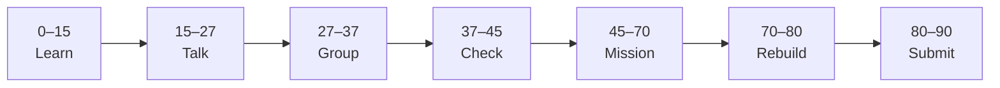

# Lesson 4: What AI Can and Cannot Do


| | |
|:---|:---|
| **Time** | 90 minutes |
| **Evidence** | `ai-literacy/` |

> [!TIP]
> Mission card → **45–70 Mission Task** → **70–80 Rebuild/Exit** → submit evidence.

**Your repo:** `[studentName]-Full-Stack-Web-and-AI-Application`

## Lesson Goal

By the end of this lesson, each student should be able to:

1. Give examples of tasks AI does well today and tasks where it fails.
2. Explain why “AI can do anything” is a dangerous belief.
3. Define **hallucination** in plain language.
4. List questions the AI School Assistant should answer well vs handle carefully.
5. Complete assigned **Week 4 videos on limits** (see Individual Learning) plus study guide Module 4.
6. Submit AI Lens Prompt 3 and GitHub evidence.

---

## 90-Minute Class Flow



### 0–15 min: Individual Learning

> [!NOTE]
> **One required resource** for this block — see below. Do not browse extra playlists during class.

**Required resource — AI for Everyone (limits & capabilities)**

Complete these parts (teacher may assign exact video titles from Week 1 and Week 4):

- Week 1: sections on what AI can / cannot do (review if already watched)
- Week 4: [AI and Society — start of week](https://www.coursera.org/learn/ai-for-everyone/home/week/4) — focus videos on **limitations**, hype, and realistic expectations before society/ethics block in Lesson 5

Study guide: [Module 4 — What AI Can and Cannot Do](../../05_Resources/AI_Literacy/AI_for_Everyone_Study_Guide.md)

**Individual notes:**

```text
AI is good at...
AI is bad at...
Hallucination means...
Three questions our app should answer well...
Three questions our app should refuse or handle carefully...
One thing I still do not understand is...
```

---

### 15–27 min: Talk Robin / Group Discussion

Use [AI Lens Prompt 3](../../05_Resources/AI_Literacy/AI_Lens_Discussion_Prompts.md): wrong exam dates scenario.

---

### 27–37 min: Group Answer

```text
When the app is confidently wrong...
We should say I don't know when...
Our group still needs help with...
```

---

### 37–45 min: Entry Points Check

**Teacher checks:** Every student can define hallucination; can name one failure mode.

---

### 45–70 min: Mission Task

1. Add `ai-reflection-04-limits-and-hallucinations.md`.
2. Two tables or lists:
   - **Answer well** (≥3 example questions)
   - **Refuse / careful** (≥3 example questions)
3. Full paragraph: what the app should do when handbook has no answer (preview RAG rule).
4. Answer AI Lens Prompt 3 in writing.
5. Commit: `Add AI limits and hallucination reflection`.

---

### 70–80 min: Independent Rebuild / Exit Check

> [!IMPORTANT]
> Independent work: close course videos, notes, AI tools, and follow-along code before this block.

Teacher reads a fake wrong answer aloud — students say what the app should do instead.

**Oral check:** What is a hallucination?

---

### 80–90 min: Submission of Evidence

---

## What You Must Submit

1. GitHub link to `ai-reflection-04-limits-and-hallucinations.md`
2. Screenshot of course progress (Week 4 started or assigned videos complete)
3. Commit history

---

## Success Criteria

1. Hallucination defined correctly.
2. Good vs careful question lists are realistic for a handbook app.
3. “I don’t know” policy stated clearly.
4. AI Lens Prompt 3 answered with cause + fix.

---

## Common Problems

| Problem | Try first |
|---|---|
| “AI will check the web” | Capstone uses **school documents only** — say if not in handbook. |
| Only technical failures | Include user trust and school policy angles. |

---

## Fast Track Option

Preview AI Lens Prompt 6 (hallucinations) — one paragraph only.

---

Educational materials in this folder are copyright © 2026 Wang Morgan. All Rights Reserved.
