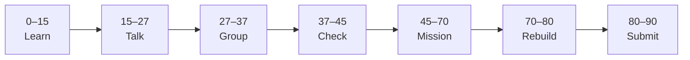

# Lesson 5: AI and Society


| | |
|:---|:---|
| **Time** | 90 minutes |
| **Evidence** | `ai-literacy/` |

> [!TIP]
> Mission card → **45–70 Mission Task** → **70–80 Rebuild/Exit** → submit evidence.

**Your repo:** `[studentName]-Full-Stack-Web-and-AI-Application`

## Lesson Goal

By the end of this lesson, each student should be able to:

1. Discuss how AI changes work and learning in schools (balanced view).
2. Identify **bias** or **fairness** concerns for a school Q&A app.
3. Explain why **responsible AI** matters before writing backend code.
4. Complete **AI for Everyone Week 4** (AI and Society — ethics, jobs, society).
5. Start `responsible-ai-notes.md` from the [Responsible AI Checklist](../../05_Resources/AI_Literacy/Responsible_AI_Checklist.md).
6. Submit reflection and course progress.

---

## 90-Minute Class Flow



### 0–15 min: Individual Learning

> [!NOTE]
> **One required resource** for this block — see below. Do not browse extra playlists during class.

**Required resource — Week 4: AI and Society**

- [AI for Everyone — Week 4](https://www.coursera.org/learn/ai-for-everyone/home/week/4) — complete remaining Week 4 content (society, fairness, impact).

Study guide: [Module 5 — AI and Society](../../05_Resources/AI_Literacy/AI_for_Everyone_Study_Guide.md)

**Individual notes:**

```text
AI changes learning because...
Bias in AI could look like...
Privacy concern for our app is...
One responsible AI rule I will follow is...
One thing I still do not understand is...
```

---

### 15–27 min: Talk Robin / Group Discussion

Choose one: [AI Lens Prompt 7](../../05_Resources/AI_Literacy/AI_Lens_Discussion_Prompts.md) (responsibility) or **Prompt 8** (fairness).

---

### 27–37 min: Group Answer

```text
Unfair advice from our app could happen if...
We reduce bias by...
Our group still needs help with...
```

---

### 37–45 min: Entry Points Check

**Teacher checks:** [AI Usage Policy](../../04_Assessment/AI_Usage_Policy.md) acknowledged; students know reflection must be own words.

---

### 45–70 min: Mission Task

1. Add `ai-reflection-05-ai-and-society.md` with Study Guide Module 5 connect question.
2. Create `responsible-ai-notes.md` — copy checklist headings from [Responsible_AI_Checklist.md](../../05_Resources/AI_Literacy/Responsible_AI_Checklist.md); fill **at least half** the items for AI School Assistant (complete rest in Lesson 6).
3. Answer one AI Lens prompt from Section C (Prompt 7, 8, or 9) in full paragraphs.
4. Commit: `Add society reflection and start responsible AI notes`.

---

### 70–80 min: Independent Rebuild / Exit Check

> [!IMPORTANT]
> Independent work: close course videos, notes, AI tools, and follow-along code before this block.

Orally state one rule you will enforce in your final project (sources, “I don’t know”, no private data, etc.).

---

### 80–90 min: Submission of Evidence

---

## What You Must Submit

1. GitHub links to new reflection and `responsible-ai-notes.md`
2. Week 4 / course progress screenshot
3. Commit history

---

## Success Criteria

1. Bias or fairness discussed with a concrete school example.
2. Responsible AI notes started with real content (not empty headings).
3. Society reflection ties to capstone.
4. AI Lens Section C prompt answered.

---

## Common Problems

| Problem | Try first |
|---|---|
| Generic ethics answers | Tie each point to **handbook Q&A** users and data. |
| Checklist too long | Complete highest-priority items: sources, uncertainty, privacy. |

---

## Fast Track Option

Finish entire Responsible AI Checklist if time — Lesson 6 can focus on case study only.

---

Educational materials in this folder are copyright © 2026 Wang Morgan. All Rights Reserved.
