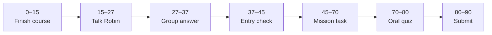

# Lesson 6: Reflection and Phase Submission

| | |
|:---|:---|
| **Time** | 90 minutes |
| **Resource** | [AI for Everyone](https://www.coursera.org/learn/ai-for-everyone) — Weeks 1–4 wrap-up |
| **Evidence** | `ai-literacy/` |
| **Checkpoint** | **C3** — AI Literacy complete |

**Your repo:** `[studentName]-Full-Stack-Web-and-AI-Application`

> [!TIP]
> Skim this page once → complete **Mission Task** (45–70) → pass oral quiz (70–80) → expand checklist below before submit.

---

## Lesson Goal

By the end of this lesson, each student should be able to:

1. Write a **5–8 sentence exit reflection** covering all of AI for Everyone (Study Guide exit questions).
2. Complete `responsible-ai-notes.md` and a short **ethics case study**.
3. Finish **three AI Lens responses** (Section A minimum) in own words.
4. Mark **AI for Everyone** complete on DeepLearning.AI or Coursera.
5. Update Notion portfolio with an **AI Literacy** section linking GitHub.
6. Pass [AI Literacy Checklist](../../04_Assessment/AI_Literacy_Checklist.md) oral review.

---

## 90-Minute Class Flow



### 0–15 min: Individual Learning

**Required resource — finish any missing AI for Everyone weeks**

- Verify Weeks 1–4 complete: [AI for Everyone on Coursera](https://www.coursera.org/learn/ai-for-everyone)
- Read Study Guide [Exit Reflection](../../05_Resources/AI_Literacy/AI_for_Everyone_Study_Guide.md)

**Individual notes:**

```text
AI in my own words (final)...
What surprised me most...
How literacy helps my capstone...
Three AI Lens prompts I chose are...
One responsible AI rule I will not break is...
```

---

### 15–27 min: Talk Robin / Group Discussion

Each student shares **one responsible AI rule** for the capstone. No repeats until everyone spoke once.

---

### 27–37 min: Group Answer

```text
Our class agrees the app must always...
Our class agrees the app must never...
Our group still needs help with...
```

---

### 37–45 min: Entry Points Check

**Teacher checks:** Lessons 1–5 files on GitHub; `responsible-ai-notes.md` started.

---

### 45–70 min: Mission Task

1. Add `ai-reflection-exit-ai-for-everyone.md` — answer all three Study Guide exit questions.
2. Complete `responsible-ai-notes.md` (all checklist items for AI School Assistant).
3. Add `ai-ethics-case-study.md`: one realistic school scenario (use **sample** data — no real private records). Include: what happened, what went wrong, what the app should do instead.
4. Ensure **three AI Lens** answers exist across your files (label prompt numbers in headings).
5. Update `ai-literacy/README.md` with table of contents linking all files.
6. Update Notion: section **AI Literacy** → link to GitHub folder + one screenshot of course certificate or progress.
7. Optional: save certificate screenshot to repo `certificates/` (if policy allows).
8. Commit: `Complete AI Literacy Phase submission`.

---

### 70–80 min: Independent Rebuild / Exit Check

Teacher oral quiz (pick 2):

- What is AI vs generative AI?
- What is a hallucination?
- Why must the assistant use school documents?

Student signs [AI_Literacy_Checklist.md](../../04_Assessment/AI_Literacy_Checklist.md) with teacher.

---

### 80–90 min: Submission of Evidence

---

## What You Must Submit

1. GitHub link to complete `ai-literacy/` folder
2. AI for Everyone **course completion** screenshot
3. Notion AI Literacy section URL
4. Completed checklist (file photo or signed printout — teacher choice)
5. `AI_USAGE.md` note in `ai-literacy/` if AI helped write any reflection (per policy)

<details>
<summary><strong>Phase checklist</strong> — expand before you submit</summary>

```text
[ ] ai-literacy/README.md with links to all reflections
[ ] AI for Everyone Weeks 1–4 complete
[ ] Exit reflection (5–8 sentences minimum)
[ ] responsible-ai-notes.md complete
[ ] ai-ethics-case-study.md with sample scenario
[ ] 3+ AI Lens prompts answered (Section A minimum)
[ ] Notion updated
[ ] Meaningful commit history (not one "done" commit)
[ ] Oral responsible AI explanation passed
```

</details>

---

## Success Criteria

1. Meets course **checkpoint C3: AI Literacy + ai-literacy/**.
2. All reflections in student's own words with capstone connections.
3. Responsible AI checklist complete.
4. Teacher checklist signed.

---

## Common Problems

| Problem | Try first |
|---|---|
| Missing Week 3 | Finish at home; submit progress + plan — teacher waiver policy. |
| Case study too vague | Use concrete Q&A example: wrong policy, missing source, privacy leak. |
| Notion not public | Follow Phase 1 publish steps; test link in incognito. |

---

## Fast Track Option

Begin [Generative AI for Everyone](https://www.deeplearning.ai/courses/generative-ai-for-everyone) — formal course Phase 2 extension; not required for this class block sign-off.

---

## After AI Literacy

**Next phase:** AI Math Bridge — your teacher will share the formal course overview.

**Class missions:** [02 Front-end Web Basics](../02Front-end/Phase_2_Web_Basics/) or your cohort schedule.

---

Educational materials in this folder are copyright © 2026 Wang Morgan. All Rights Reserved.
