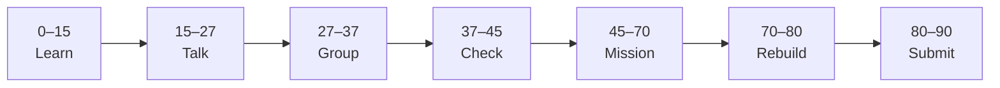

# Lesson 1: Setup and Course Map


| | |
|:---|:---|
| **Time** | 90 minutes |
| **Evidence** | `independent-rebuild/` + follow-along folder |
| **Independent rebuild** | `independent-rebuild/lesson-01/` · [rules](../INDEPENDENT_REBUILD.md) |

> [!TIP]
> Mission card → **45–70 Mission Task** → **70–80 Rebuild/Exit** → submit evidence.

**Your repo:** `[studentName]-Full-Stack-Web-and-AI-Application`

## Lesson Goal

By the end of this lesson, each student should be able to:

1. Enroll in the Udemy bridge course and locate Project 1 in the curriculum.
2. Explain the flow: **Next.js (UI) → FastAPI (API) → database** (course uses MongoDB).
3. Create `full-stack-practice/` with README describing your first-success goal.
4. Verify Python, Node.js, and Git work on your machine.
5. Submit enrollment screenshot and repo evidence.
6. **Independent rebuild:** from memory, write `full-stack-practice/independent-rebuild/lesson-01/` (no materials open) — see [INDEPENDENT_REBUILD.md](../INDEPENDENT_REBUILD.md).

---

## 90-Minute Class Flow



### 0–15 min: Individual Learning

> [!NOTE]
> **One required resource** for this block — see below. Do not browse extra playlists during class.

**Required resource — Udemy:**

[Learn Next.js and FastAPI by Building 2 Full Stack Apps](https://www.udemy.com/course/learn-nextjs-and-fastapi-by-building-2-full-stack-apps/)

Watch: **Introduction + course overview + environment setup** sections (teacher assigns exact lecture names from sidebar).

**Individual notes:**

```text
This course builds...
Project 1 is about...
Next.js handles...
FastAPI handles...
MongoDB in this course vs our SQLite/FastAPI class missions...
One thing I still do not understand is...
```

---

### 15–27 min: Talk Robin / Group Discussion

**Share:** Why two apps in the course; ports you expect (3000, 8000); one setup step that confused you.

---

### 27–37 min: Group Answer

```text
Full-stack means...
Our first success will look like...
Our group still needs help with...
```

---

### 37–45 min: Entry Points Check

**Teacher checks:** Udemy access; `node -v`; `python --version`; repo cloned or folder ready.

---

### 45–70 min: Mission Task

1. Create `full-stack-practice/README.md`:
   - Udemy course link
   - Goal: **First Success = browser shows data from FastAPI**
   - Note: formal capstone uses `fastapi-backend/` + `nextjs-frontend/` later
2. Add `.gitignore` patterns for `node_modules/`, `.venv/`, `.env`.
3. List tools installed (Node, Python, Git) in README.
4. Commit: `Start full-stack-practice for Udemy bridge course`.

---

### 70–80 min: Independent Rebuild / Exit Check

> [!IMPORTANT]
> Independent work: close course videos, notes, AI tools, and follow-along code before this block.

**Required — no materials:** [INDEPENDENT_REBUILD.md](../INDEPENDENT_REBUILD.md)

1. Close Udemy, notes, and `full-stack-practice/README.md`.
2. Create `full-stack-practice/independent-rebuild/lesson-01/README.md` — **hand-type** from memory:
   - Three-layer stack diagram (Browser → Next.js → FastAPI → DB)
   - Planned folder names for backend / frontend
   - Tool versions you verified (`node -v`, `python --version`)
3. Add `REBUILD.md` (honor statement + template).
4. Commit: `Independent rebuild lesson-01 (no materials)`.

**Oral check:** Explain the three layers without reading any file.

---

### 80–90 min: Submission of Evidence

---

## What You Must Submit

1. GitHub link to `full-stack-practice/README.md`
2. GitHub link to `full-stack-practice/independent-rebuild/lesson-01/` + `REBUILD.md`
3. Udemy course dashboard screenshot (enrolled)
4. Commit history (follow-along + separate rebuild commit)

---

## Success Criteria

1. README states first-success goal clearly.
2. Environment tools verified.
3. At least one meaningful commit.
4. **Independent rebuild** folder exists; student can explain it orally without materials.

---

## Common Problems

| Problem | Try first |
|---|---|
| Udemy paywall | School account, purchase, or teacher-provided coupon. |
| Node/Python missing | Install LTS Node + Python 3.11+; restart terminal. |

---

## Fast Track Option

Skim Project 1 section titles only — do not start coding until Lesson 2.

---

Educational materials in this folder are copyright © 2026 Wang Morgan. All Rights Reserved.
