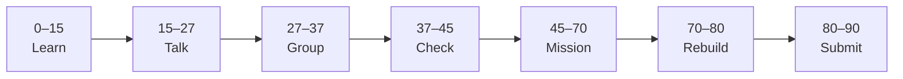

# Lesson 2: FastAPI Backend and First API


| | |
|:---|:---|
| **Time** | 90 minutes |
| **Evidence** | `independent-rebuild/` + follow-along folder |
| **Independent rebuild** | `independent-rebuild/lesson-02/` · [rules](../INDEPENDENT_REBUILD.md) |

> [!TIP]
> Mission card → **45–70 Mission Task** → **70–80 Rebuild/Exit** → submit evidence.

**Your repo:** `[studentName]-Full-Stack-Web-and-AI-Application`

## Lesson Goal

By the end of this lesson, each student should be able to:

1. Follow Udemy Project 1 to run a **FastAPI** server locally.
2. Test at least one route in `/docs` or browser.
3. Explain JSON response shape the frontend will consume.
4. Store backend code under `full-stack-practice/` (course folder layout OK).
5. Submit `/docs` or API screenshot and commit.
6. **Independent rebuild:** hand-type minimal FastAPI in `full-stack-practice/independent-rebuild/lesson-02/` — [INDEPENDENT_REBUILD.md](../INDEPENDENT_REBUILD.md).

---

## 90-Minute Class Flow



### 0–15 min: Individual Learning

> [!NOTE]
> **One required resource** for this block — see below. Do not browse extra playlists during class.

**Required resource — Udemy Project 1 (backend sections):**

Same course: [Learn Next.js and FastAPI — Project 1 backend](https://www.udemy.com/course/learn-nextjs-and-fastapi-by-building-2-full-stack-apps/)

Teacher assigns: FastAPI project creation, routes, models, MongoDB connection intro (as far as class time allows).

**Individual notes:**

```text
My backend runs on port...
The main GET/POST route is...
Request body fields are...
/docs helps me because...
One thing I still do not understand is...
```

---

### 15–27 min: Talk Robin / Group Discussion

**Share:** One route you tested; difference from `fastapi-backend/` class missions; MongoDB vs in-memory.

---

### 27–37 min: Group Answer

```text
Backend validates data with...
API returns JSON so frontend can...
Our group still needs help with...
```

---

### 37–45 min: Entry Points Check

**Teacher checks:** Backend starts without crash; student can open `/docs`.

---

### 45–70 min: Mission Task

1. Complete Udemy backend steps through first working API (teacher checkpoint).
2. Add to `full-stack-practice/README.md` section **Backend**:
   - How to start server
   - Main endpoint list
3. Screenshot `/docs` or JSON response → `full-stack-practice/screenshots/backend-api.png` (create folder if needed).
4. Commit: `Add FastAPI backend from Udemy project 1`.

---

### 70–80 min: Independent Rebuild / Exit Check

> [!IMPORTANT]
> Independent work: close course videos, notes, AI tools, and follow-along code before this block.

**Required — no materials:** [INDEPENDENT_REBUILD.md](../INDEPENDENT_REBUILD.md)

1. Close Udemy and your follow-along backend — do not copy-paste.
2. In `full-stack-practice/independent-rebuild/lesson-02/`, **hand-type** a minimal FastAPI app:
   - `main.py` with `GET /` or `GET /items` returning JSON
   - `requirements.txt` with `fastapi` and `uvicorn`
3. Run `uvicorn` and open `/docs` — screenshot → `screenshots/rebuild-api.png`.
4. Add `REBUILD.md`; commit: `Independent rebuild lesson-02 (no materials)`.

**Oral check:** Walk through your rebuild `main.py` line by line.

---

### 80–90 min: Submission of Evidence

---

## What You Must Submit

1. GitHub link to backend files (follow-along)
2. GitHub link to `independent-rebuild/lesson-02/` + `REBUILD.md`
3. API or `/docs` screenshot (follow-along + rebuild)
4. Udemy progress screenshot
5. Commit history

---

## Success Criteria

1. FastAPI runs locally (follow-along).
2. At least one endpoint returns JSON (follow-along).
3. README documents how to run backend.
4. **Rebuild** FastAPI runs separately; code hand-typed without materials.

---

## Common Problems

| Problem | Try first |
|---|---|
| MongoDB connection fails | Follow Udemy env vars; teacher may provide shared DB URI for class. |
| Import errors | Activate venv; `pip install -r requirements.txt`. |

---

## Fast Track Option

Add health route `GET /health` if not in course yet.

---

Educational materials in this folder are copyright © 2026 Wang Morgan. All Rights Reserved.
