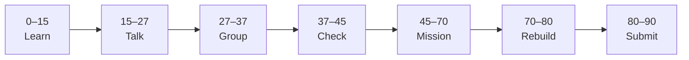

# Lesson 3: Next.js Frontend and Fetch


| | |
|:---|:---|
| **Time** | 90 minutes |
| **Evidence** | `independent-rebuild/` + follow-along folder |
| **Independent rebuild** | `independent-rebuild/lesson-03/` · [rules](../INDEPENDENT_REBUILD.md) |

> [!TIP]
> Mission card → **45–70 Mission Task** → **70–80 Rebuild/Exit** → submit evidence.

**Your repo:** `[studentName]-Full-Stack-Web-and-AI-Application`

## Lesson Goal

By the end of this lesson, each student should be able to:

1. Follow Udemy Project 1 **Next.js frontend** sections.
2. Run Next.js dev server (typically port 3000).
3. Call FastAPI from the browser or server component using `fetch` (course pattern).
4. Display API data on a page (even if CORS fails — fix in Lesson 4).
5. Submit frontend screenshot and commit.
6. **Independent rebuild:** hand-type minimal Next.js + `fetch` in `full-stack-practice/independent-rebuild/lesson-03/` — [INDEPENDENT_REBUILD.md](../INDEPENDENT_REBUILD.md).

---

## 90-Minute Class Flow



### 0–15 min: Individual Learning

> [!NOTE]
> **One required resource** for this block — see below. Do not browse extra playlists during class.

**Required resource — Udemy Project 1 (frontend sections):**

[Learn Next.js and FastAPI](https://www.udemy.com/course/learn-nextjs-and-fastapi-by-building-2-full-stack-apps/) — Next.js setup, pages/app router per course, fetch preview.

**Individual notes:**

```text
Frontend runs on port...
fetch URL is...
Data displays on page as...
If fetch fails, error looks like...
One thing I still do not understand is...
```

---

### 15–27 min: Talk Robin / Group Discussion

**Share:** Where `fetch` runs (client vs server in course); what you see if backend is off.

---

### 27–37 min: Group Answer

```text
Frontend needs backend URL because...
JSON becomes UI when...
Our group still needs help with...
```

---

### 37–45 min: Entry Points Check

**Teacher checks:** Both servers can run; students know both URLs.

---

### 45–70 min: Mission Task

1. Complete Udemy frontend steps through first data display attempt.
2. Update `full-stack-practice/README.md` **Frontend** section (install, `npm run dev`, env vars if any).
3. Screenshot page showing data OR clear error (CORS OK for Lesson 4) → `screenshots/frontend-fetch.png`.
4. Commit: `Add Next.js frontend fetch from Udemy project 1`.

---

### 70–80 min: Independent Rebuild / Exit Check

> [!IMPORTANT]
> Independent work: close course videos, notes, AI tools, and follow-along code before this block.

**Required — no materials:** [INDEPENDENT_REBUILD.md](../INDEPENDENT_REBUILD.md)

1. Close Udemy and follow-along frontend — no copy-paste.
2. In `full-stack-practice/independent-rebuild/lesson-03/`, **hand-type**:
   - Minimal Next.js page (App Router or Pages — your choice from memory)
   - `fetch('http://localhost:8000/...')` to your **lesson-02 rebuild** backend (or mock if backend not running)
   - Display JSON or error text on page
3. Add `REBUILD.md`; commit: `Independent rebuild lesson-03 (no materials)`.

**Oral check:** Explain where `fetch` runs and what URL you used.

---

### 80–90 min: Submission of Evidence

---

## What You Must Submit

1. GitHub link to frontend code (follow-along)
2. GitHub link to `independent-rebuild/lesson-03/` + `REBUILD.md`
3. Screenshot of page or DevTools Network tab
4. Commit history

---

## Success Criteria

1. Next.js dev server runs (follow-along).
2. Frontend attempts real API call (not mock-only) in follow-along.
3. README documents frontend startup.
4. **Rebuild** page hand-typed; `fetch` written from memory.

---

## Common Problems

| Problem | Try first |
|---|---|
| CORS error in console | Expected until Lesson 4 — capture screenshot as evidence. |
| Wrong API URL | Check `.env.local` or course config for backend base URL. |

---

## Fast Track Option

Log fetch URL and response status in console for debugging practice.

---

Educational materials in this folder are copyright © 2026 Wang Morgan. All Rights Reserved.
