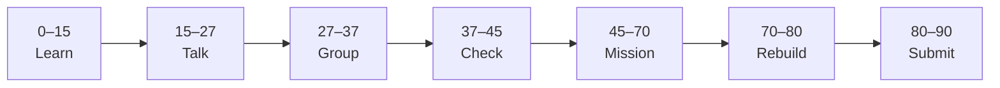

# Lesson 4: CORS and First Success


| | |
|:---|:---|
| **Time** | 90 minutes |
| **Evidence** | `independent-rebuild/` + follow-along folder |
| **Independent rebuild** | `independent-rebuild/lesson-04/` · [rules](../INDEPENDENT_REBUILD.md) |

> [!TIP]
> Mission card → **45–70 Mission Task** → **70–80 Rebuild/Exit** → submit evidence.

**Your repo:** `[studentName]-Full-Stack-Web-and-AI-Application`

## Lesson Goal

By the end of this lesson, each student should be able to:

1. Fix **CORS** so Next.js can read FastAPI responses (Udemy section + course pattern).
2. Demonstrate **end-to-end success**: user action → API → UI update.
3. Explain CORS in one sentence for oral check.
4. Add loading or error message when API fails.
5. Record **First Success** moment in README (timestamp + screenshot).
6. **Independent rebuild:** hand-type CORS fix + connected UI in `full-stack-practice/independent-rebuild/lesson-04/` — [INDEPENDENT_REBUILD.md](../INDEPENDENT_REBUILD.md).

---

## 90-Minute Class Flow



### 0–15 min: Individual Learning

> [!NOTE]
> **One required resource** for this block — see below. Do not browse extra playlists during class.

**Required resource — Udemy:**

Same course — sections on **CORS**, connecting frontend to backend, troubleshooting (teacher assigns exact lectures).

Review: Phase 9 full-stack integration pattern (concept only — your teacher will explain).

**Individual notes:**

```text
CORS error meant...
Fix applied on...
After fix, browser shows...
Loading state shows user...
One thing I still do not understand is...
```

---

### 15–27 min: Talk Robin / Group Discussion

**Share:** Before/after screenshot; why backend must allow frontend origin.

---

### 27–37 min: Group Answer

```text
CORS protects...
We fixed it by...
Our group still needs help with...
```

---

### 37–45 min: Entry Points Check

**Teacher checks:** Both servers running; students can name frontend and backend ports.

---

### 45–70 min: Mission Task

1. Apply Udemy CORS fix — verify data loads in browser.
2. Add simple loading text or spinner while fetching (course or your own).
3. Update README with **First Success** section:

   ```markdown
   ## First Success (Lesson 4)
   - Date:
   - What worked:
   - Screenshot: screenshots/first-success.png
   ```

4. Capture `screenshots/first-success.png` — full page with real data visible.
5. Commit: `Fix CORS and record first full-stack success`.

---

### 70–80 min: Independent Rebuild / Exit Check

> [!IMPORTANT]
> Independent work: close course videos, notes, AI tools, and follow-along code before this block.

**Required — no materials:** [INDEPENDENT_REBUILD.md](../INDEPENDENT_REBUILD.md)

1. Close Udemy and follow-along projects — rebuild only in `independent-rebuild/lesson-04/`.
2. **Hand-type** minimal backend with `CORSMiddleware` allowing `http://localhost:3000`.
3. **Hand-type** minimal frontend with `fetch`, **loading** text, and **error** message.
4. Demo end-to-end from rebuild folders only; screenshot → `screenshots/rebuild-first-success.png`.
5. Add `REBUILD.md`; commit: `Independent rebuild lesson-04 (no materials)`.

**Oral check:** Explain CORS using only your rebuild code.

---

### 80–90 min: Submission of Evidence

---

## What You Must Submit

1. `first-success.png` on GitHub (follow-along)
2. `independent-rebuild/lesson-04/` + `REBUILD.md` + rebuild screenshot
3. README First Success section filled
4. Commit history

---

## Success Criteria

1. Frontend displays live API data (follow-along).
2. Student can demo follow-along without Udemy video open.
3. CORS explained orally using **rebuild** code.
4. **Rebuild** mini full-stack works from memory-only folders.

---

## Common Problems

| Problem | Try first |
|---|---|
| Still blocked | Check `CORSMiddleware` origins include `http://localhost:3000`. |
| 404 on API | Verify path matches backend route exactly. |

---

## Fast Track Option

Add basic error message if `fetch` fails (network or 500).

---

Educational materials in this folder are copyright © 2026 Wang Morgan. All Rights Reserved.
