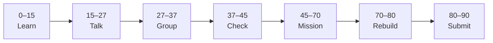

# Lesson 5: Project One Checkpoint


| | |
|:---|:---|
| **Time** | 90 minutes |
| **Evidence** | `independent-rebuild/` + follow-along folder |
| **Independent rebuild** | `independent-rebuild/lesson-05/` · [rules](../INDEPENDENT_REBUILD.md) |

> [!TIP]
> Mission card → **45–70 Mission Task** → **70–80 Rebuild/Exit** → submit evidence.

**Your repo:** `[studentName]-Full-Stack-Web-and-AI-Application`

## Lesson Goal

By the end of this lesson, each student should be able to:

1. Complete **Udemy Project 1** to teacher-assigned scope (full app or MVP).
2. Write `full-stack-practice/FIRST_SUCCESS.md` — story of your breakthrough in your own words.
3. Optionally start Project 2 preview (homework only).
4. Update Notion portfolio with full-stack practice link.
5. Pass Phase 01 oral check and checklist.
6. **Independent rebuild:** hand-type mini full-stack in `full-stack-practice/independent-rebuild/lesson-05/` — [INDEPENDENT_REBUILD.md](../INDEPENDENT_REBUILD.md).

---

## 90-Minute Class Flow



### 0–15 min: Individual Learning

> [!NOTE]
> **One required resource** for this block — see below. Do not browse extra playlists during class.

**Required resource — Udemy:**

Finish remaining **Project 1** lectures (CRUD, UI polish, deploy preview — teacher selects required minimum).

**Individual notes:**

```text
Project 1 feature I completed...
Hardest bug was...
How this connects to AI School Assistant...
One thing I still do not understand is...
```

---

### 15–27 min: Talk Robin / Group Discussion

Each student: 30 seconds — **“My first success was when…”**

---

### 27–37 min: Group Answer

```text
Full-stack debugging order is...
We will reuse this for capstone by...
Our group still needs help with...
```

---

### 37–45 min: Entry Points Check

**Teacher checks:** Lesson 4 first-success screenshot exists; Project 1 substantially complete.

---

### 45–70 min: Mission Task

1. Create `FIRST_SUCCESS.md` (5–8 sentences + screenshot link).
2. Finalize `full-stack-practice/README.md`: stack diagram (ASCII OK):

   ```text
   Browser → Next.js :3000 → FastAPI :8000 → MongoDB
   ```

3. Export one more screenshot of completed Project 1 UI.
4. Update Notion with link to GitHub `full-stack-practice/`.
5. Commit: `Complete Phase 01 first success checkpoint`.

---

### 70–80 min: Independent Rebuild / Exit Check

> [!IMPORTANT]
> Independent work: close course videos, notes, AI tools, and follow-along code before this block.

**Required — no materials:** [INDEPENDENT_REBUILD.md](../INDEPENDENT_REBUILD.md)

1. Close Udemy and all follow-along code.
2. In `full-stack-practice/independent-rebuild/lesson-05/`, **hand-type** a **mini Project 1**:
   - Backend: at least one route + CORS
   - Frontend: one page showing API data + loading/error
   - Must differ from copy-paste — smaller scope OK
3. Cold start demo from rebuild README in under 5 minutes.
4. Add `REBUILD.md`; commit: `Independent rebuild lesson-05 (no materials)`.

**Oral check:** Explain one bug you fixed in rebuild without opening follow-along.

---

### 80–90 min: Submission of Evidence

**Phase 01 checklist:**

```text
[ ] full-stack-practice/ on GitHub
[ ] independent-rebuild/lesson-01 … lesson-05 each with REBUILD.md
[ ] Backend runs + documented
[ ] Frontend runs + documented
[ ] CORS fixed — data on screen
[ ] FIRST_SUCCESS.md written
[ ] first-success screenshot
[ ] Notion updated
[ ] Can explain flow orally from rebuild code
```

---

## What You Must Submit

1. GitHub link to `full-stack-practice/` + `FIRST_SUCCESS.md`
2. GitHub link to `independent-rebuild/lesson-05/` + all prior rebuild folders
3. Udemy Project 1 progress screenshot
4. Completed checklist
5. Notion link

---

## Success Criteria

1. Genuine end-to-end working Project 1 (teacher scope).
2. First success documented in student voice.
3. **All five** independent rebuild folders committed.
4. Ready for Phase 02 Cursor AI Kanban course.

---

## Common Problems

| Problem | Try first |
|---|---|
| Project too big | Teacher defines MVP: one list + one create form. |
| Copy-paste without understanding | Oral check — explain one file you changed. |

---

## Fast Track Option

Begin Udemy Project 2 at home — not required for Phase 01 sign-off.

---

## After Phase 01

Continue to [Phase 02: Cursor AI Kanban + Vibe](../Phase_02_NextJS_Deep_Dive/lesson-06-app-router-and-layouts.md)

---

Educational materials in this folder are copyright © 2026 Wang Morgan. All Rights Reserved.
