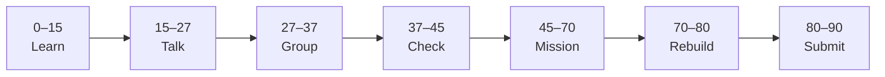

# Lesson 6: Introduction & Cursor 101


| | |
|:---|:---|
| **Time** | 90 minutes |
| **Evidence** | `independent-rebuild/` + follow-along folder |
| **Independent rebuild** | `independent-rebuild/lesson-06/` · [rules](../INDEPENDENT_REBUILD.md) |

> [!TIP]
> Mission card → **45–70 Mission Task** → **70–80 Rebuild/Exit** → submit evidence.

**Your repo:** `[studentName]-Full-Stack-Web-and-AI-Application`

## Lesson Goal

By the end of this lesson, each student should be able to:

1. Enroll in [Complete Cursor AI: Vibe Code a Full-Stack Next.js 15 App](https://www.udemy.com/course/cursorai-nextjs/) and start at the [course introduction lecture](https://www.udemy.com/course/cursorai-nextjs/learn/lecture/47849001?start=0).
2. Explain what the **Kanban full-stack demo** will look like when finished.
3. Install **Cursor AI** and complete initial project setup (Node.js; Postgres or Docker per course).
4. Use **Cursor Chat**, understand **Rules**, and try **Tab** or **inline edit** once.
5. Create `vibe-coding/kanban-cursor/README.md` with setup notes and commit.
6. **Independent rebuild:** hand-type starter in `vibe-coding/independent-rebuild/lesson-06/` — [INDEPENDENT_REBUILD.md](../INDEPENDENT_REBUILD.md) (**no Udemy, no Cursor, no follow-along open**).

---

## 90-Minute Class Flow



### 0–15 min: Individual Learning

> [!NOTE]
> **One required resource** for this block — see below. Do not browse extra playlists during class.

**Required resource — Udemy §1 Introduction & Cursor 101:**

[Complete Cursor AI: Vibe Code a Full-Stack Next.js 15 App](https://www.udemy.com/course/cursorai-nextjs/learn/lecture/47849001?start=0)

**Watch in class (minimum):**

- Welcome and What You'll Learn
- Project Demo: Full-Stack Kanban Board in Next.js
- About LLMs, Embeddings, Context and Limits of AI
- Getting Up & Running with Cursor AI

**Homework before Lesson 7:** finish §1 through **Course Resources & Getting Help** (Cursor Chat, Rules, Tab, Inline Edits, MCP intro, All Cursor Updates).

**Individual notes:**

```text
The Kanban project will use...
Cursor Chat vs Agent mode...
Cursor Rules are for...
LLM context limits mean I should...
One thing I still do not understand is...
```

---

### 15–27 min: Talk Robin / Group Discussion

**Share:** One Cursor feature you will use daily; one AI limitation you must verify manually.

---

### 27–37 min: Group Answer

```text
Vibe coding means we still...
We verify AI output by...
Our group still needs help with...
```

---

### 37–45 min: Entry Points Check

**Teacher checks:** Udemy enrolled; Cursor opens; `node -v` works; Phase 01 `FIRST_SUCCESS.md` exists.

---

### 45–70 min: Mission Task

1. Create `vibe-coding/kanban-cursor/README.md`:
   - Udemy course link + §1 progress checklist
   - Tools installed (Node, Cursor, Postgres/Docker status)
   - Link to course GitHub repo from **Course Resources** lecture (if provided)
2. Clone or scaffold the Kanban project per Udemy **Course Resources** instructions.
3. Add `.cursor/rules` or note planned rules (from **What are Cursor Rules?** lecture).
4. Commit: `Start Cursor AI Kanban project — Lesson 6`.

---

### 70–80 min: Independent Rebuild / Exit Check

> [!IMPORTANT]
> Independent work: close course videos, notes, AI tools, and follow-along code before this block.

**Required — no materials:** [INDEPENDENT_REBUILD.md](../INDEPENDENT_REBUILD.md)

1. Close Udemy, Cursor, and `kanban-cursor/` — no copy-paste.
2. In `vibe-coding/independent-rebuild/lesson-06/`, **hand-type**:
   - Minimal Next.js app (`app/page.tsx` or equivalent) with a title “Kanban Rebuild”
   - `REBUILD.md` listing **from memory**: Cursor Chat vs Agent, one Rule you would write, one AI limit
3. Run `npm run dev` and screenshot.
4. Commit: `Independent rebuild lesson-06 (no materials)`.

**Oral check:** Explain LLM context limits without opening notes.

---

### 80–90 min: Submission of Evidence

---

## What You Must Submit

1. GitHub link to `vibe-coding/kanban-cursor/README.md` (follow-along)
2. GitHub link to `vibe-coding/independent-rebuild/lesson-06/` + `REBUILD.md`
3. Udemy §1 progress screenshot
4. Screenshot of Cursor with follow-along project open
5. Commit history (follow-along + rebuild commits separate)

---

## Success Criteria

1. Student can name the Kanban demo outcome (Next.js 15 + DB + Cursor).
2. Cursor used in follow-along only; **rebuild** done without Cursor/AI.
3. Student states one AI limitation orally from `REBUILD.md`.

---

## Common Problems

| Problem | Try first |
|---|---|
| Cursor not connecting | Check login, model settings, network. |
| Postgres/Docker confusing | Follow **Course Resources** lecture; ask teacher for school Docker policy. |
| Overwhelmed by §1 length | Finish required in-class lectures; assign rest as homework. |

---

## Fast Track Option

Install **Context7** or **Playwright MCP** (per MCP lecture) and note what each enables.

---

Educational materials in this folder are copyright © 2026 Wang Morgan. All Rights Reserved.
