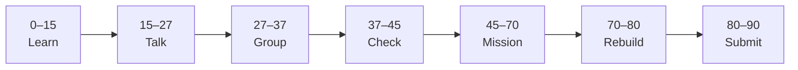

# Lesson 7: Building the Kanban User Interface


| | |
|:---|:---|
| **Time** | 90 minutes |
| **Evidence** | `independent-rebuild/` + follow-along folder |
| **Independent rebuild** | `independent-rebuild/lesson-07/` · [rules](../INDEPENDENT_REBUILD.md) |

> [!TIP]
> Mission card → **45–70 Mission Task** → **70–80 Rebuild/Exit** → submit evidence.

**Your repo:** `[studentName]-Full-Stack-Web-and-AI-Application`

## Lesson Goal

By the end of this lesson, each student should be able to:

1. Complete Udemy **§2 Building the Project User Interface** (5 lectures · ~49 min).
2. Build or prompt-build a **responsive Kanban UI** with **shadcn/ui** (dark/light theme per course).
3. Map UI columns/cards to your [Figma user flow](../../../01_Web_Tools/Phase_02_Figma/) (handbook assistant screens).
4. Use Cursor to implement **one UI slice** only after writing a short plan.
5. Submit running UI screenshot and commit.
6. **Independent rebuild:** hand-type Kanban column UI in `vibe-coding/independent-rebuild/lesson-07/` — [INDEPENDENT_REBUILD.md](../INDEPENDENT_REBUILD.md).

---

## 90-Minute Class Flow



### 0–15 min: Individual Learning

> [!NOTE]
> **One required resource** for this block — see below. Do not browse extra playlists during class.

**Required resource — Udemy §2:**

[Complete Cursor AI — §2 Building the Project User Interface](https://www.udemy.com/course/cursorai-nextjs/)

Complete all **5 lectures** in this section (expand in Udemy sidebar).

Cross-check [Figma Phase 02](../../../01_Web_Tools/Phase_02_Figma/) — layout, spacing, and loading placeholders.

**Individual notes:**

```text
shadcn/ui gives us...
Dark/light theme works by...
Kanban columns map to our capstone as...
I prompted Cursor to...
One thing I still do not understand is...
```

---

### 15–27 min: Talk Robin / Group Discussion

**Share:** One UI decision you made vs what Cursor suggested; how Figma informed your layout.

---

### 27–37 min: Group Answer

```text
Good UI needs loading states because...
We still read AI diffs because...
Our group still needs help with...
```

---

### 37–45 min: Entry Points Check

**Teacher checks:** §1 homework done; Kanban repo runs (`npm run dev`); Lesson 6 README updated.

---

### 45–70 min: Mission Task

1. Finish §2 UI in `vibe-coding/kanban-cursor/` (follow Udemy prompts).
2. Add **loading skeleton or placeholder** on the main board view (course pattern or Figma-inspired).
3. Update `vibe-coding/README.md` — table: **Figma frame → Kanban component → future capstone route**.
4. Screenshot light **and** dark theme → `vibe-coding/kanban-cursor/screenshots/`.
5. Commit: `Build Kanban UI with Cursor — Lesson 7`.

---

### 70–80 min: Independent Rebuild / Exit Check

> [!IMPORTANT]
> Independent work: close course videos, notes, AI tools, and follow-along code before this block.

**Required — no materials:** [INDEPENDENT_REBUILD.md](../INDEPENDENT_REBUILD.md)

1. Close Udemy, Cursor, and `kanban-cursor/`.
2. In `vibe-coding/independent-rebuild/lesson-07/`, **hand-type**:
   - One Kanban **column** + 2–3 **static cards** (hard-coded array OK)
   - Basic styling (Tailwind or CSS) from memory
   - Loading placeholder component or skeleton (static demo OK)
3. Add `REBUILD.md`; commit: `Independent rebuild lesson-07 (no materials)`.

**Oral check:** Point to JSX you typed and explain structure.

---

### 80–90 min: Submission of Evidence

---

## What You Must Submit

1. Screenshots (follow-along: light + dark or mobile + desktop)
2. `independent-rebuild/lesson-07/` + `REBUILD.md` + rebuild screenshot
3. Figma → UI mapping table in `vibe-coding/README.md`
4. Udemy §2 progress screenshot
5. Commit history

---

## Success Criteria

1. Kanban UI visible in follow-along (static OK if DB not wired).
2. Plan → Cursor → verify used once in follow-along.
3. Loading/placeholder in follow-along or **rebuild**.
4. **Rebuild** column UI hand-typed without materials.

---

## Common Problems

| Problem | Try first |
|---|---|
| shadcn install fails | Re-run course commands; check `components.json`. |
| Theme toggle broken | Compare with course repo diff; check `ThemeProvider`. |
| AI generated wrong layout | Narrow prompt: “only edit `app/page.tsx`”. |

---

## Fast Track Option

Add a fourth column or custom card color — small scoped Cursor task with reflection note.

---

Educational materials in this folder are copyright © 2026 Wang Morgan. All Rights Reserved.
